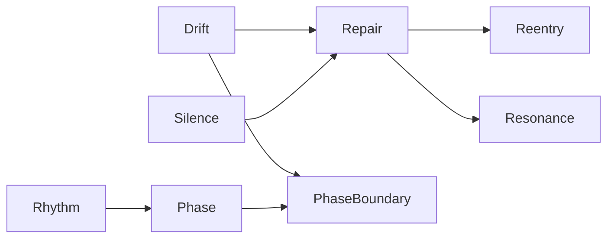

# 📚 PLD Related Work & Adjacent Frameworks (v0.6)

> **Purpose:**  
> This document situates **Phase Loop Dynamics (PLD)** within the broader landscape of design research, HCI theory, and interaction frameworks.  
> It identifies conceptual overlaps, operational differences, and strategic implications for applied research, prototyping, and product integration.

---

## 1. Design Research as Methodological Infrastructure

**Key Insight:**  
Design research underpins curriculum development, pattern-driven learning, and empirical UX analysis. It supports repair and reentry through structured iteration.

**PLD Differentiator:**  
PLD formalizes *Drift → Repair → Reentry* sequences with phase mapping and telemetry, enabling repeatable rhythm-aware design.

---

## 2. Agentic Initiative Framework (AIF)  
*— Modular recovery & user-led reconfiguration*

**Source:** Intelligent UI design literature.

**Key Traits:**  
- Modular user flows, outcome-oriented  
- User-driven fallback or goal adaptation  

**PLD Differentiator:**  
AIF redirects to a goal; PLD reenters a loop with temporal and rhythmic awareness, triggered by hesitation cues, drift detection, and internal repair attempts.

---

## 3. Open vs. Closed Frameworks in Design Education

**Key Insight:**  
Open frameworks enable reinterpretation, iterative evolution, and adaptive recovery — aligning with drift-aware logic.

**PLD Differentiator:**  
PLD embraces modularity and loop transitions while providing scaffolds for reentry rather than rigid pathing.

---

## 4. Rhythm-Aware and Temporal UX

**Key Insight:**  
UX research increasingly values pacing and hesitation timing to enhance trust.

**PLD Differentiator:**  
PLD introduces “Latency Hold” and “Resonance” as rhythm-aligned constructs, explicitly modeling interaction tempo and phase buffering.

---

## 5. Coherology and RIC (Resonance Intelligence Core)

**Key Insight:**  
Coherology and RIC focus on symbolic coherence maintenance.

**PLD Differentiator:**  
PLD operationalizes symbolic recovery into implementable UX scripts and metrics, emphasizing measurable, recoverable rhythms.

---

## 6. Comparative Framework Table

| Framework / Theory       | Drift Detection     | Repair Handling      | Reentry Logic         | Rhythm Modeling       | Temporal Constructs     | Feedback Granularity   | Openness       | PLD Differentiator |
|--------------------------|---------------------|-----------------------|------------------------|------------------------|--------------------------|-------------------------|----------------|--------------------|
| **PLD**                  | Explicit            | Phase-defined         | Loop-driven            | Latency/Resonance      | Explicit (Phased)        | High (telemetry)        | Modular / Open | Rhythm as structure |
| Agentic Initiative       | Partial (goal shift)| Modular fallback      | Goal re-fix            | Not defined            | Implicit                 | Medium                  | Semi-open      | Temporal loops     |
| Design Thinking          | Implicit            | Iterative prototype   | Re-framing loop        | Not defined            | Implicit                 | Variable                | Open           | Drift as design unit|
| Coherology / RIC         | Symbolic level      | Recursive symbolic    | Coherence reentry      | Resonance logic        | Conceptual / Symbolic    | Low                     | Theoretical    | Observable metrics |
| Design Research          | Case-informed       | Adaptive redesign     | Learning trajectory    | N/A                    | Empirical / Observational| Variable                | Open           | Recovery scaffolds |

---

## 7. Strategic Implications for PLD

PLD bridges theory and deployment:

- **Unlike adjacent models**, PLD treats hesitation, silence, and ambiguity as first-class design units.
- Offers reusable loop templates (`loop04_feedbackinternal_004.j2`) and observability schemas (`metrics_schema.yaml`).
- Enables predictive analytics (e.g., `drift_to_repair_ratio`, `avg_reentry_lag`).

---

## 8. Concept Map

---

## 9. Conclusion & Collaboration Call

PLD is a **rhythm-first**, loop-based framework that makes drift, repair, and reentry designable and measurable.

**Relevance Across Domains:**  
- Conversational AI (fallback-repair chaining)  
- Educational UX (dropout-sensitive reentry)  
- Prototyping (timing-aware transitions)

📬 *Interested in collaboration?*  
- See: [Field Stewardship](./07_field_stewardship)  
- Contact: `contact@deepzenspace.io`

---

**Citation:**  
Phase Loop Dynamics — Related Work & Adjacent Frameworks (v0.6)  
https://github.com/kiyoshisasano-DeepZenSpace
