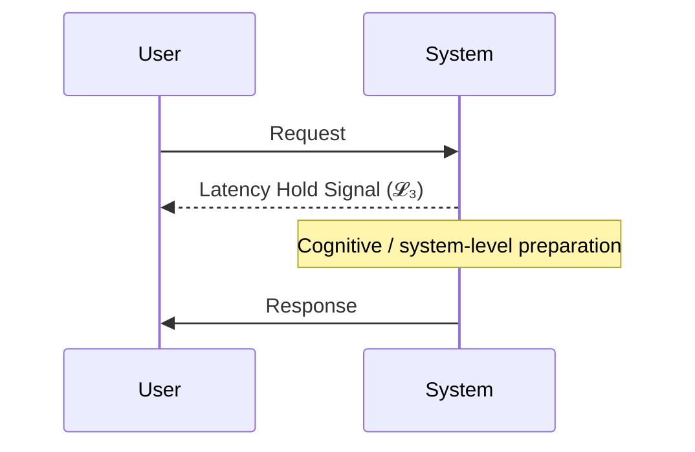

# Quickstart Kit — Phase Loop Dynamics (PLD)

This Quickstart Kit provides a **hands-on entry point** for applying the Phase Loop Dynamics (PLD) framework in UX prototyping, LLM orchestration, and metrics-driven evaluation.

It is **aligned with the PLD Core Theory** documented in [`01_phase_loop_dynamics`](../01_phase_loop_dynamics/) and integrates:
- **Lexicon v0.6** safe usage rules
- **Academic mapping** to related research
- **Mathematical Appendix** notation for reproducibility

---

## 1. Purpose

The Quickstart Kit serves as:
1. **Entry Guide** — understand PLD concepts and terminology
2. **Pattern Library** — ready-to-use operator patterns for UX, LLM prompts, and Rasa flows
3. **Metrics Integration** — schemas, logging patterns, and dashboard templates

> **Audience:**  
> - **UX Engineers** — prototype and test conversational flows with latency/repair handling  
> - **LLM Developers** — integrate prompt re-entry, repair triggers, and drift control  
> - **Data Analysts** — track PLD-specific metrics and evaluate interaction quality

---

## 2. Repository Layout

Following the **2025-08-09 migration**, the Quickstart Kit is organized as:

```
00_overview/
  quickstart.md
  pld_theory_summary.md
  usage_notes.md

20_patterns/
  ux/
    figma_latency_hold.md
  llm/
    reentry_prompt.json
  rasa/
    soft_repair.yml
    soft_repair_actions.py
  mapping/
    schema_mapping_table.md

30_metrics/
  guides/
    drift_event_logging.md
  schemas/
    metrics_schema.yaml
    pld_event.schema.json
  dashboards/
    reentry_success_dashboard.json

_meta/
  MIGRATION.md
  REDIRECTS.md
```

For a detailed migration table, see [`_meta/MIGRATION.md`](../_meta/MIGRATION.md).

---

## 3. Core PLD Concepts

| PLD Term | Tier | Academic Link | Mathematical Ref |
|---|---|---|---|
| **Structural Phase** | Core | [Phase (Minimalist Program)](../01_phase_loop_dynamics/related_work/pld_to_academic.md) | — |
| **Cue-Driven Repair** | Core | [Conversational Repair](../01_phase_loop_dynamics/related_work/pld_to_academic.md) | ℛ |
| **Structural Drift** | Core | [Concept Drift](../01_phase_loop_dynamics/related_work/pld_to_academic.md) | 𝒟 |
| **Latent Phase** | Derived | [Conversational Silence](../01_phase_loop_dynamics/related_work/pld_to_academic.md) | 𝓛₃ |
| **Resonance** | Derived | [Dialogic Resonance](../01_phase_loop_dynamics/related_work/pld_to_academic.md) | 𝓛₅ |
| **Coherence Field** | Derived | [Coherence Relations](../01_phase_loop_dynamics/related_work/pld_to_academic.md) | C(σ,t) |

> Full lexicon: [`PLD_LEXICON_SAFE_USAGE_GUIDE.md`](../01_phase_loop_dynamics/PLD_LEXICON_SAFE_USAGE_GUIDE.md)  
> Academic mapping: [`pld_to_academic.md`](../01_phase_loop_dynamics/related_work/pld_to_academic.md)

---

## 4. Getting Started

### 4.1 Read the Overview
- [`00_overview/quickstart.md`](00_overview/quickstart.md) — minimal working example
- [`00_overview/pld_theory_summary.md`](00_overview/pld_theory_summary.md) — condensed theory
- [`00_overview/usage_notes.md`](00_overview/usage_notes.md) — best practices & pitfalls

### 4.2 Pick a Pattern
Choose from [`20_patterns`](20_patterns/) based on your target environment:
- **UX** (Figma prototypes with latency hold simulation)
- **LLM** (prompt re-entry orchestration)
- **Rasa** (soft repair integration)

### 4.3 Track Metrics
Integrate logging and dashboards from [`30_metrics`](30_metrics/) to measure:
- Drift-to-Repair Ratio (𝒟 / ℛ)
- Re-entry Success Rate
- Average Latency Hold Duration

---

## 5. Example: Latency Hold Pattern



See: [`20_patterns/ux/figma_latency_hold.md`](20_patterns/ux/figma_latency_hold.md)

---

## 6. Best Practices

1. **Use Lexicon Precisely** — match definitions in `PLD_LEXICON_SAFE_USAGE_GUIDE.md`
2. **Reference Mathematical Notation** — maintain reproducibility in analysis
3. **Log Rich Context** — timestamps, phase IDs, and triggering cues
4. **Map to Academic Terms** — for clarity across research communities

---

## 7. See Also

- [Phase Loop Dynamics — Core Theory](../01_phase_loop_dynamics/README_phase_loop_dynamics.md)
- [PLD × Academic Mapping](../01_phase_loop_dynamics/related_work/pld_to_academic.md)
- [Mathematical Appendix](../01_phase_loop_dynamics/PLD_Mathematical_Appendix.md)

---

**Version:** Quickstart Kit v2025-08-09  
**License:** MIT  
**Maintainer:** PLD Research Group
