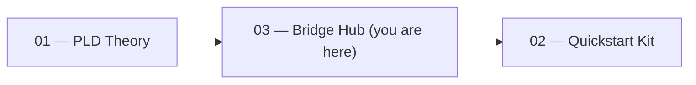

# PLD Bridge Hub — Start Here

**Role in one line:** This hub bridges **PLD theory (01)** and **implementation kits (02)** so partners can begin working from *this folder alone*.

---

## 📌 Quick Access
- **Partner Index** → [`INDEX.md`](./INDEX.md)
- **One-command Demo** → [`DEMORUN.md`](./DEMORUN.md)
- **Theory Overview** → [`../01_phase_loop_dynamics/README_phase_loop_dynamics.md`](../01_phase_loop_dynamics/README_phase_loop_dynamics.md)
- **Mathematical Appendix** → [`../01_phase_loop_dynamics/PLD_Mathematical_Appendix.md`](../01_phase_loop_dynamics/PLD_Mathematical_Appendix.md)
- **PLD Flow Diagram** → [`../01_phase_loop_dynamics/10_phase_loop_dynamics.svg`](../01_phase_loop_dynamics/10_phase_loop_dynamics.svg)
- **Safe Lexicon** → [`../PLD_LEXICON_SAFE_USAGE_GUIDE.md`](../PLD_LEXICON_SAFE_USAGE_GUIDE.md)
- **Connectivity Map** → [`../PLD_Lexicon_Connectivity_Map.md`](../PLD_Lexicon_Connectivity_Map.md)
- **Quickstart Kit** → [`../02_quickstart_kit/README_quickstart.md`](../02_quickstart_kit/README_quickstart.md)
- **Metrics Schemas** → [`../02_quickstart_kit/30_metrics/schemas/metrics_schema.yaml`](../02_quickstart_kit/30_metrics/schemas/metrics_schema.yaml), [`../02_quickstart_kit/30_metrics/schemas/pld_event.schema.json`](../02_quickstart_kit/30_metrics/schemas/pld_event.schema.json)
- **Structure Generators** → [`structure_generators/OVERVIEW.md`](./structure_generators/OVERVIEW.md)

---

## 📂 Where the Hub Fits



See the full process diagram:  
[`../01_phase_loop_dynamics/10_phase_loop_dynamics.svg`](../01_phase_loop_dynamics/10_phase_loop_dynamics.svg)

---

## 🚀 Quickstart in 5 Minutes

1. **Move to this folder**
   ```bash
   cd 03_pld-Bridge-Hub
   ```
2. **Create a Python virtual environment**
   - **macOS/Linux**
     ```bash
     python3 -m venv .venv && source .venv/bin/activate
     ```
   - **Windows (PowerShell)**
     ```powershell
     py -m venv .venv
     .venv\Scripts\Activate.ps1
     ```
3. **Install dependencies**
   ```bash
   pip install --upgrade pip
   pip install jsonschema
   ```
4. **Run the demo**
   ```bash
   python bootstrap_demo.py
   ```
   This will:
   - Generate demo events (`demo_quick/events_demo.jsonl`)
   - Validate them against the PLD event schema
   - Output a report (`demo_quick/demo_report.md`)

5. **View your report** in `demo_quick/demo_report.md`.

For full details, see [`DEMORUN.md`](./DEMORUN.md).

---

## 🧭 Role-Based Paths

- **Engineer** → Mathematical Appendix §§1.3–1.6 → Quickstart `20_patterns` → Metrics schemas  
- **UX/Research** → Safe Lexicon & Connectivity Map → Notion templates → UX latency-hold patterns  
- **Analyst / ML** → Mathematical Appendix §2.5 → `30_metrics` → Academic mapping index  

---

## 📄 Documentation & Theory

- **Docs Overview** → [`docs/OVERVIEW.md`](./docs/OVERVIEW.md)  
- **External Papers (Zenodo)** → [`docs/zenodo_paper_links.md`](./docs/zenodo_paper_links.md)  
- **Academic Mapping Index** → [`../01_phase_loop_dynamics/09_academic_mapping_index.md`](../01_phase_loop_dynamics/09_academic_mapping_index.md)  

---

## 🤝 Collaboration
See collaboration models, partner roles, and engagement guidelines in:  
[`../05_field_stewardship`](../05_field_stewardship)

---

## 📜 License
**CC BY-NC 4.0** — Attribution required; commercial use prohibited. See [`LICENSE`](../LICENSE).
