<!--
Revision notes (2025-08-09)
- Single landing doc for partners: role paths, quick access, workflow.
- Mirrors 01 (theory) ↔ 02 (quickstart) and points to demo/run.
-->

# PLD Bridge Hub — Partner Index

**One-line role:** The hub that connects **PLD theory (01)** to **implementation kits (02)** so partners can start from *this* folder only.

## Quick Access
- Theory overview → `../01_phase_loop_dynamics/README_phase_loop_dynamics.md`
- Math Appendix → `../01_phase_loop_dynamics/PLD_Mathematical_Appendix.md`
- PLD flow diagram → `../01_phase_loop_dynamics/10_phase_loop_dynamics.svg`
- Safe Lexicon → `../PLD_LEXICON_SAFE_USAGE_GUIDE.md`
- Connectivity Map → `../PLD_Lexicon_Connectivity_Map.md`
- Quickstart Kit → `../02_quickstart_kit/README_quickstart.md`
- Metrics schemas → `../02_quickstart_kit/30_metrics/schemas/metrics_schema.yaml`, `../02_quickstart_kit/30_metrics/schemas/pld_event.schema.json`
- One-command demo → `./DEMORUN.md`

## Where the hub sits

```mermaid
flowchart LR
  A01["01 — PLD Theory"] --> A03["03 — Bridge Hub (you are here)"]
  A03 --> A02["02 — Quickstart Kit"]
```

See full diagram: `../01_phase_loop_dynamics/10_phase_loop_dynamics.svg`

## Role paths
- **Engineer** → Math Appendix §§1.3–1.6 → Quickstart 20_patterns → Metrics schemas
- **UX/Research** → Safe Lexicon & Connectivity → Notion templates → UX patterns (latency_hold)
- **Analyst/ML** → Math Appendix §2.5 → 30_metrics → Academic mappings index

## Collaboration workflow
1. Scope in Notion (phases, cues, repair).  
2. Spec thresholds (κ for 𝒟, τ for C(σ,t)).  
3. Implement a pattern (LLM/Rasa/UX).  
4. Emit events (schema-compliant).  
5. Validate & visualize (demo/dashboard).

## License
**CC BY-NC 4.0** — attribution required; no commercial use.
