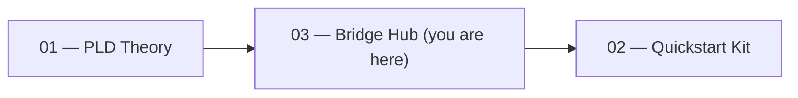

# 🧩 PLD Bridge Hub — Start Here

> The Bridge Hub connects **Phase Loop Dynamics (PLD) theory (01)** and **implementation kits (02)** —  
> enabling contributors to begin working directly from this folder.


---

## 📘 Overview

The **PLD Bridge Hub** serves as the practical integration layer of the PLD ecosystem.  
It links theory (01) and implementation kits (02) through ready-to-run demos,  
schema validation, and event metric generation.

This repository is the **main entry point for engineers and researchers** who want to test, validate, or extend PLD-based event logic.

---

## 📂 Repository Layout

```text
03_pld-Bridge-Hub/
├── DEMORUN.md                 ← One-command demo guide
├── bootstrap_demo.py          ← Generates demo events + validates schema
├── demo_pld_trace/            ← Conversational pause/reentry analyzer
│   ├── generate_trace.py
│   ├── input_trace.txt
│   └── utils/
│       ├── pause_classifier.py
│       └── reentry_detector.py
├── structure_generators/      ← Event structure + metric modules
│   ├── latency_tracker.py
│   ├── pause_classifier_bot.py
│   └── reentry_detector.py
├── scripts/
│   └── validate_events.sh     ← CLI validator wrapper
└── docs/
    ├── LICENSE
    ├── CITATION.cff
    ├── CONTRIBUTING.md
    └── OVERVIEW.md
```

---

## 🧠 How It Fits in the PLD Stack



> This hub operationalizes the theory of Phase Loop Dynamics (01)  
> into structured telemetry and validation workflows.

---

## 🚀 Quickstart (5-Minute Demo)

1. **Move to this folder**
   ```bash
   cd 03_pld-Bridge-Hub
   ```

2. **Create a Python environment**
   ```bash
   python3 -m venv .venv && source .venv/bin/activate   # macOS/Linux
   # or
   py -m venv .venv; .venv\Scripts\Activate.ps1         # Windows
   ```

3. **Install dependencies**
   ```bash
   pip install --upgrade pip
   pip install jsonschema
   ```

4. **Run the demo**
   ```bash
   python bootstrap_demo.py
   ```
   → Generates `demo_quick/events_demo.jsonl`  
   → Validates against schema  
   → Produces `demo_quick/demo_report.md`

5. **Open the report**
   ```bash
   open demo_quick/demo_report.md
   ```

For additional examples, see [`DEMORUN.md`](./DEMORUN.md).

---

## ⚙️ Core Components

| Component | Description |
|------------|-------------|
| **`bootstrap_demo.py`** | Entry point — generates synthetic PLD events and validates them. |
| **`demo_pld_trace/`** | Turn-by-turn conversational analyzer (pause / reentry visualization). |
| **`structure_generators/`** | Core PLD event logic: latency tracking, reentry detection, etc. |
| **`scripts/validate_events.sh`** | CLI tool to check event logs against PLD schemas. |
| **`docs/`** | Documentation, contribution, and licensing info. |

---

## 📊 Event Metrics & Schema Notes

### Event Schema (`pld_event.schema.json`)
Defines canonical event fields:  
`event_type`, `timestamp`, `session_id`, and nested `metadata`.

Example enforcement:
- `latency_hold` → requires `metadata.duration_ms`
- `repair_triggered` → must include `metadata.strategy`

### Metric Examples

| Metric | Formula | Description |
|--------|----------|-------------|
| `drift_to_repair_ratio` | drift_detected.count / repair_triggered.count | Rate of repair attempts after drift |
| `reentry_success_rate` | reentry_success.count / reentry_success.total_attempts | Effective reentry frequency |
| `avg_latency_hold` | latency_hold.sum(duration_ms) / latency_hold.count | Mean user/system pause duration |
| `repair_loop_depth` | repair_triggered.max_consecutive_events_per_context | Nested repair sequence depth |

---

## 🧭 Navigation by Role

| Role | Recommended Path |
|------|-------------------|
| **Engineer** | Run demo → inspect event JSONL → explore `structure_generators` |
| **UX Researcher** | Use `demo_pld_trace` to visualize user reentry or hesitation |
| **Data Analyst** | Integrate validated events into downstream metric pipelines |

---

## 🤝 Contributions

We welcome:
- Schema alignment / validation improvements  
- Pause & reentry detector refinements  
- Integration into real telemetry or dialogue systems  

Follow standard PR flow and include a brief demo log for new modules.

---

## 📜 License

**License:** [CC BY-NC 4.0](https://creativecommons.org/licenses/by-nc/4.0/)  
> “Phase Loop Dynamics — Kiyoshi Sasano / DeepZenSpace”

---

## ✅ Summary

If you can run:
```bash
python bootstrap_demo.py
```
and open:
```bash
demo_quick/demo_report.md
```
🎉 You’ve successfully crossed the **PLD Bridge Hub** —  
where **theory meets implementation.**
