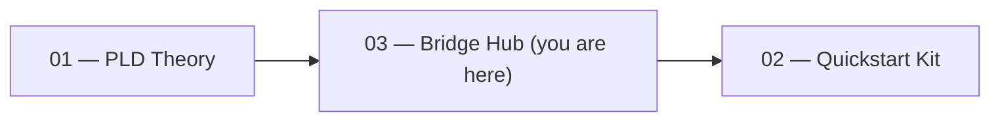

<!--
Revision notes (2025-08-09, updated)
- Single landing doc for partners: role paths, quick access, workflow.
- Added links to structure_generators and a quickstart section.
-->

# PLD Bridge Hub — Partner Index

**One-line role:** The hub that connects **PLD theory (01)** to **implementation kits (02)** so partners can start from *this* folder only.

## Quick Access
- Theory overview → `../01_phase_loop_dynamics/README_phase_loop_dynamics.md`
- Math Appendix → `../01_phase_loop_dynamics/PLD_Mathematical_Appendix.md`
- PLD flow diagram → `../01_phase_loop_dynamics/10_phase_loop_dynamics.svg`
- Safe Lexicon → `../PLD_LEXICON_SAFE_USAGE_GUIDE.md`
- Connectivity Map → `../PLD_Lexicon_Connectivity_Map.md`
- Quickstart Kit → `../02_quickstart_kit/README_quickstart.md`
- Metrics schemas → `../02_quickstart_kit/30_metrics/schemas/metrics_schema.yaml`, `../02_quickstart_kit/30_metrics/schemas/pld_event.schema.json`
- Structure Generators (code) → `./structure_generators/OVERVIEW.md`
- One-command demo → `./DEMORUN.md`

## Where the hub sits

See full diagram: `../01_phase_loop_dynamics/10_phase_loop_dynamics.svg`

## Role paths
- **Engineer** → Math Appendix §§1.3–1.6 → Quickstart 20_patterns → Metrics schemas
- **UX/Research** → Safe Lexicon & Connectivity → Notion templates → UX patterns (latency_hold)
- **Analyst/ML** → Math Appendix §2.5 → 30_metrics → Academic mappings index

## Quickstart in 5 Minutes
Run a minimal demo and validate events:  
See [`DEMORUN.md`](./DEMORUN.md)

## Collaboration
For details on collaboration models, partner roles, and engagement guidelines,  
see [`05_field_stewardship`](../05_field_stewardship).

## License
**CC BY-NC 4.0** — attribution required; no commercial use.
