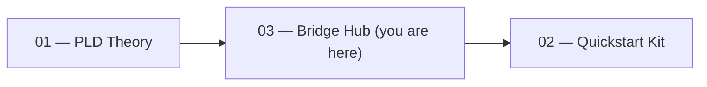

# 🧩 PLD Bridge Hub — Start Here

> The Bridge Hub connects **Phase Loop Dynamics (PLD) theory (01)** and **implementation kits (02)** —  
> enabling partners and contributors to begin working from *this folder alone*.


---

## 📘 Overview

The **PLD Bridge Hub** is the central integration layer of the PLD ecosystem.  
It provides ready-to-run demos, schema validation pipelines, and event-metric connections between the theoretical model and production-ready telemetry.

> In short — this is the **entry point for engineers** to experiment, validate, and extend PLD-based event structures.

---

## 📂 Repository Layout

```text
03_pld-Bridge-Hub/
├── _brige_hub_start.md      ← You are here
├── top-level-files/  
│   ├── bootstrap_demo.py    ← One-command demo (event generation + validation)
├── demo_pld_trace/          ← Conversational trace analyzer
│   ├── generate_trace.py
│   ├── input_trace.txt
│   └── utils/
├── scripts/
│   └── validate_events.sh   ← CLI validator wrapper
├── structure_generators/
│   └── OVERVIEW.md
└── ...
```

---

## 🧠 How It Fits in the PLD Stack



See the full PLD process diagram:  
[`../01_phase_loop_dynamics/10_phase_loop_dynamics.svg`](../01_phase_loop_dynamics/10_phase_loop_dynamics.svg)

---

## 🚀 Quickstart (5-Minute Demo)

1. **Move to this folder**
   ```bash
   cd 03_pld-Bridge-Hub
   ```

2. **Create a Python virtual environment**
   - macOS/Linux  
     ```bash
     python3 -m venv .venv && source .venv/bin/activate
     ```
   - Windows (PowerShell)  
     ```powershell
     py -m venv .venv
     .venv\Scripts\Activate.ps1
     ```

3. **Install dependencies**
   ```bash
   pip install --upgrade pip
   pip install jsonschema
   ```

4. **Run the demo**
   ```bash
   python bootstrap_demo.py
   ```
   This will:
   - Generate demo events → `demo_quick/events_demo.jsonl`
   - Validate them against the PLD schema
   - Output → `demo_quick/demo_report.md`

5. **Open the report**
   ```
   demo_quick/demo_report.md
   ```

For more context, see [`DEMORUN.md`](./DEMORUN.md).

---

## ⚙️ Core Components

| Component | Description |
|------------|-------------|
| **`bootstrap_demo.py`** | Generates a synthetic PLD event sequence and validates against the schema. |
| **`demo_pld_trace/`** | Analyzes conversational traces (pause / reentry detection) and visualizes them with Mermaid. |
| **`scripts/validate_events.sh`** | CLI validator supporting both automatic demo run and manual validation modes. |
| **`structure_generators/`** | Reusable modules for event generation, context reconstruction, and pause analysis. |
| **`02_quickstart_kit/30_metrics/schemas/`** | Central schemas for event structure and derived metrics. |

---

## 📊 Metrics & Schemas

### Event Schema (`pld_event.schema.json`)
Defines valid event types and required fields (e.g., `event_type`, `timestamp`, `session_id`).  
Supports embedded rule:  
`latency_hold` events must include `metadata.duration_ms`.

### Metrics Schema (`metrics_schema.yaml`)
Defines formulas for automated metric calculation:

| Metric | Formula | Description |
|--------|----------|-------------|
| `drift_to_repair_ratio` | drift_detected.count / repair_triggered.count | Frequency of recovery attempts after drift |
| `reentry_success_rate` | reentry_success.count / reentry_success.total_attempts | Rate of successful reentries |
| `avg_latency_hold` | latency_hold.sum(duration_ms) / latency_hold.count | Mean system pacing duration |
| `repair_escalation_rate` | repair_triggered.count(strategy=hard_repair) / repair_triggered.count | Escalation ratio |
| `latency_interrupt_rate` | latency_hold.count(user_cancelled=true) / latency_hold.count | User interruptions during pacing |
| `repair_loop_depth` | repair_triggered.max_consecutive_events_per_context | Repair attempt chain depth |

> Schemas are located in:  
> [`../02_quickstart_kit/30_metrics/schemas/`](../02_quickstart_kit/30_metrics/schemas/)

---

## 🧭 Role-Based Navigation

| Role | Recommended Path |
|------|-------------------|
| **Engineer** | Mathematical Appendix §§1.3–1.6 → Quickstart `20_patterns` → Metrics schemas |
| **UX / Research** | Safe Lexicon → Connectivity Map → UX latency-hold patterns |
| **Analyst / ML** | Mathematical Appendix §2.5 → `30_metrics` → Academic Mapping Index |

---

## 📄 Documentation References

- **Partner Index** → [`INDEX.md`](./INDEX.md)  
- **One-Command Demo Guide** → [`DEMORUN.md`](./DEMORUN.md)  
- **Theory Overview** → [`../01_phase_loop_dynamics/README_phase_loop_dynamics.md`](../01_phase_loop_dynamics/README_phase_loop_dynamics.md)  
- **Mathematical Appendix** → [`../01_phase_loop_dynamics/PLD_Mathematical_Appendix.md`](../01_phase_loop_dynamics/PLD_Mathematical_Appendix.md)  
- **Safe Lexicon** → [`../PLD_LEXICON_SAFE_USAGE_GUIDE.md`](../PLD_LEXICON_SAFE_USAGE_GUIDE.md)  
- **Connectivity Map** → [`../PLD_Lexicon_Connectivity_Map.md`](../PLD_Lexicon_Connectivity_Map.md)  
- **Docs Overview** → [`docs/OVERVIEW.md`](./docs/OVERVIEW.md)  
- **External Papers (Zenodo)** → [`docs/zenodo_paper_links.md`](./docs/zenodo_paper_links.md)

---

## 🤝 Collaboration & Contributions

We welcome partners and contributors focusing on:
- Schema alignment and validation improvements  
- Pause / reentry detection extensions  
- Integration with telemetry or dashboard frameworks  

See engagement guidelines in:  
[`../05_field_stewardship`](../05_field_stewardship)

When contributing:
- Follow standard fork → branch → PR workflow  
- Include a concise test log for new scripts or schemas  
- Use descriptive commit messages (e.g., `feat(trace): add reentry tag classifier`)

---

## 📜 License

**License:** [CC BY-NC 4.0](https://creativecommons.org/licenses/by-nc/4.0/)  
Non-commercial use permitted with attribution:  
> “Phase Loop Dynamics — Kiyoshi Sasano / DeepZenSpace”

---

## 🧭 At a Glance

> If you can run `python bootstrap_demo.py` and open `demo_quick/demo_report.md`,  
> you’ve successfully traversed the Bridge Hub —  
> where **PLD theory meets implementation**.

---
