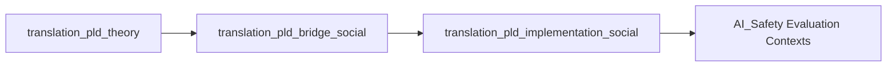

# 🧠 AI Social Alignment Translation — Phase Loop Dynamics (v1.0)

> “Social alignment is not imposed; it emerges through loops of drift, repair, and resonance.”  
> — *Kiyoshi Sasano, 2025*

---

## 1. Purpose and Position in the Ecosystem

This repository is part of the **DeepZenSpace AI Safety Translation Interface**,  
focusing on translating **Phase Loop Dynamics (PLD)** into the analytical language of  
**social systems theory** and **network science**.

It provides a full theoretical-to-practical pathway for studying how  
**trust, cooperation, and synchronization** evolve and stabilize in collective systems.

---

## 2. Folder Overview

```
AI_SocialAlignment_translation/
├── translation_pld_theory/              ← Conceptual translation (social system reframing)
├── translation_pld_bridge_social/       ← Bridge between theory and metrics
└── translation_pld_implementation_social/ ← Empirical and computational implementation layer
```

| Layer | Focus | Primary Output |
|-------|--------|----------------|
| **1. Theory** | Reframing of PLD concepts in social communication terms | Conceptual docs, lexicon, diagrams |
| **2. Bridge** | Translation of theoretical variables into measurable constructs | Mapping indices, analytic guides |
| **3. Implementation** | Modeling, simulation, and data schema design | JSON schemas, case studies, reports |

---

## 3. Conceptual Foundations

| Classical Theory | Core Mechanism | PLD Reframing |
|------------------|----------------|----------------|
| **Luhmann (1984)** | Autopoiesis of communication | Drift = communication noise → Repair = closure |
| **Barabási (2002)** | Scale-free networks | Resonance = synchronized cascades |
| **Lewicki & Bunker (1996)** | Trust repair cycles | Repair = restoration of relational stability |
| **Strogatz (2003)** | Coupled oscillators / synchrony | Latency = phase lag / coordination delay |
| **Coleman (1990)** | Social capital & closure | Stability (S) = systemic resilience index |

These anchors define how **social alignment** inherits the mathematical rhythm of PLD  
while remaining grounded in sociological mechanisms.

---

## 4. Translation Pathway



The process begins with conceptual translation (**A01**),  
passes through metric calibration (**A02**),  
and culminates in empirical modeling and measurement (**A03**).

---

## 5. Reading Guide (2 Hours Total)

| Stage | File | Est. Time | Goal |
|--------|------|-----------|------|
| 1 — Theory | `translation_pld_theory/README.md` | 30 min | Understand drift–repair–resonance as social feedback loops |
| 2 — Bridge | `translation_pld_bridge_social/README_social_bridge.md` | 30 min | Learn mapping from theory → trust/synchronization metrics |
| 3 — Implementation | `translation_pld_implementation_social/README_social_implementation.md` | 60 min | Apply PLD to real-world systems (organizations, networks, communities) |

**Fast-Track Route (90 min):**  
theory → bridge → case studies → appendix_schema

---

## 6. Key Variables

| Symbol | Meaning | Observable Equivalent |
|---------|----------|-----------------------|
| **δ** | Social drift rate | Sentiment / entropy change |
| **t(ℛ)** | Repair latency | Time to acknowledgment or reconciliation |
| **ρ** | Synchronization index | Phase coherence / interaction correlation |
| **S** | Stability / resilience | Post-repair trust ratio |

---

## 7. Analytical Themes

- **Trust Drift & Repair:** dynamic erosion and reconstruction of cooperation  
- **Collective Synchronization:** phase alignment in communication networks  
- **Resilience & Closure:** long-term stability of normative systems  
- **Network Adaptivity:** topology-dependent response to perturbation  
- **Social Learning:** repetition of loops as collective memory  

---

## 8. Integration with Other Domains

| Related Module | Focus |
|----------------|--------|
| **AI_CognitiveAlignment_translation** | Individual cognition and interpretation loops |
| **AI_TechnicalAlignment_translation** | Systemic governance and control stability |
| **AI_SocialAlignment_translation (this)** | Collective coordination and trust dynamics |

---

## 9. Meta-Cognitive Checkpoints

- Can PLD variables (**δ**, **ρ**, **S**) act as indicators for **institutional AI alignment**?  
- How does **collective trust synchronization** affect AI–human cooperation systems?  
- What **data granularity** best captures repair latency in large-scale networks?  
- Where does **autopoietic closure** emerge — at agent, group, or system level?  

---

## 📘 Citation

**AI Social Alignment Translation — Phase Loop Dynamics**  
KIyoshi Sasano, 2025  

> “To align socially is to loop — to drift, to repair, and to resonate again.”
