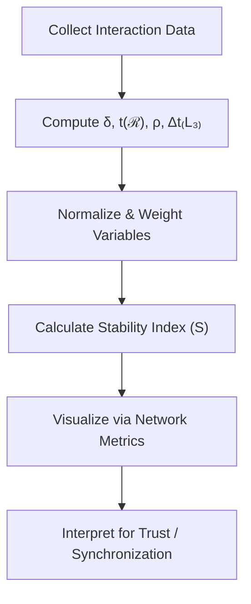

# 📊 Measurement Framework for Social Synchronization and Trust Dynamics

> “What cannot be observed cannot evolve — measurement is the communication of structure.”  
> — *Adapted from Luhmann (1984)*

---

## 1. Purpose & Scope

This framework defines how **Phase Loop Dynamics (PLD)** parameters — originally conceived for interactional timing — can be **translated into measurable indicators** for social systems.

It operationalizes:
- **Social drift** (δ): rate of trust erosion or communication breakdown  
- **Trust repair** (t(ℛ)): time to recover functional coordination  
- **Collective synchronization** (ρ): coherence of expectations across agents  
- **Normative latency** (Δt₍L₃₎): socially tolerated decision delay  
- **System stability** (S): resilience of coordination under perturbation  

---

## 2. Core Indicators

| Indicator | Definition | Unit / Range | Interpretation |
|------------|-------------|---------------|----------------|
| **δ (Social Drift Rate)** | Rate at which communicative coherence decays | 0–1 | High δ → unstable coordination |
| **t(ℛ) (Repair Time)** | Duration from breakdown to re-stabilization | seconds / hours / days | Shorter t(ℛ) → efficient trust repair |
| **ρ (Synchronization Coherence)** | Degree of phase alignment in actions or communications | 0–1 | Higher ρ → synchronized collective behavior |
| **Δt₍L₃₎ (Normative Latency)** | Social delay tolerated before breakdown | seconds / cycles | High Δt₍L₃₎ → resilient tolerance |
| **S (System Stability)** | Composite trust–resonance index | 0–1 | Higher S → sustainable trust equilibrium |

---

## 3. Data Model

Social measurement requires mapping **event-based observables** into PLD variables.

### Example Schema
| Field | Type | Description |
|--------|------|-------------|
| `timestamp` | datetime | Event occurrence time |
| `actor_id` | string | Social node identifier |
| `event_type` | categorical | {“trust_break”, “repair_attempt”, “coordination_act”} |
| `phase_state` | categorical | {Drift, Repair, Resonance} |
| `delta_phi` | float | Phase lag between nodes |
| `latency_ms` | float | Delay between communicative turns |
| `coherence_score` | float | Calculated synchronization ρ(t) |

---

## 4. Formulas and Models

### 4.1 Trust Repair Function
\[
t(ℛ) = \int_{t_0}^{t_1} f(δ(t)) dt
\]
Where **f(δ(t))** is the rate function describing erosion and recovery cycles.  
Lower integrals indicate faster repair.

### 4.2 Coherence Function
\[
ρ(t) = 1 - e^{-Δφ / σ_t}
\]
Where **Δφ** is the phase lag between communicating agents, and **σ_t** controls tolerance.

### 4.3 Social Stability Index
\[
S = ρ(t) (1 - δ) (1 - \frac{Δt₍L₃₎}{t(ℛ)})
\]
This composite variable models system stability under dynamic communication conditions.

---

## 5. Network Metrics Table

| Network Metric | Description | PLD Equivalent | Measurement Example |
|----------------|--------------|----------------|----------------------|
| **Degree Centrality** | Number of active trust links | Cue density | # of mutual acknowledgments |
| **Clustering Coefficient** | Cohesion of communication subnetworks | Local resonance (ρₗ) | % of nodes with overlapping responses |
| **Assortativity** | Similarity of trust levels across links | Alignment symmetry | Correlation of reliability indices |
| **Temporal Betweenness** | Mediation of timing in interaction flow | Latency control (Δt₍L₃₎) | Median delay moderation |
| **Stability Index (S)** | Aggregate network coherence | Composite PLD index | Weighted mean of trust × ρ |

---

## 6. Example Applications

### a. Organizational Dynamics
- Measure **δ** by tracking communication breakdowns in distributed teams.  
- Use **t(ℛ)** to assess how quickly coordination is restored after task drift.  
- Compute **ρ** through periodic reporting rhythm alignment.

### b. Online Collective Synchronization
- Identify trust cascades and meme propagation as resonance phenomena.  
- Quantify coherence **ρ(t)** by co-posting intervals or engagement peaks.  
- Apply **S** as an indicator of online community resilience.

### c. Civic Trust Measurement
- Apply PLD variables to municipal response systems.  
- **Δt₍L₃₎** captures tolerated bureaucratic delay.  
- **S** quantifies the public’s perceived stability of institutional communication.

---

## 7. Implementation Workflow

---

## 8. Meta-Cognitive Checkpoints

- What threshold of ρ indicates **functional synchronization** in non-digital communities?  
- How can **Δt₍L₃₎** be empirically identified — survey-based latency or observed delay?  
- Are **repair cycles** (t(ℛ)) continuous or discrete in networked trust evolution?  
- Can the **stability index S** serve as a diagnostic tool for institutional adaptation?

---

## 9. Reading Path

1. Begin with `social_drift_repair_guide.md` for understanding δ and t(ℛ).  
2. Study `trust_resonance_patterns.md` to interpret ρ and S.  
3. Apply this framework for empirical social modeling and simulation.

---

## 📘 Citation

**Measurement Framework for Trust & Synchronization — PLD Translation for Social Systems (v1.0)**  
_Phase Drift · DeepZenSpace Translation Ecology (2025)_

> “Measurement, in social systems, is not observation from outside — it is a communication that reproduces itself.”
