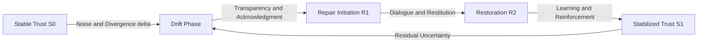

# 🔄 Social Drift & Repair Guide — Phase Loop Dynamics (v1.0)

> “Trust is not static equilibrium but a dynamic oscillation between drift and repair.”  
> — *Adapted from Lewicki & Bunker, 1996; Luhmann, 1984*

---

## 1. Purpose and Context

The **Drift–Repair Loop (𝓛₂)** within *Phase Loop Dynamics (PLD)* models the cyclic behavior of **trust erosion and recovery** within social systems.  
It reframes “miscommunication” and “restoration” as measurable, recursive feedback processes.

- **Goal:** Translate cognitive *repair loops* into *trust-repair cycles*.  
- **Scope:** Organizational coordination, community resilience, and online collaboration.  
- **Orientation:** Mesoscopic view — between micro-interaction and macro-structure.

---

## 2. Theoretical Foundations

| Theory | Core Principle | Relevance to PLD Drift–Repair |
|--------|----------------|-------------------------------|
| **Luhmann (1984)** | Communication generates both meaning and noise; trust stabilizes complexity. | Drift = increase in communicative noise; Repair = re-stabilization of meaning. |
| **Lewicki & Bunker (1996)** | Trust evolves through stages and is periodically repaired after violation. | PLD Repair loops model the iterative reinforcement of trust after erosion. |
| **Coleman (1990)** | Social capital depends on reliability and closure of social expectations. | Repair reconstitutes closure, allowing collective re-coordination. |
| **Barabási (2002)** | Network hubs stabilize flow but can fail under overload. | Drift may emerge when high-degree nodes lose local trust connectivity. |

---

## 3. PLD Operator Mapping — From Syntax to Social Process

| PLD Operator | Social Equivalent | Description |
|---------------|-------------------|--------------|
| **𝓛₂ (Drift–Repair)** | Trust degradation and restoration loop | Cyclic transition between disalignment and re-coherence. |
| **𝓓 (Drift Operator)** | Trust erosion rate (δ) | Quantifies deviation from stable expectation alignment. |
| **ℛ (Repair Operator)** | Trust reinforcement or reconciliation function | Reintegrates communication after breakdown. |
| **t(ℛ)** | Repair duration | Time required to return to baseline trust. |
| **S** | Stability coefficient | Degree of system resilience after repair. |

Mathematically:

$$
S = 1 - \frac{\delta}{t(ℛ)} \quad \text{where} \quad 0 < S \le 1
$$

High $S$ implies robust recovery and low sensitivity to drift.

---

## 4. Drift–Repair Cycle Model

> Each cycle closes via feedback, strengthening the network’s adaptive capacity.

---

## 5. Analytical Framework

| Variable | Definition | Typical Measurement |
|-----------|-------------|---------------------|
| **δ (drift rate)** | Rate of trust erosion per unit time | Sentiment decline, rumor spread velocity |
| **t(ℛ)** | Repair duration | Days/weeks to recover confidence score |
| **ρ (synchronization)** | Re-alignment across actor network | Cross-correlation of cooperation frequency |
| **Δt₍L₃₎ (latency)** | Delay before initiating repair | Mean time to acknowledgment |
| **S (stability)** | Residual trust level post-repair | Ratio of post/pre cooperation strength |

---

## 6. Empirical Contexts

### a. Organizational Coordination
- **Drift:** Strategic ambiguity reduces trust among departments.  
- **Repair:** Transparent goal redefinition and shared metrics restore coherence.  
- **Outcome:** Increased information flow, improved synchronization (ρ↑).

### b. Community Governance
- **Drift:** Norm violation erodes perceived fairness.  
- **Repair:** Public deliberation or ritual acknowledgment reinstates legitimacy.  
- **Outcome:** Stabilized participation and reduced latency (Δt₍L₃₎↓).

### c. Online Collaboration
- **Drift:** Misinformation triggers fragmentation in online groups.  
- **Repair:** Collective correction through peer moderation re-establishes alignment.  
- **Outcome:** Emergent trust clusters with higher S-index stability.

---

## 7. Quantitative Illustration

Drift–Repair can be expressed as a damped oscillation model:

$$
T(t) = T_0 e^{-\delta t} + (1 - e^{-t/t(ℛ)})T_{repair}
$$

where:  
- $T(t)$ = trust level at time *t*  
- $T_0$ = baseline trust before drift  
- $T_{repair}$ = asymptotic trust after repair  

**Simulation Insight:** sustained minor drifts with short repair times increase system adaptability.

---

## 8. Meta-Cognitive Checkpoints

- Can social “trust repair” be modeled as a **Markov transition** between {aligned, drifted, repaired} states?  
- How does *repair latency* (Δt₍L₃₎) relate to social resilience (S)?  
- Could network clustering coefficient (C) predict drift propagation velocity (δ)?  
- Is repair frequency a better predictor of long-term coherence than repair magnitude?

---

## 9. Reading Path

1. Begin here to understand the **Drift–Repair cycle** in social translation of PLD.  
2. Continue with `trust_resonance_patterns.md` to explore emergent synchronization post-repair.  
3. Complete with `measurement_framework.md` to quantify δ, ρ, and S empirically.

---

## 📘 Citation

**Social Drift & Repair Guide — PLD Translation for Social Systems (v1.0)**  
_Phase Drift · DeepZenSpace Translation Ecology (2025)_

> “Repair is not the opposite of drift — it is the memory that prevents forgetting.”
