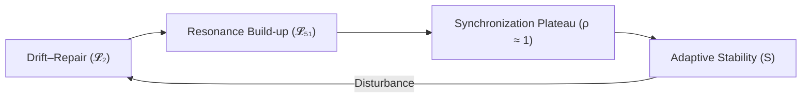

# 🌐 Trust Resonance Patterns — Phase Loop Dynamics (v1.0)

> “Synchronization is not imitation; it is a convergence of expectations.”  
> — *Adapted from Strogatz (2003), Luhmann (1984)*

---

## 1. Concept Overview

In **Phase Loop Dynamics (PLD)**, the **Alignment–Resonance Loop (𝓛₅)** captures how **collective trust** and **social coherence** emerge through recurrent synchronization.  
This section reinterprets *resonance* as the **temporal coupling of expectations** across individuals or subsystems within a network.

Resonance thus functions as:
- The **closure of communication cycles** (Luhmann)  
- The **phase synchronization** among actors (Strogatz)  
- The **stabilization of hub dynamics** (Barabási)

It is the *social echo* that transforms drifted signals into collective rhythm.

---

## 2. Theoretical Anchors

| Theory | Concept | PLD Resonance Interpretation |
|--------|----------|-------------------------------|
| **Strogatz (2003)** | Coupled oscillators, phase-locking | Synchronization of communicative intentions across agents |
| **Barabási (2002)** | Network cascades, emergent hubs | Trust cascades forming resonance clusters |
| **Luhmann (1984)** | Autopoietic communication | Recursive trust reproduction through expectation resonance |
| **Lewicki & Bunker (1996)** | Trust stages | Resonance = mutual reinforcement beyond episodic repair |

---

## 3. Resonance Dynamics in Social Systems

Resonance emerges when distributed agents **align temporally** and **normatively** — not by identical behavior, but by *predictable variance* within a shared phase window.

### Key Mechanisms:
- **Phase Coupling (φ₁ ↔ φ₂):** Mutual adjustment of communicative tempo.  
- **Latency Compensation (Δt₍L₃₎):** Social buffering allowing re-entry after delay.  
- **Feedback Reinforcement:** Repetition and mirroring stabilize mutual trust.  
- **Resonant Closure:** The completion of a cycle where expectations and responses converge.

### Equation (Conceptual Form)
\[
ρ(t) = 1 - e^{-\frac{Δφ}{σ_t}} \quad \text{where} \quad ρ(t) ∈ [0,1]
\]
- \(ρ(t)\): coherence coefficient (network synchronization)  
- \(Δφ\): phase lag between actors  
- \(σ_t\): temporal tolerance parameter  

High \(ρ\) implies strong resonance and systemic coherence.

---

## 4. PLD Operator Mapping

| PLD Operator | Social Process | Description |
|---------------|----------------|--------------|
| **𝓛₅ (Alignment–Resonance Loop)** | Collective synchronization | Closure and re-entry of mutual expectations |
| **Δφ** | Phase lag | Delay in mutual understanding or coordination |
| **ρ** | Coherence coefficient | Synchronization strength across network |
| **Δt₍L₃₎** | Normative latency | Permissible social hesitation |
| **S** | Stability of resonance | Sustainability of synchronized state |

Resonance acts as the **completion loop** of the trust-repair cycle (𝓛₂), transforming repaired relations into *self-sustaining communication flows*.

---

## 5. Empirical Scenarios

### a. Organizational Synchronization
- **Context:** Distributed teams coordinating asynchronously.  
- **Resonance Trigger:** Shared rhythm of reporting cycles or agile stand-ups.  
- **Outcome:** Reduced coordination lag (Δφ↓), increased stability (S↑).

### b. Networked Communities
- **Context:** Online groups stabilizing after misinformation cascades.  
- **Resonance Trigger:** Collective tagging, co-validation rituals, or hashtag convergence.  
- **Outcome:** Spontaneous emergence of trust clusters (ρ↑).

### c. Inter-Organizational Coalitions
- **Context:** Alliances aligning policy or research timelines.  
- **Resonance Trigger:** Periodic cross-institutional workshops creating phase-lock.  
- **Outcome:** Enhanced coordination resilience (S≈1).

---

## 6. Visualization

> Resonance stabilizes when trust feedback enters self-sustaining oscillation within bounded latency.

---

## 7. Quantitative Interpretation

The **resonance half-life** can be modeled as exponential decay of coherence under perturbation:

\[
ρ(t+Δt) = ρ(t) e^{-Δt / τ_{res}}
\]

where \(τ_{res}\) is the *resonance persistence constant*, determined empirically by interaction rhythm.  
Higher \(τ_{res}\) values imply resilient synchronization under environmental drift.

---

## 8. Cross-Domain Mapping

| Domain | Observable Form | Resonance Expression |
|---------|----------------|----------------------|
| **Trust Networks** | Mutual endorsement frequency | Temporal coupling of reliability signals |
| **Collaborative Workflows** | Rhythmic task handoffs | Phase-locking of production cycles |
| **Online Discourse** | Trending convergence | Synchronization of communicative attention |
| **Civic Coordination** | Collective norm reinforcement | Feedback-based coherence |

---

## 9. Meta-Cognitive Checkpoints

- How does **resonance** differ from **repair** in stabilizing trust cycles?  
- Can synchronization (ρ) be empirically approximated via temporal co-posting or joint action frequency?  
- What thresholds of phase lag (Δφ) indicate collapse vs. tolerance in cooperative systems?  
- Does resonance require explicit coordination, or can it emerge from self-organized timing?

---

## 10. Reading Path

1. If unfamiliar with drift–repair, review `social_drift_repair_guide.md`.  
2. Continue with `measurement_framework.md` for methods to quantify ρ and τ₍res₎.  
3. This section is central for **translating PLD resonance into network-level trust models**.

---

## 📘 Citation

**Trust Resonance Patterns — PLD Translation for Social Systems (v1.0)**  
_Phase Drift · DeepZenSpace Translation Ecology (2025)_

> “Resonance is the memory of synchronization — a rhythm that remembers itself.”
