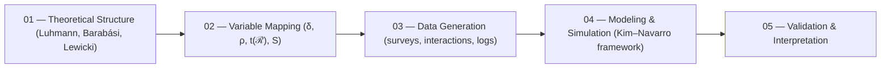

# 🧩 PLD Implementation Overview — From Theory to Social Data Pipeline (v1.0)

> “The challenge is not translating theory into numbers, but ensuring the numbers still speak theory.”  
> — *Prof. Elena Morales & Dr. Aaron Kim, 2025*

---

## 1. Purpose and Context

This document outlines the **Phase Loop Dynamics (PLD) Implementation Pipeline** for social systems research.  
It serves as the **entry point** connecting the theoretical structure (autopoiesis, synchronization, trust repair)  
to empirical computation (network data, simulation, and validation metrics).

**Objective:**  
Operationalize PLD’s core variables — *δ (drift), t(ℛ) (repair latency), ρ (synchronization), S (stability)* —  
as measurable, model-ready indicators in computational social science.

---

## 2. Pipeline Overview


Each step bridges abstract social feedback cycles with observable, quantifiable behavior.

---

## 3. Dual-Layer Orientation

| Layer | Lead Persona | Objective | Data Focus |
|--------|--------------|------------|-------------|
| **Theoretical Layer** | Prof. Elena Morales | Maintain conceptual fidelity with autopoiesis and trust systems theory | Model invariance, meaning-closure consistency |
| **Computational Layer** | Dr. Aaron Kim | Build measurable and reproducible analytical structures | Network metrics, time-series indicators |

The collaboration between theory (*Luhmannian autopoiesis*) and data (*network synchronization*) ensures  
that measurement remains semantically grounded — not just statistically valid.

---

## 4. PLD Variable Operationalization

| Symbol | Name | Social Interpretation | Empirical Variable | Typical Data Source |
|---------|------|------------------------|--------------------|---------------------|
| **δ** | Trust Drift | Degradation of mutual expectation | trust_drift_rate | Sentiment / interaction decay |
| **t(ℛ)** | Repair Latency | Delay in re-coordination | repair_latency | Recovery duration logs |
| **ρ** | Synchronization Index | Degree of shared phase alignment | sync_index | Cross-correlation / phase coupling |
| **S** | Stability | Post-repair resilience | stability_index | Cooperation retention |
| **C** | Network Closure | Trust density in clusters | network_closure | Clustering coefficient |

Each variable is mapped to both a theoretical construct and a computational observable.

---

## 5. Data Flow Architecture

```mermaid
graph TD
  subgraph Theory_Domain
    T1[Luhmannian Feedback Cycles]
    T2[Trust Repair Models]
  end
  subgraph Data_Domain
    D1[Interaction Logs]
    D2[Survey Panels]
    D3[Online Network Graphs]
  end
  subgraph Modeling_Layer
    M1[Drift Rate Estimation (δ)]
    M2[Repair Latency Regression (t(ℛ))]
    M3[Kuramoto Simulation (ρ)]
  end
  subgraph Validation_Layer
    V1[Cross-Case Calibration]
    V2[Stability Metrics (S)]
  end

  T1 --> M1
  T2 --> M2
  D1 --> M1
  D2 --> M2
  D3 --> M3
  M1 --> V1
  M2 --> V1
  M3 --> V2
```
**Theory informs modeling structure**, while **data constrains interpretability** —  
forming a *closed analytical feedback loop.*

---

## 6. Analytical Focus Areas

### a. Drift Detection
Regression-based estimation of δ using sentiment decay and interaction entropy.  
Drift triggers modeled as communication phase discontinuities.

### b. Repair Latency Modeling
Estimation of t(ℛ) from observed re-alignment or re-engagement timestamps.  
Predictive variable: organizational transparency, community responsiveness.

### c. Synchronization & Resonance
Kuramoto-type coupling model approximating ρ between agents’ behavioral phase states.  
Resonance = sustained phase coherence across interaction nodes.

### d. Stability Estimation
Ratio of pre/post coordination strength → S-index.  
Higher S indicates adaptive social recovery.

---

## 7. Validation Logic

| Dimension | Validation Method | Target Variable |
|------------|-------------------|-----------------|
| **Temporal** | Autocorrelation analysis | δ, t(ℛ) |
| **Structural** | Network motif preservation | ρ, C |
| **Statistical** | Cross-validation (time-split) | δ, S |
| **Semantic** | Theoretical alignment review | all |

Validation is **twofold:** quantitative coherence (*statistical*)  
and semantic coherence (*theoretical preservation*).

---

## 8. Meta Integration — The PLD Implementation Stack

| Layer | Module | Description |
|--------|---------|-------------|
| **Theory (01)** | `translation_pld_theory/` | Conceptual model of loops and phases |
| **Bridge (02)** | `translation_pld_bridge_social/` | Mapping and alignment logic |
| **Implementation (03)** | `translation_pld_implementation_social/` | Operational measurement and analytics |
| **Data Outputs** | `.jsonl`, `.csv`, `.md` | Trust drift and synchronization logs |

This folder (“Implementation”) represents **Layer 03** —  
where symbolic dynamics become computationally traceable cycles.

---

## 9. Meta-Cognitive Checkpoints

- Does each variable retain its social meaning when translated to numerical form?  
- Are we validating both temporal rhythm and normative coherence?  
- Could synchronization (ρ) be misinterpreted as agreement rather than timing alignment?  
- How can repair latency (t(ℛ)) be distinguished from organizational inertia?  

> Pause here — ensure theory and computation are still in dialogue, not in divergence.

---

## 10. Reading Path and Next Steps

| Step | File | Focus |
|------|------|--------|
| 1️⃣ | `01_trust_drift_metrics.md` | Quantifying trust decay (δ) |
| 2️⃣ | `02_repair_latency_model.md` | Modeling repair latency (t(ℛ)) |
| 3️⃣ | `03_resonance_network_simulation.md` | Network synchronization (ρ) |
| 4️⃣ | `04_case_studies_social_systems.md` | Real-world applications |
| 5️⃣ | `05_appendix_data_schema.md` | Schema and metrics definitions |

Begin with **drift detection** — the smallest unit of instability —  
and end with **schema** — the most stable frame of translation.

---

## 📘 Citation

**PLD Implementation Overview: Social System Translation (v1.0)**  
_Dr. Aaron Kim & Prof. Elena Morales, 2025 — DeepZenSpace Translation Ecology_  
<https://github.com/kiyoshisasano-DeepZenSpace>

> “Computation without reflection is drift; reflection without data is silence.”
