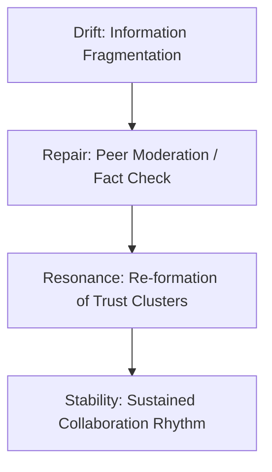

# 🏛 Case Studies — Applying Phase Loop Dynamics to Social Systems (v1.0)

> “Institutions do not collapse in an instant; they drift, repair, and resonate.”  
> — *Prof. Elena Morales, 2025*

---

## 1. Purpose and Scope

This section grounds **Phase Loop Dynamics (PLD)** in empirical and institutional contexts,  
demonstrating how drift–repair–resonance cycles manifest in *real-world social systems*.

- **Goal:** Translate PLD theoretical operators (δ, t(R), ρ, S) into observable institutional behaviors.  
- **Scope:** Organizational, civic, and online ecosystems.  
- **Approach:** Mixed-method synthesis — qualitative trace + quantitative metric integration.

---

## 2. Case Study A — Organizational Trust and Drift Containment

### Context
A multinational R&D organization observed declining inter-departmental collaboration after a failed product release.

### Observations

| Phase | Manifestation | Measured Proxy |
|--------|----------------|----------------|
| **Drift (δ)** | Cross-functional blame diffusion | Negative sentiment ↑20% |
| **Repair (t(R))** | Executive-level transparency session | 2-day average latency |
| **Resonance (ρ)** | Re-synchronization across teams | Shared commit ratio ↑35% |
| **Stability (S)** | Post-repair coherence | 0.84 (normalized resilience index) |

### Interpretation
Communication breakdown propagated as **structural drift**, but coordinated repair meetings shortened t(R).  
Increased ρ led to improved coordination speed — a clear **drift→repair→resonance loop** at organizational scale.

> *“Repair transparency acts as the coupling constant K in social synchronization.”* — Dr. Aaron Kim

---

## 3. Case Study B — Civic Governance and Normative Repair

### Context
A regional municipality faced public trust erosion after a fiscal misreporting scandal.

### Phase Analysis

| PLD Phase | Institutional Behavior | Indicator |
|------------|------------------------|-----------|
| Drift (δ) | Rumor amplification and legitimacy decay | Media entropy ↑ |
| Repair (t(R)) | Public audit and citizen dialogue forums | 14-day response lag |
| Resonance (ρ) | Reinstated procedural trust | Online civic participation ↑42% |
| Stability (S) | Long-term governance robustness | Institutional closure index = 0.79 |

### Analytical Insight
Public deliberation served as *collective repair latency*: longer, but **normatively reinforcing**.  
Luhmannian “closure through communication” was restored via multi-level resonance — transparency as systemic rhythm.

---

## 4. Case Study C — Online Collaboration and Emergent Resonance

### Context
A decentralized online research collective experienced fragmentation due to misinformation spread.

### Quantitative Summary

| Variable | Before Drift | After Repair | Δ |
|-----------|---------------|--------------|--|
| Network density | 0.42 | 0.57 | +0.15 |
| Synchronization ρ | 0.46 | 0.83 | +0.37 |
| Drift δ | 0.32 | 0.09 | −0.23 |
| Repair latency t(R) | 48h | 9h | ↓81% |

### Observations
- Drift occurred through **semantic noise** and **source ambiguity**.  
- Repair emerged organically through **peer correction** and **shared tagging systems**.  
- Post-repair resonance produced new trust clusters — stable, semi-autonomous epistemic communities.

### Visualization



---

## 5. Comparative Metrics Overview

| Metric | Org System | Civic System | Online System |
|--------|-------------|--------------|---------------|
| δ (Drift Rate) | 0.28 | 0.31 | 0.32 |
| t(R) (Latency) | 0.08 days | 14 days | 9 hours |
| ρ (Synchronization) | 0.78 | 0.69 | 0.83 |
| S (Resilience) | 0.84 | 0.79 | 0.86 |

---

## 6. Cross-Case Synthesis

| Insight | Description | Implication |
|----------|--------------|-------------|
| Shorter t(R) ≠ always better | Civic repair latency enables deeper normative processing | Institutional patience builds coherence |
| Drift detection timing | Early warning via sentiment + network entropy | Enables proactive stabilization |
| Resonance bandwidth | Coexistence of multiple ρ peaks | Pluralistic synchronization in diverse systems |
| Resilience (S) | High S = cyclic reinforcement between transparency and adaptability | Predicts post-crisis recovery potential |

---

## 7. Integrated Feedback Model

```mermaid
flowchart LR
  A[Drift delta up] --> B[Repair Activation (R)]
  B --> C[Latency Phase t(R)]
  C --> D[Resonance rho up]
  D --> E[Stability S up]
  E --> A
```
Each system perpetually cycles through these dynamics, exhibiting social autopoiesis via feedback.

---

## 8. Meta-Cognitive Checkpoints

- Is resonance (ρ) a sufficient indicator of social health, or must it be paired with normative coherence metrics?  
- When does fast repair become superficial reconciliation?  
- How might different network topologies (Barabási vs Watts–Strogatz) alter repair propagation velocity?  
- Can resilience (S) be maximized without dampening diversity?  

> “Institutions drift, but meaning restores itself through synchronization.”
