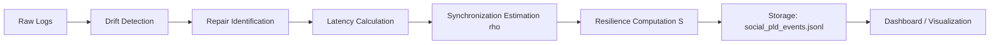

# 🧾 Appendix — Data Schema & Metric Specification for Social PLD (v1.0)
## 1. Purpose

This appendix defines the **data schema**, **logging fields**, and **metric mappings** used in the  
*translation_pld_implementation_social* framework.  
It serves as the canonical format for empirical modeling of trust, synchronization, and social repair.

---

## 2. Entity Overview

| Entity | Description | Typical Source |
|---------|--------------|----------------|
| **Event** | Atomic social interaction (message, post, meeting, citation) | Communication logs, transcripts |
| **Drift Episode** | Detected disalignment (semantic or relational) | Sentiment or network entropy change |
| **Repair Action** | Initiated restoration behavior | Acknowledgment, apology, or correction event |
| **Resonance Cycle** | Emergent synchronization pattern | Network clustering / phase alignment |
| **System State** | Aggregate condition (resilience, stability) | Derived time-series indicators |

---

## 3. Core Variable Schema

| Variable | Type | Unit | Description |
|-----------|------|------|-------------|
| `timestamp` | ISO-8601 | seconds | Event time |
| `actor_id` | string | — | Unique ID of participant |
| `interaction_id` | string | — | Thread or session identifier |
| `event_type` | enum | categorical | {drift, repair, resonance, stability} |
| `sentiment_score` | float | −1.0 – 1.0 | Polarity of trust tone |
| `entropy_score` | float | 0.0 – 1.0 | Information uncertainty (drift proxy) |
| `repair_flag` | boolean | — | True if explicit repair signal present |
| `latency_seconds` | float | seconds | Time from drift onset to repair signal |
| `synchrony_index` | float | 0.0 – 1.0 | ρ — network phase alignment |
| `resilience_score` | float | 0.0 – 1.0 | S — post-repair stability measure |

---

## 4. Derived Metrics

### a. Drift Metrics

| Metric | Formula | Interpretation |
|---------|----------|----------------|
| **drift_rate (δ)** | Δentropy / Δt | Rate of uncertainty increase |
| **trust_decline_ratio** | (neg_sentiment / total_msgs) | Communication degradation |
| **entropy_spread** | var(entropy_i) | Structural drift dispersion |

### b. Repair Metrics

| Metric | Formula | Description |
|---------|----------|-------------|
| **repair_latency (t(R))** | t_repair_init − t_drift_onset | Delay before trust restoration |
| **repair_frequency** | count(repair_events) / Δt | Responsiveness per unit time |
| **repair_efficiency** | (ρ_post − ρ_pre) / t(R) | Synchronization speed of repair |

### c. Resonance Metrics

| Metric | Formula | Interpretation |
|---------|----------|----------------|
| **sync_strength (ρ)** | |Σ e^{iθ_j}| / N | Degree of phase alignment |
| **resonance_persistence** | duration(ρ>0.7) / total_time | Sustained coherence window |
| **coupling_density** | ΣKᵢⱼ / N² | Communication connectivity intensity |

### d. Stability Metrics

| Metric | Formula | Meaning |
|---------|----------|---------|
| **resilience_index (S)** | 1 − δ / t(R) | Post-repair adaptive strength |
| **stability_variance** | var(S_t) | Fluctuation of social equilibrium |
| **closure_rate** | completed_loops / total_loops | Autopoietic recovery frequency |

---

## 5. Example JSON Schema

```json
{
  "$schema": "http://json-schema.org/draft-07/schema#",
  "title": "SocialPLD_Event",
  "type": "object",
  "properties": {
    "timestamp": {"type": "string", "format": "date-time"},
    "actor_id": {"type": "string"},
    "event_type": {"type": "string", "enum": ["drift", "repair", "resonance", "stability"]},
    "sentiment_score": {"type": "number"},
    "entropy_score": {"type": "number"},
    "latency_seconds": {"type": "number"},
    "synchrony_index": {"type": "number"},
    "resilience_score": {"type": "number"}
  },
  "required": ["timestamp", "actor_id", "event_type"]
}
```

---

## 6. Data Flow and Pipeline



**Storage Recommendation**  
- Format: JSONL (1 line = 1 event)  
- Encoding: UTF-8  
- Typical volume: 10³–10⁵ events/day  

**Tools**  
- pandas / Dask for preprocessing  
- jsonschema for validation  
- PostHog or Metabase for visualization  

---

## 7. Example Data Snippet

```json
{"timestamp": "2025-03-01T09:15:24Z", "actor_id": "user_034", "event_type": "drift", "entropy_score": 0.72, "sentiment_score": -0.43}
{"timestamp": "2025-03-01T11:25:40Z", "actor_id": "user_034", "event_type": "repair", "latency_seconds": 7800, "synchrony_index": 0.56}
{"timestamp": "2025-03-01T15:45:50Z", "actor_id": "user_034", "event_type": "resonance", "synchrony_index": 0.88, "resilience_score": 0.83}
```

---

## 8. Metric Mapping Table

| PLD Variable | Social Metric | Data Field | Update Function |
|---------------|----------------|--------------|------------------|
| δ | Drift rate | entropy_score | rolling(Δentropy/Δt) |
| t(R) | Repair latency | latency_seconds | drift → repair transition time |
| ρ | Synchronization | synchrony_index | mean(phase coherence) |
| S | Resilience | resilience_score | 1 − δ / t(R) |

---

## 9. Meta-Cognitive Checkpoints

- Can resilience (S) be inferred purely from event-level data, or does it require multi-layer modeling?  
- How should missing repair signals be interpreted — as non-repair or latent repair?  
- What sampling resolution best captures oscillatory social dynamics (hourly vs daily)?  
- Are ρ and S stable across network topologies, or topology-dependent variables?  
