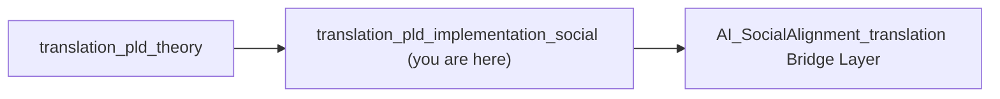

# 🌍 Phase Loop Dynamics — Social Implementation Suite (v1.0)

> “The system does not think, but it remembers how to synchronize.”  
> — *Prof. Elena Morales, 2025*

---

## 1. Purpose and Context

This module — **`translation_pld_implementation_social`** — operationalizes the **Phase Loop Dynamics (PLD)** framework within the empirical study of **social trust, synchronization, and collective resilience**.

It translates abstract loop dynamics (𝓛₁–𝓛₅) into:
- measurable variables (**δ**, **t(ℛ)**, **ρ**, **S**),
- reproducible simulation pipelines, and
- domain-specific case studies.

> **Audience:** Researchers and analysts in social systems theory, network science, and computational sociology.

---

## 2. Folder Structure

```
translation_pld_implementation_social/
├── 00_overview_pipeline.md             ← Overview of data & simulation workflow
├── 01_drift_repair_operator.md         ← Drift–Repair operator mapping (δ, t(ℛ))
├── 02_trust_dynamics_mapping.md        ← Cross-domain trust mechanics (Lewicki, Luhmann)
├── 03_resonance_network_simulation.md  ← Synchronization model (ρ) and network resonance
├── 04_case_studies_social_systems.md   ← Empirical case studies (organization, civic, online)
├── 05_appendix_data_schema.md          ← JSON schema & metric specification for PLD data
└── README_social_implementation.md     ← You are here
```

---

## 3. Conceptual Overview

### a. Core Idea

PLD reframes **social coordination** as a *recursive system of loops*:

| Phase | Description |
|--------|--------------|
| **Drift (δ)** | Erosion of trust or meaning coherence |
| **Repair (t(ℛ))** | Communicative recovery through acknowledgment |
| **Resonance (ρ)** | Re-synchronization of collective rhythm |
| **Stability (S)** | System’s resilience to future perturbation |

---

### b. Mathematical Kernel

$$
S = 1 - rac{δ}{t(ℛ)}, \quad ρ(t) = rac{1}{N} \left| \sum e^{iθ_j(t)} 
ight|
$$

Together, these quantify how social systems **lose and regain coherence**.

---

## 4. Implementation Pipeline

```mermaid
flowchart LR
  A[Raw Interaction Logs] --> B[Drift Detection (δ)]
  B --> C[Repair Event Tracking (t(ℛ))]
  C --> D[Synchronization Modeling (ρ)]
  D --> E[Resilience Scoring (S)]
  E --> F[Visualization & Case Analysis]
```

| Stage | Description | Output |
|--------|--------------|---------|
| 01 | Identify disalignment via sentiment & entropy | δ-series |
| 02 | Detect repair onset and measure delay | t(ℛ) |
| 03 | Simulate synchronization using Kuramoto model | ρ(t) |
| 04 | Compute resilience index and visualize cycles | S |

---

## 5. Theoretical Anchors

| Source | Mechanism | PLD Translation |
|---------|------------|----------------|
| **Luhmann (1984)** | Communication autopoiesis | Drift–repair cycles = communicative closure |
| **Lewicki & Bunker (1996)** | Trust repair stages | Repair operator ℛ = relational reconciliation |
| **Barabási (2002)** | Network topology dynamics | Resonance amplification through hubs |
| **Strogatz (2003)** | Synchronization of oscillators | Phase coherence (ρ) as social order |
| **Coleman (1990)** | Social capital formation | Stability (S) as closure–reliability ratio |

---

## 6. Key Components Summary

| File | Focus | Keywords |
|------|--------|----------|
| `00_overview_pipeline.md` | Pipeline outline | architecture, process flow |
| `01_drift_repair_operator.md` | Trust degradation & recovery | δ, t(ℛ), Lewicki repair cycle |
| `02_trust_dynamics_mapping.md` | Cross-domain mapping | autopoiesis, network cohesion |
| `03_resonance_network_simulation.md` | Synchronization modeling | Kuramoto, ρ(t), coherence |
| `04_case_studies_social_systems.md` | Empirical validation | organization, civic, online |
| `05_appendix_data_schema.md` | Data schema | JSON spec, δ–ρ–S metrics |

---

## 7. Analytical Framework

| Variable | Symbol | Interpretation | Typical Metric |
|-----------|---------|----------------|----------------|
| Drift | δ | Rate of social disalignment | Entropy change |
| Repair Latency | t(ℛ) | Delay to repair onset | Acknowledgment interval |
| Synchronization | ρ | Collective phase coherence | Cross-correlation of actions |
| Stability | S | Post-repair resilience | 1 − δ / t(ℛ) |

Each can be extracted from temporal interaction datasets or network event logs.

---

## 8. Example Research Workflow

1. **Collect data:** message logs, public statements, online comments  
2. **Detect drift:** entropy ↑ or sentiment ↓  
3. **Annotate repair events:** apologies, clarifications, reconciliations  
4. **Model synchronization:** compute ρ(t) via network simulation  
5. **Compute stability index:** S = 1 − δ / t(ℛ)  
6. **Interpret results:** visualize repair cycles and resonance persistence  

---

## 9. Integration with Broader Translation Framework



This folder acts as the **implementation hinge** connecting theoretical PLD constructs  
to real-world social system dynamics.

---

## 10. Meta-Cognitive Checkpoints

- Does **δ** fully capture qualitative “trust drift,” or do we require sentiment–entropy hybrid indices?  
- How does topology (Barabási vs random) alter **critical coupling (Kₐ)**?  
- Can **S** remain high under frequent low-intensity drift cycles?  
- How do **transparency** and **latency** interact as repair moderators?  

---

## 11. Quickstart Summary

| Task | File | Time |
|------|------|------|
| Understand PLD–social mapping | `00_overview_pipeline.md` | 10 min |
| Learn drift–repair dynamics | `01_drift_repair_operator.md` | 20 min |
| Run resonance simulation | `03_resonance_network_simulation.md` | 25 min |
| Review empirical cases | `04_case_studies_social_systems.md` | 30 min |
| Apply data schema | `05_appendix_data_schema.md` | 15 min |

**Total reading + setup time:** ≈100 minutes (*Dr. Kim’s optimized workflow*)

---

> “Implementation is not translation — it’s synchronization with meaning.”  
> — *Kiyoshi Sasano, 2025*
