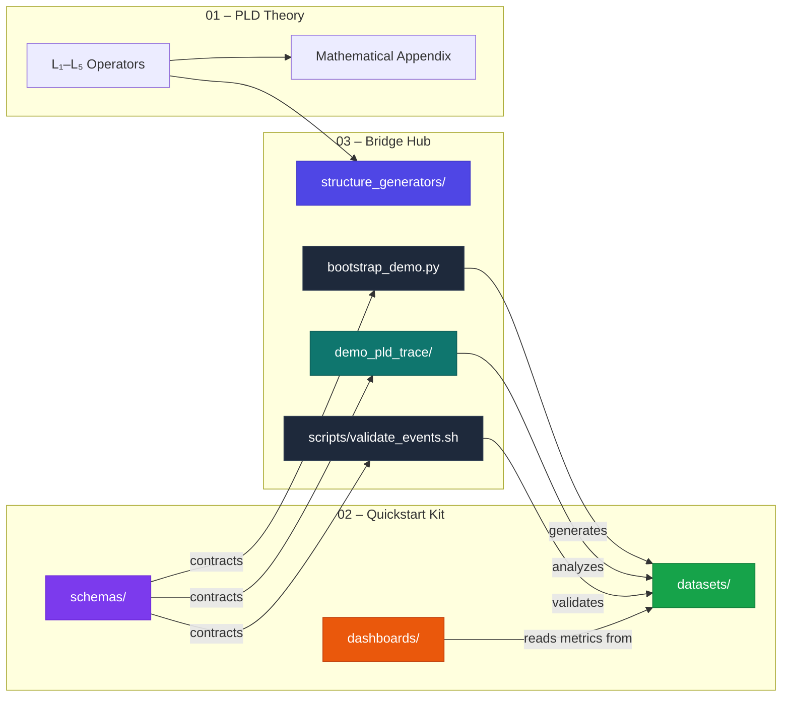
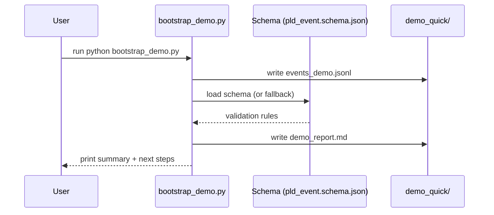
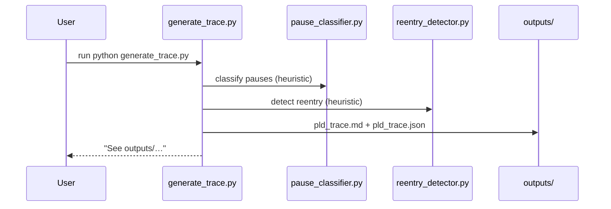
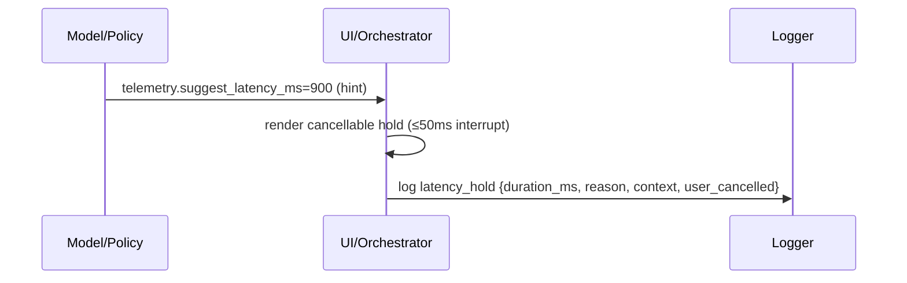

# PLD Bridge Hub — Layer Architecture (HCI Translation)
**Folder:** `06_translation_interface/HCI_translation/hci_translation_pld_bridge_hub/`  
**Version:** 1.0 • Last updated: 2025-10-14  
**License:** CC BY-NC 4.0  
**Maintainers:** PLD–HCI Implementation Working Group

---

## 1) Purpose
This document specifies the **Bridge Hub architecture** in HCI terms. It connects the Phase Loop Dynamics (PLD) theory (operators L₁–L₅) to runnable components that engineers and UX researchers can use immediately. The focus here is on **module boundaries, data contracts, timing responsibilities, and safety**.

**Design goals**
- Single entry for hands-on experiments (`bootstrap_demo.py`)  
- Clean separation between **models (hint)** and **UI/orchestrator (act)** for latency holds  
- Schema-first observability (events → validation → metrics → dashboards)  
- Swappable analyzers (pause / reentry) with heuristic or LLM backends

---

## 2) High-Level Architecture

**Interpretation**
- **Bridge Hub** is the *integration hinge*: it emits demo events, validates them, and ships analyzers that map logs to PLD constructs.
- **Quickstart Kit** provides **authoritative schemas** and **example dashboards**.
- **Theory** informs algorithms and safety envelopes but is not required to run the demos.

---

## 3) Module Responsibilities & Interfaces

### 3.1 `bootstrap_demo.py`
- **Role:** One-command *hello-world* for PLD events.
- **Inputs:** none.
- **Outputs:**  
  - `demo_quick/events_demo.jsonl` — synthetic PLD event stream  
  - `demo_quick/demo_report.md` — counts + demo metrics
- **Contracts:** Validates against `pld_event.schema.json` (falls back to embedded minimal schema with `latency_hold.duration_ms` rule).  
- **Why it matters (HCI):** Guarantees a reproducible *first run* of the PLD pipeline without external data.

### 3.2 `scripts/validate_events.sh`
- **Role:** CLI wrapper to validate any JSONL against the schema.
- **Inputs:** path to events JSONL; optional schema path.
- **Outputs:** stdout summary of validity and event tallies.
- **Contracts:** Prefers repo schema; falls back to embedded minimal schema.
- **HCI Focus:** Fits analyst/ops workflows (batch checks in CI, data quality gates).

### 3.3 `demo_pld_trace/`
- **Role:** Visual analyzer for conversation-like logs.
- **Components:**
  - `generate_trace.py` → reads `input_trace.txt`, tags **pauses**/**reentries**, renders Mermaid graph + tag list
  - `utils/pause_classifier.py` → simplified pause classifier (heuristic)
  - `utils/reentry_detector.py` → simplified reentry detector (heuristic)
- **Outputs:** `outputs/pld_trace.md`, `outputs/pld_trace.json`
- **HCI Focus:** Makes PLD *visible* (temporal structure, reentry anchors).

### 3.4 `structure_generators/`
- **Role:** Reusable building blocks for structure/telemetry.
- **Notable modules:**
  - `latency_tracker.py` → interactive timer; emits CSV + optional `latency_hold` JSONL
  - `pause_classifier_bot.py` → heuristic-first, LLM-optional classification (structured JSON)
  - `reentry_detector.py` → heuristic-first, LLM-optional reentry detector
  - `design_rationale.md` → theory ↔ design decisions

---

## 4) Data Contracts (HCI-Ready)

### 4.1 Core Event (excerpt; see full schema in Quickstart Kit)
```json
{
  "event_type": "latency_hold",
  "timestamp": "2025-10-13T12:00:00Z",
  "session_id": "S-12345",
  "metadata": {
    "duration_ms": 1200,
    "reason": "soft_repair_probe",
    "context": "search_shimmer",
    "user_cancelled": false
  }
}
```
**Rule:** `latency_hold` MUST include `metadata.duration_ms` (≥ 0).

**Other first-class events:** `drift_detected`, `repair_triggered`, `repair_failed`, `reentry_success`, `repair_escalation`, `reentry_anchor_set`, `reentry_missing_anchor`.

### 4.2 Directory-Level Contracts
- **Bridge Hub** writes JSONL to `03_pld-Bridge-Hub/demo_quick/` and `demo_pld_trace/outputs/`.
- **Dashboards** consume from the validated `pld_events` table (or demo JSONL after import).

---

## 5) Sequence Diagrams (Key Flows)

### 5.1 Demo Bootstrap (Generate → Validate → Report)


### 5.2 Trace Analyzer (Tags + Mermaid)


### 5.3 Latency Hold (Hint–Act Split)


---

## 6) Timing & Safety (HCI Envelope)
- **Latency hold bounds:** 600–1500 ms, cancellable within ≤50 ms on any user input.  
- **Repair cap:** max 2 attempts before escalation or handoff.  
- **Resonance entry:** stability window with coherence ρ ≥ 0.85 (configurable).  
- **No chained holds:** avoid consecutive holds without user action in between (≥5 s gap).

**Why this matters:** These limits protect users from over-pacing, repair storms, and deceptive delays.

---

## 7) Configuration Surfaces
| Layer | Knob | Typical Range | Default |
|------|------|----------------|---------|
| Drift detection | `silence_ms` | 8000–12000 | 10000 |
| Latency | `τ_latency_ms` | 600–1500 | 900 |
| Repair | `max_repair_attempts` | 1–3 | 2 |
| Resonance | `ρ_threshold` | 0.75–0.95 | 0.85 |
| Safety | `cooldown_s` | 2–5 | 3 |

Parameters should be **runtime-configurable** (flags, env, remote config) to support A/B tests and accessibility.

---

## 8) Extensibility Points
- **Backends:** swap heuristic analyzers with LLMs by flipping a flag (`--api`) and setting an API key.  
- **Storage:** pipe JSONL to a queue/topic → warehouse table.  
- **Metrics:** plug `reentry_success_dashboard.json` or your own BI tool.  
- **Modes:** pick **Tiers T₀–T₃** (observation → adaptive timing).

---

## 9) Security & Privacy (HCI Compliance)
- **Pseudonymize** `session_id` / `user_id`; avoid PII in metadata.  
- **Separate** PLD telemetry from content logs; enforce retention limits.  
- **Validate** on ingestion; reject events missing required fields (e.g., `duration_ms`).  
- **Respect** reduced-motion and accessibility preferences when rendering holds.

---

## 10) Testing Checklist
- [ ] Validation passes for demo JSONL (0 schema errors).  
- [ ] Latency holds always include `duration_ms`.  
- [ ] Repair caps respected (no infinite loops).  
- [ ] User input cancels holds within ≤50 ms (measured).  
- [ ] Dashboards load demo data and render in <2 s.  
- [ ] Privacy review: no PII in emitted metadata.

---

## 11) Glossary (HCI Lens)
- **Drift** — measurable deviation from expected flow; triggers *repair* or passive observation.  
- **Repair** — clarification or redirection to restore context; soft-first, capped.  
- **Latency Hold (L₃)** — intentional, cancellable delay to shape rhythm; UI responsibility.  
- **Reentry** — user resumes a prior abandoned intent; requires anchor.  
- **Resonance** — stabilized alignment window (tempo coherence), monitored and bounded.

---

> **Takeaway:** The Bridge Hub gives you a safe, schema-enforced, and visible path from **PLD theory → HCI practice**. Start with the demo, inspect the trace, and plug your own telemetry into the same contracts.
