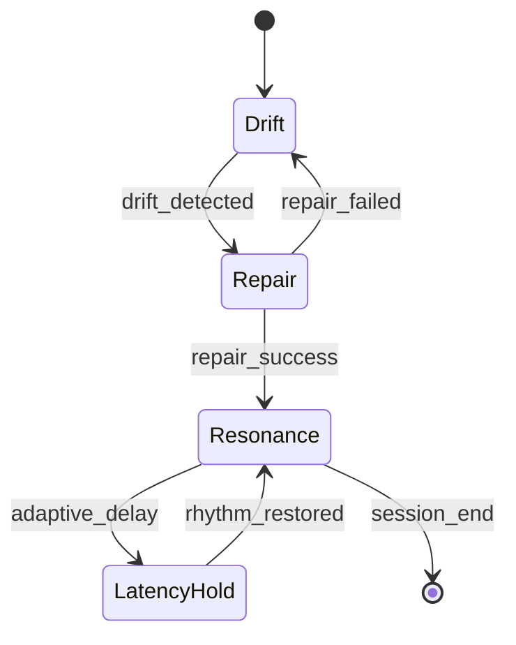
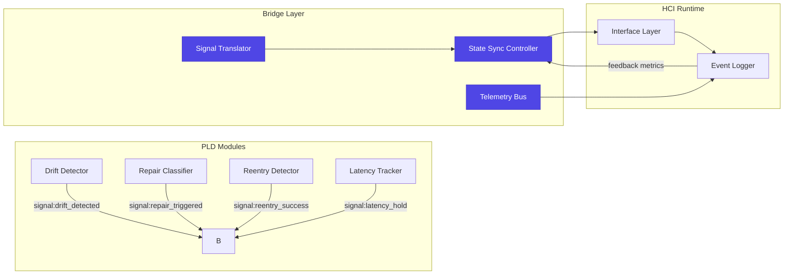
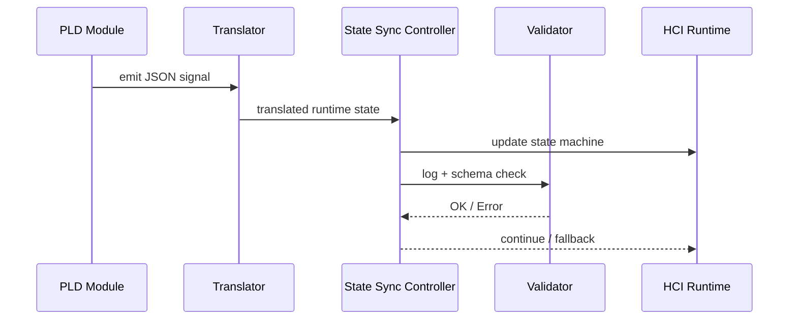

# PLD Bridge Hub — Signal Translation and State Synchronization
**Folder:** `06_translation_interface/HCI_translation/hci_translation_pld_bridge_hub/`  
**Version:** 1.0 • Last updated: 2025-10-14  
**License:** CC BY-NC 4.0  
**Maintainers:** PLD–HCI Integration Working Group

---

## 1) Purpose
This document defines how **PLD phase signals** (Drift, Repair, Resonance, Latency Hold) are translated into **runtime HCI state machines** and synchronized across modules.  
The Bridge Hub functions as an **intermediate state controller**, ensuring continuous alignment between theoretical feedback loops and UI-driven event processes.

---

## 2) Conceptual Mapping — PLD to HCI

| PLD Phase | Signal Type | HCI State Equivalent | Example Runtime Trigger |
|------------|--------------|----------------------|--------------------------|
| **Drift (𝒟)** | Divergence signal | `state: paused` / `intent_lost` | Long silence, broken task chain |
| **Repair (ℛ)** | Recovery signal | `state: corrective_action` | User retry, undo, or clarification |
| **Resonance (𝓛₃)** | Stability signal | `state: synchronized_flow` | Stable rhythm or fluent loop |
| **Latency Hold (𝓡₅)** | Controlled delay | `state: latency_feedback` | Timed wait before response |

**Rule:** Each PLD signal must correspond to one and only one **runtime state** in the HCI model.  
State transitions must be timestamped and observable through the metrics bus.

---

## 3) Core State Machine



**Interpretation:**
- **Drift → Repair** — user disorientation detected; repair phase initiated.  
- **Repair → Resonance** — successful correction restores synchronization.  
- **Resonance → LatencyHold** — temporary delay introduced to maintain rhythm.  
- **LatencyHold → Resonance** — transition back to flow after hold expires.

---

## 4) Translation Interface Specification

### 4.1 Signal Format
```json
{
  "signal_type": "drift_detected|repair_triggered|resonance_stable|latency_hold",
  "timestamp": "ISO8601",
  "session_id": "string",
  "source_module": "pause_classifier|reentry_detector|latency_tracker",
  "metadata": {
    "confidence": 0.92,
    "context": "export_flow",
    "duration_ms": 1200
  }
}
```

### 4.2 Translation Logic
| Incoming Signal | Translated Runtime State | Output Action |
|------------------|--------------------------|----------------|
| `drift_detected` | `state = paused` | Pause interaction, surface hint |
| `repair_triggered` | `state = corrective_action` | Start guided repair sequence |
| `reentry_success` | `state = synchronized_flow` | Resume previous intent thread |
| `latency_hold` | `state = latency_feedback` | Activate cancellable UI wait state |

---

## 5) Synchronization Pipeline



**Operation:**
1. PLD modules emit event signals (JSON-compliant).  
2. **Signal Translator** maps them to runtime HCI states.  
3. **State Sync Controller** updates active interaction models.  
4. **Telemetry Bus** ensures downstream visibility (dashboards, validators).  

---

## 6) Synchronization Rules

| Rule | Description | Enforcement |
|-------|-------------|-------------|
| **One-to-one mapping** | Each PLD event → one HCI state | Bridge Translator schema |
| **Temporal ordering** | Events processed by timestamp | Queue or event bus ordering |
| **Conflict resolution** | Later event with same session_id overwrites previous | State Sync Controller |
| **Resonance persistence** | Maintain stable flow for ≥3 cycles before closing | Feedback loop timer |
| **Error fallback** | If unknown signal, fallback to `paused` state | Default handler |

---

## 7) Example State Sync Log

```json
{
  "session_id": "sess_demo_001",
  "previous_state": "repair",
  "new_state": "resonance",
  "transition_event": "reentry_success",
  "timestamp": "2025-10-14T09:21:43Z",
  "duration_since_last": 2150,
  "latency_ms": 920,
  "operator": "BridgeHub.StateSync"
}
```

**Notes:**
- Every transition is measurable (timestamped).  
- Logs are emitted to the telemetry bus for validation (`pld_state_transitions.jsonl`).

---

## 8) Synchronization Latency Budget
| Process | Max Allowed Latency | Notes |
|----------|--------------------|-------|
| Drift → Repair detection | 250 ms | reaction to hesitation |
| Repair → Resonance | 500 ms | human correction observed |
| LatencyHold → Resonance | 1000 ms | timed delay before release |
| Any state transition log emit | 50 ms | must not block main loop |

**Rationale:** These limits ensure reactive yet fluid HCI adaptation within perceptual thresholds (based on PLD Paper 1 cognitive envelopes).

---

## 9) Failure Handling
- **Unrecognized signal:** Map to `paused`, tag with `"reason":"unknown_signal"`  
- **Missing timestamp:** Inject system timestamp, mark `"metadata.estimated":true`  
- **Out-of-order events:** Use monotonic correction buffer (size ≤10 events)  
- **Schema violation:** Send to quarantine queue, trigger alert via validator  

---

## 10) Telemetry Validation Workflow


---

## 11) Integration Guidelines
- All modules must emit ISO8601 timestamps and unique `session_id`.  
- Synchronization updates are atomic; partial updates are prohibited.  
- UI systems consuming Bridge Hub states must expose local `sync_status` for verification.  
- Telemetry errors must **not** halt runtime; instead, mark degraded mode.  
- Feedback channel must remain open for user-controlled override.  

---

## 12) Summary
The **Signal Translation and State Sync Layer** bridges PLD cognitive loops and HCI runtime systems by enforcing measurable, atomic state transitions.  
It provides deterministic synchronization between cognitive signals and human-facing interfaces — the backbone of adaptive interaction under the PLD model.

