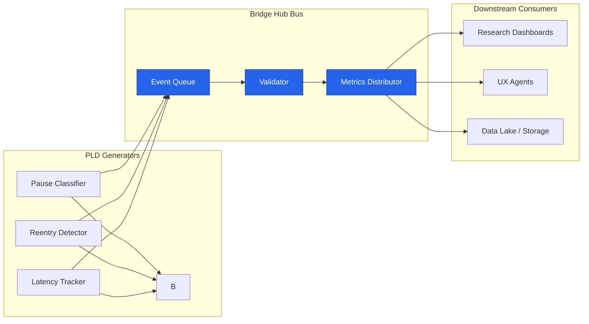
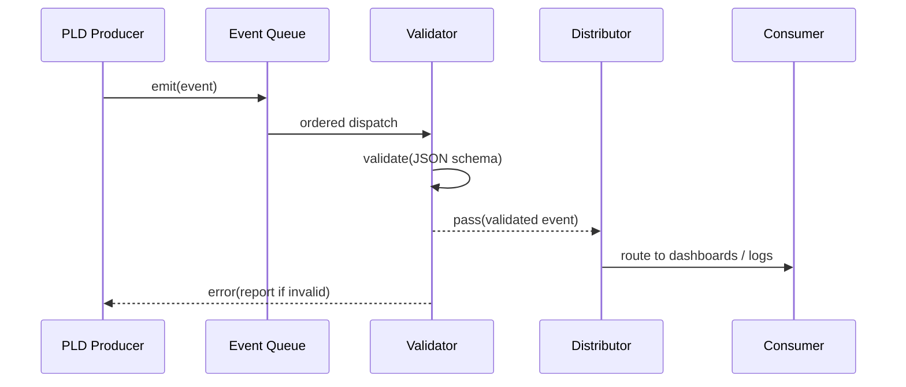

# PLD Bridge Hub — Data and Metrics Bus
**Folder:** `06_translation_interface/HCI_translation/hci_translation_pld_bridge_hub/`  
**Version:** 1.0 • Last updated: 2025-10-14  
**License:** CC BY-NC 4.0  
**Maintainers:** PLD–HCI Integration Working Group

---

## 1) Purpose
This document describes the **Data and Metrics Bus** within the PLD Bridge Hub translation layer — a unified telemetry and event transport system that synchronizes HCI state updates, PLD events, and analytics pipelines.  
It ensures that all PLD phases and human interaction states are logged, validated, and distributed to visualization, AI agents, or feedback loops in real time.

---

## 2) Design Principles
1. **Universality:** All PLD modules emit events in JSONL format using a common schema.  
2. **Traceability:** Every event must include a timestamp, session ID, and origin tag.  
3. **Scalability:** The bus supports multiple concurrent publishers and subscribers.  
4. **Low Latency:** Mean routing latency must remain below 100 ms.  
5. **Transparency:** Logs are human-readable and machine-validated.  

---

## 3) System Overview



**Operation Summary:**
- **Producers** emit PLD phase events.  
- **Event Queue** buffers and orders events by timestamp.  
- **Validator** checks JSON schema compliance.  
- **Metrics Distributor** routes clean data to connected consumers (dashboards, models).  

---

## 4) Event Structure

```json
{
  "event_type": "latency_hold",
  "timestamp": "2025-10-14T09:32:44Z",
  "session_id": "sess_local_001",
  "origin": "latency_tracker",
  "metadata": {
    "duration_ms": 1100,
    "reason": "soft_repair_probe",
    "context": "latency_tracker",
    "user_cancelled": false
  }
}
```

Each event is atomic, timestamped, and guaranteed to be processable independently.

---

## 5) Internal Bus Layers

| Layer | Function | Technology / Concept | Typical Latency |
|--------|-----------|----------------------|-----------------|
| **Producer Layer** | Emits raw PLD JSON events | Python module (async write) | < 10 ms |
| **Queue Layer** | Buffers and orders by time | Local in-memory queue or Kafka bridge | < 20 ms |
| **Validation Layer** | Applies JSON schema | `jsonschema` + custom fastpath | < 5 ms |
| **Metrics Layer** | Derives stats (avg latency, repair ratio) | Python / pandas / DuckDB | < 50 ms |
| **Distributor Layer** | Routes to endpoints (file, socket, UI) | WebSocket / REST / CSV append | < 15 ms |

Total end-to-end latency target: **≤ 100 ms**.

---

## 6) Bus Topics and Routing Keys

| Topic | Description | Publisher | Consumer |
|--------|--------------|------------|-----------|
| `pld.pause` | Pause detection events | Pause Classifier | UX Agents, Dashboards |
| `pld.repair` | Repair phase transitions | Pause Classifier | Feedback Engine |
| `pld.reentry` | Reentry detection | Reentry Detector | UX Memory Modules |
| `pld.latency` | Latency hold or wait events | Latency Tracker | Performance Monitor |
| `pld.sync` | HCI synchronization signals | Bridge StateSync | All consumers |
| `pld.errors` | Validation or schema failures | Validator | System Monitor |

Routing is typically implemented via pub/sub with JSONL streams or WebSocket messages.

---

## 7) Metrics Output Schema

```json
{
  "timestamp": "2025-10-14T09:33:11Z",
  "session_id": "sess_local_001",
  "metrics": {
    "avg_latency_ms": 742,
    "pause_count": 3,
    "repair_rate": 0.67,
    "reentry_success_rate": 0.75
  },
  "window": "last_60s"
}
```

The metrics payload aggregates temporal windows for live dashboards and is regenerated every 30 s by the Metrics Distributor.

---

## 8) Real-Time Monitoring CLI

### Example Command
```bash
python monitor_metrics.py --watch events_latency.jsonl
```

### Example Output
```
[stats 2025-10-14T09:35Z]
  total events: 42
  latency_hold: 10 (avg 890 ms)
  reentry_success: 8
  repair_triggered: 15
  pause_drift: 9
  validation_errors: 0
```

---

## 9) Validation Pipeline



---

## 10) Failure Handling and Recovery

| Failure | Detection | Recovery Action |
|----------|------------|-----------------|
| Schema validation error | JSON parsing exception | Log to `pld.errors` topic, skip |
| Queue overflow | Event backlog threshold | Drop oldest events (soft) |
| Bus disconnection | Connection heartbeat fail | Retry with exponential backoff |
| Latency > 100 ms | Internal monitor | Emit `performance_warning` event |
| Missing session_id | Schema validator | Inject temporary ID with warning |

---

## 11) Integration Example

```python
from pld_bridge.metrics_bus import publish_event

publish_event(
    topic="pld.repair",
    payload={
        "event_type": "repair_triggered",
        "timestamp": "2025-10-14T09:41:00Z",
        "session_id": "sess_demo_002",
        "metadata": {"reason": "retry_button", "context": "toolbar_ui"}
    }
)
```

This call ensures schema compliance and routes data through the Metrics Bus.

---

## 12) Analytics Extensions
- **DuckDB integration** for historical metrics queries.  
- **Grafana dashboards** consuming live metrics stream.  
- **Resonance Index** computation (`repair_rate * reentry_success_rate`).  
- **Drift Heatmaps** over time for session rhythm visualization.  
- **Latency distribution histograms** for UI timing calibration.  

---

## 13) Security and Privacy
- Event logs store **no PII**; only timestamps and anonymized session IDs.  
- All external bus connections require signed WebSocket tokens.  
- Logs older than 7 days must be purged or aggregated.  
- Use AES-256 for data at rest (if bus writes to disk).  

---

## 14) Summary
The **Data and Metrics Bus** forms the connective tissue of the PLD Bridge Hub, providing real-time event distribution and verifiable telemetry.  
It unifies the cognitive phase signals of PLD with the runtime observability of HCI systems — ensuring every pause, repair, and resonance cycle remains measurable, auditable, and adaptive.

