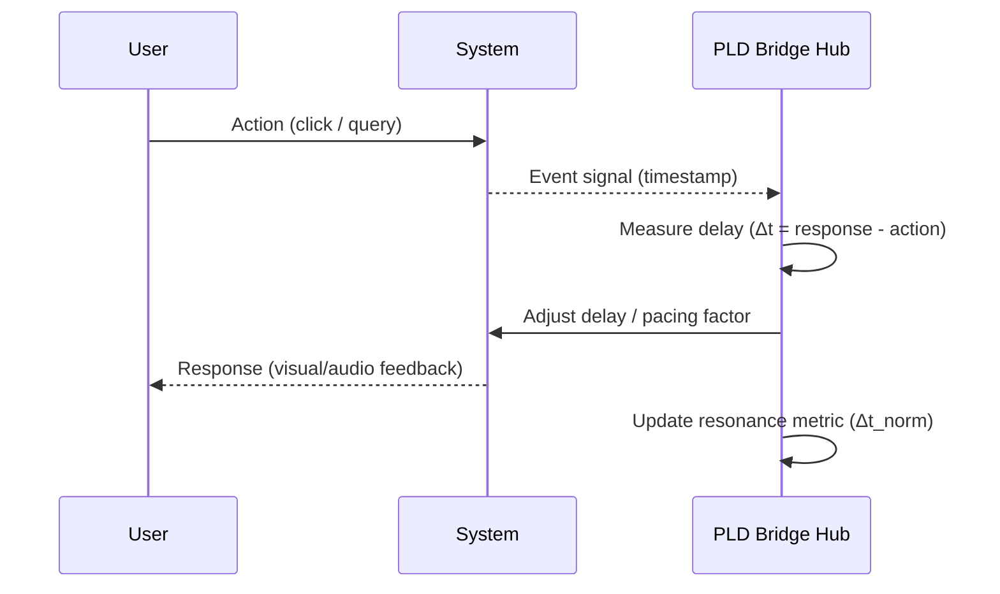
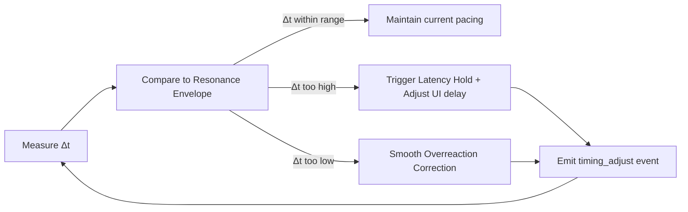
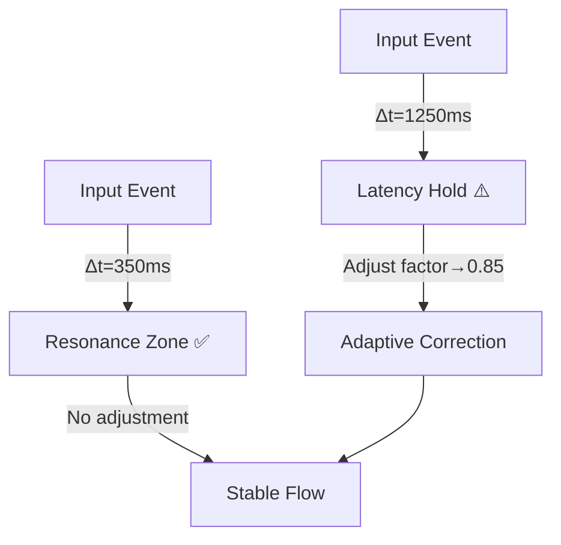

# PLD Bridge Hub — Latency and Adaptive Timing
**Folder:** `06_translation_interface/HCI_translation/hci_translation_pld_bridge_hub/`  
**Version:** 1.0 • Last updated: 2025-10-14  
**License:** CC BY-NC 4.0  
**Maintainers:** PLD–HCI Integration Working Group

---

## 1) Purpose
This document defines how the **PLD Bridge Hub** manages *latency, pacing, and adaptive timing control* within human-computer interaction loops.  
It aligns PLD’s theoretical *Latency Hold* and *Resonance Timing* constructs with measurable HCI timing envelopes, ensuring perceptual smoothness and cognitive synchronization.

---

## 2) Concept Overview

| Concept | Description | HCI Analogue |
|----------|--------------|---------------|
| **Latency Hold** | Intentional or observed pause in flow, often pre-repair or cognitive delay. | Loading animation, spinner |
| **Adaptive Timing** | Dynamic adjustment of UI delay or pacing based on user behavior. | Progressive feedback timing |
| **Resonance Envelope** | Stable rhythm between user input and system response. | Flow or “felt smoothness” |
| **Timing Drift** | Mismatch between expected and actual feedback time. | Lag or over-response |

---

## 3) Timing Model



**Interpretation:** The Bridge Hub continuously measures *response latency (Δt)* and dynamically adjusts pacing rules to maintain *resonance stability*.

---

## 4) Latency Classification Rules

| Rule ID | Condition | Classification | Suggested Response |
|----------|-------------|----------------|--------------------|
| L1 | Δt ≤ 250 ms | Smooth | Immediate feedback |
| L2 | 250 ms < Δt ≤ 800 ms | Acceptable | Subtle shimmer or micro-delay |
| L3 | 800 ms < Δt ≤ 1500 ms | Pause | Show “thinking” indicator |
| L4 | 1500 ms < Δt ≤ 3000 ms | Friction | Progressive animation or user prompt |
| L5 | Δt > 3000 ms | Drift | Offer cancel/retry or repair trigger |

Latency is not purely mechanical — it is **experiential timing**, linked to cognitive loops and expectation management.

---

## 5) Adaptive Timing Algorithm (Simplified)

```python
def adaptive_latency_control(last_latency_ms, user_reaction_ms, target_resonance_ms=600):
    """
    Adjusts pacing factor based on deviation from resonance envelope.
    Returns a multiplier for next-cycle pacing.
    """
    error = last_latency_ms - target_resonance_ms
    correction = error / target_resonance_ms
    factor = 1.0 - (0.2 * correction)
    return max(0.5, min(1.5, factor))  # clamp between half-speed and 1.5x
```

This function tunes UI delay timing dynamically to keep the perceived rhythm near the **resonance envelope**.

---

## 6) Timing Feedback Channels

| Channel | Type | Purpose | Frequency |
|----------|------|----------|-----------|
| `latency_hold` | Event | Record actual delay | On every pause |
| `timing_adjust` | Event | Emit adaptive pacing update | Each correction |
| `resonance_metric` | Derived metric | Quantify rhythm stability | Every 60 s |
| `performance_warning` | Alert | Drift threshold exceeded | As needed |

---

## 7) Resonance Metric Formula

```text
resonance_index = 1 - abs(Δt_avg - Δt_target) / Δt_target
```

Where:  
- Δt_avg = average response delay over window  
- Δt_target = target resonance envelope (typically 600 ms)  

Values closer to 1.0 indicate stable rhythmic alignment between human and system.

---

## 8) Practical HCI Guidelines

| Timing Context | Recommended Envelope | PLD Event | UI Example |
|----------------|----------------------|------------|-------------|
| Button click → response | 100 – 300 ms | Smooth | Visual confirmation or ripple |
| Menu open → option select | 300 – 700 ms | Cognitive pause | Highlight or animation |
| Command execution | 700 – 1200 ms | Latency hold | Loading shimmer |
| Long-running process | 1200 – 2500 ms | Friction drift | Progress bar with cancel |
| Repair or retry loop | Variable | Adaptive pacing | “Try again” or micro-delay |

---

## 9) Adaptive Loop with Feedback



The loop continuously rebalances latency and feedback cadence to prevent both overload and under-response conditions.

---

## 10) Sample Event Log (Adaptive Timing)

```json
{
  "event_type": "timing_adjust",
  "timestamp": "2025-10-14T10:05:21Z",
  "session_id": "sess_local_007",
  "metadata": {
    "previous_latency_ms": 940,
    "adjusted_factor": 0.87,
    "reason": "adaptive_resonance_correction"
  }
}
```

This event documents each dynamic adjustment for analysis in dashboards or model retraining.

---

## 11) System Constraints

| Component | Time Budget | Notes |
|------------|--------------|-------|
| Measurement Accuracy | ± 10 ms | Required precision for reliable adaptation |
| Adjustment Frequency | ≤ 5 Hz | Avoid perceptual flicker |
| UI Response Update | ≤ 100 ms | Perceptual feedback limit |
| Max Correction Magnitude | ± 50% pacing factor | To maintain natural flow |

---

## 12) Human-Centered Constraints

- Keep **feedback predictability** higher than raw speed.  
- Avoid oscillating pacing (“rubberband” timing).  
- Align adaptive timing with **cognitive load windows** (typically 400–1200 ms).  
- Preserve **user agency** — adaptive control should be explainable and reversible.  

---

## 13) Visualization Example



---

## 14) Integration Points

| Component | Role | Output |
|------------|------|--------|
| **Latency Tracker** | Measures Δt and emits latency_hold | Raw timing data |
| **Adaptive Controller** | Adjusts pacing factor | timing_adjust event |
| **Metrics Bus** | Aggregates resonance metrics | Live dashboards |
| **Repair Router** | Uses drift to repair | Cross-loop correction |

---

## 15) Summary
The **Latency and Adaptive Timing Layer** establishes the rhythmic foundation for PLD–HCI coherence.  
By continuously measuring, classifying, and adjusting system delays, it transforms mechanical latency into a *cognitively aligned tempo* — sustaining flow, reducing friction, and optimizing resonance between user and machine.

