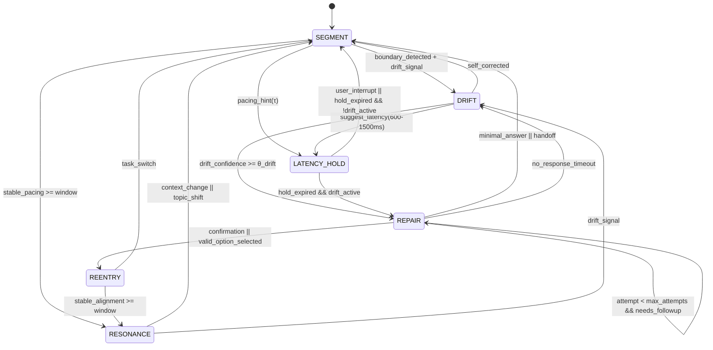

# Temporal State Machine Specification (PLD → HCI)  
**Folder:** `06_translation_interface/HCI_translation/hci_translation_pld_implementation/`  
**Version:** 1.0 • Last updated: 2025-10-13  
**License:** CC BY-NC 4.0  
**Maintainer:** Phase Loop Dynamics Research Group

---

## 1. Purpose

This specification defines the **event-driven temporal state machine** (TSM) for implementing **Phase Loop Dynamics (PLD)** in HCI systems.  
It operationalizes the Drift → Repair → Reentry → Resonance loop with **observable transitions, timing constraints, and telemetry hooks**.

---

## 2. States and Phases

The TSM consists of six explicit states. Each state is **observable**, **interruptible**, and **measurable**.

| State | Code | Description | Primary Goal |
|------|------|-------------|--------------|
| **Segment** | `SEGMENT` | L₁: boundary detection; monitors for phase starts/ends (syntax/timing/prosody) | Detect transition opportunities |
| **Drift** | `DRIFT` | L₂: misalignment detected (silence/ambiguity/off-path) | Quantify deviation; decide repair |
| **Repair** | `REPAIR` | L₂: soft/hard clarification; capped attempts | Reduce drift; route to reentry or handoff |
| **Latency Hold** | `LATENCY_HOLD` | L₃: intentional pacing delay (τ) rendered by UI | Shape rhythm; avoid abruptness |
| **Reentry** | `REENTRY` | Context relink and resume flow | Restore progress with stable context |
| **Resonance** | `RESONANCE` | L₅: stabilized alignment window | Maintain tempo; monitor for new drift |

> **Responsibility separation:** latency timing is a **UI/Orchestrator** responsibility; LLMs only **suggest** holds (no sleeps).

---

## 3. Transition Diagram



---

## 4. Trigger Conditions (Operational)

| Trigger | Condition (example) | Source | Notes |
|--------|----------------------|--------|------|
| `boundary_detected` | pause > 800ms OR topic shift | L₁ detector | opens transition from `SEGMENT` |
| `drift_signal` | no input 8–12s, intent confidence < 0.5, off-path click | TSM monitor / NLU | enters `DRIFT` |
| `suggest_latency(τ)` | soft repair planned; τ = 600–1500ms | LLM telemetry / policy | leads to `LATENCY_HOLD` |
| `drift_confidence >= θ_drift` | aggregated drift score exceeds threshold | drift model | leads to `REPAIR` |
| `user_interrupt` | keypress/click/speech during hold | UI | exits `LATENCY_HOLD` immediately |
| `confirmation` | user selects option/affirms intent | UI/NLU | leads to `REENTRY` |
| `valid_option_selected` | candidate repair option chosen | UI | leads to `REENTRY` |
| `no_response_timeout` | no reply within repair timeout | timer | fallback to `DRIFT` or `SEGMENT` |
| `stable_alignment >= window` | low drift rate; tempo match persisted | resonance monitor | transitions to/from `RESONANCE` |
| `task_switch` | topic/intent change | UI/NLU | exits `REENTRY` |

---

## 5. Timing & Control Parameters

| Parameter | Default | Range | Scope | Description |
|-----------|---------|-------|-------|-------------|
| `θ_drift` | 0.5 | 0.4–0.6 | NLU | minimum intent confidence to avoid drift |
| `silence_ms` | 10000 | 8000–12000 | I/O | inactivity threshold for drift |
| `τ_latency` | 900 | 600–1500 | UI | pacing hold duration in ms |
| `max_repair_attempts` | 2 | 1–3 | Policy | cap soft repair loops |
| `repair_timeout_ms` | 12000 | 8000–15000 | Timer | wait for user reply during repair |
| `resonance_window_s` | 6 | 4–10 | Monitor | time with stable alignment before `RESONANCE` |
| `sampling_interval_ms` | 16 | 16–50 | Monitor | phase error computation cadence |

> Implementations SHOULD expose these as **runtime-configurable** values with per-user adaptation.

---

## 6. Telemetry & Logging Hooks

All transitions MUST emit structured events conforming to `05_logging_schema_and_contracts.md`.

| Event | When | Required Metadata |
|-------|------|-------------------|
| `drift_detected` | enter `DRIFT` | `session_id`, `ui_state`, `confidence_score`/`drift_type` |
| `latency_hold` | enter `LATENCY_HOLD` | `duration_ms`, `reason`, `context_id` |
| `repair_triggered` | enter `REPAIR` | `strategy (soft|hard)`, `attempt`, `latency_before_repair` |
| `repair_failed` | repair cap reached or timeout | `failed_attempts`, `context_id` |
| `reentry_success` | enter `REENTRY` with valid anchor | `previous_context_id`, `reentry_lag`, `reentry_method` |
| `handoff` (optional) | escalate beyond repair | `target_channel`, `reason` |

**LLM orchestration contract:** models return `telemetry.suggest_latency_ms` ONLY; UI renders the actual delay and logs `latency_hold`.

---

## 7. Interrupt Rules (Non-Blocking Design)

- **User-first priority:** any user input **immediately cancels** `LATENCY_HOLD` and routes to `SEGMENT` or the relevant target state.  
- **Repair is non-modal:** users can navigate away; system must store `prior_context_id` for later `REENTRY`.  
- **Cap loops:** exceed `max_repair_attempts` → emit `repair_failed` and route to **handoff** or minimal answer.  
- **Transparency:** visual indicators (e.g., shimmer/ellipsis) MUST accompany any hold.

---

## 8. Reference Interfaces (Pseudocode)

### 8.1 Event Reducer

```ts
type State = 'SEGMENT'|'DRIFT'|'REPAIR'|'LATENCY_HOLD'|'REENTRY'|'RESONANCE';

interface Context {
  sessionId: string;
  priorContextId?: string;
  repairAttempts: number;
  uiState?: string;
  confidence?: number;
}

function reduce(state: State, event: any, ctx: Context): [State, Context] {
  switch (state) {
    case 'SEGMENT':
      if (event.type === 'DRIFT_SIGNAL') return ['DRIFT', ctx];
      if (event.type === 'PACING_HINT') return ['LATENCY_HOLD', ctx];
      if (event.type === 'STABLE_PACING') return ['RESONANCE', ctx];
      return [state, ctx];

    case 'DRIFT':
      if (event.type === 'SUGGEST_LATENCY') return ['LATENCY_HOLD', ctx];
      if (event.type === 'DRIFT_CONFIRMED') return ['REPAIR', ctx];
      if (event.type === 'SELF_CORRECTED') return ['SEGMENT', ctx];
      return [state, ctx];

    case 'LATENCY_HOLD':
      if (event.type === 'USER_INTERRUPT') return ['SEGMENT', ctx];
      if (event.type === 'HOLD_EXPIRED' && event.payload.driftActive) return ['REPAIR', ctx];
      if (event.type === 'HOLD_EXPIRED') return ['SEGMENT', ctx];
      return [state, ctx];

    case 'REPAIR':
      if (event.type === 'CONFIRM') return ['REENTRY', ctx];
      if (event.type === 'FOLLOWUP' && ctx.repairAttempts < 2)
        return ['REPAIR', { ...ctx, repairAttempts: ctx.repairAttempts + 1 }];
      if (event.type === 'FOLLOWUP') return ['SEGMENT', ctx]; // or HANDOFF
      if (event.type === 'TIMEOUT') return ['DRIFT', ctx];
      return [state, ctx];

    case 'REENTRY':
      if (event.type === 'STABLE_ALIGNMENT') return ['RESONANCE', ctx];
      if (event.type === 'TASK_SWITCH') return ['SEGMENT', ctx];
      return [state, ctx];

    case 'RESONANCE':
      if (event.type === 'TOPIC_SHIFT') return ['SEGMENT', ctx];
      if (event.type === 'DRIFT_SIGNAL') return ['DRIFT', ctx];
      return [state, ctx];
  }
}
```

### 8.2 Latency Responsibility Split

```ts
// LLM returns only *hints*:
{
  "action": "soft_repair",
  "message": "...",
  "telemetry": { "suggest_latency_ms": 900, "reason": "soft_repair_probe" }
}

// UI/Orchestrator renders delay and logs:
if (hint?.suggest_latency_ms) {
  log('latency_hold', { duration_ms: hint.suggest_latency_ms, reason: hint.reason });
  await renderLatencyHold(hint.suggest_latency_ms); // cancellable on user input
}
```

---

## 9. Conformance Tests (Minimal)

- **C1 — Non-blocking latency:** user input during hold cancels within **<50ms**.  
- **C2 — Repair cap:** more than two consecutive `REPAIR` transitions trigger `repair_failed`.  
- **C3 — Logging completeness:** every transition emits its corresponding log event with required fields.  
- **C4 — Reentry integrity:** `reentry_success` must include `previous_context_id` and computed `reentry_lag`.  
- **C5 — Resonance gating:** resonance requires stability over `resonance_window_s` with low drift rate.

---

## 10. Metrics Bindings

This TSM feeds the analytics layer (`07_analytics_and_dashboards.md`) with:

- `drift_to_repair_ratio`  
- `reentry_success_rate`  
- `avg_latency_hold`  
- `time_to_repair`  
- `repair_loop_depth`  
- `unresolved_drifts`

---

## 11. Deployment Notes

- Provide a **feature flag** for tier selection (`pld_mode`: T₀–T₃).  
- Store **per-user tempo baselines** for adaptive τ.  
- Ensure **privacy-preserving** session IDs; avoid PII in logs.  
- Make thresholds **A/B testable** via remote config.

---

> “A temporal state machine is the contract that makes rhythm testable.”  
> — *Phase Loop Dynamics, 2025*
