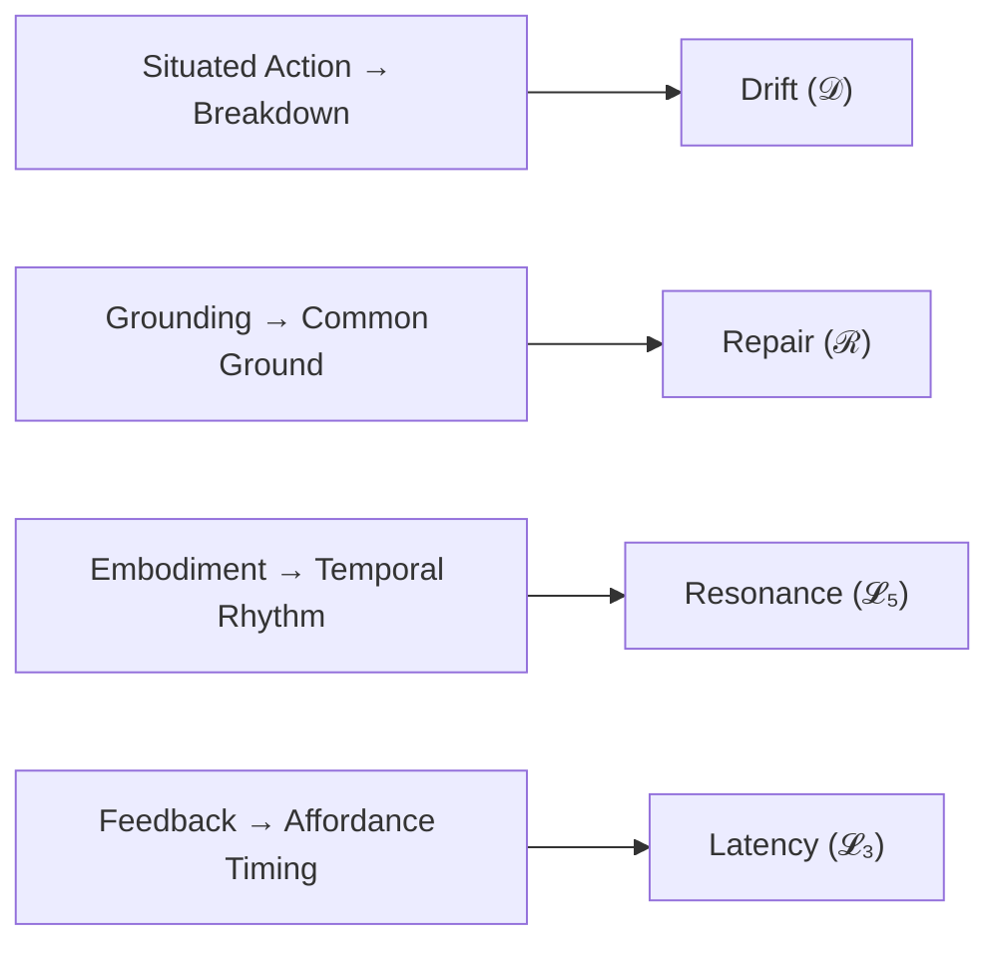

# Part 2 — Theoretical Background: Positioning PLD within HCI Foundations
*(v1.1 – Added Orientation, Mapping Table, and Visual Overview)*

---

## 2.0 Reading Orientation

**Estimated time:** ≈ 20 min **Difficulty:** 🟡  
**Best suited for:** Readers familiar with Suchman (1987), Clark (1996), and Dourish (2001).

**Before reading, recall:**
- *Breakdown* (Suchman) — when a plan no longer fits situated contingencies.  
- *Common ground* (Clark) — mutual knowledge enabling coordinated action.  
- *Embodiment* (Dourish) — action as temporally and physically situated.

If any of these are unclear, revisit the self-check in Part 1.

**Fastest Path note:**  
For the 90-minute reading route, skim only Sections **2.1** and **2.7**.  
Sections 2.3–2.6 provide detailed definitions and can be consulted selectively.

**Goal of Part 2:**  
To map PLD constructs onto canonical HCI theories and clarify how PLD extends them conceptually and operationally.

---

## 2.1 Mapping Classical Theories to PLD Constructs

| Classical Theory / Author | Core Concept | PLD Reinterpretation | Quantifiable Indicator |
|----------------------------|---------------|----------------------|------------------------|
| **Suchman (1987)** | *Situated Action* / Breakdown | **Drift (𝒟)** — graded coordination loss in ongoing activity | δ (drift distance) |
| **Clark (1996)** | *Common Ground* / Grounding Acts | **Repair (ℛ)** — state transition restoring mutual predictability | t(ℛ) |
| **Dourish (2001)** | *Embodiment* / Temporal Co-presence | **Resonance (𝓛₅)** — entrainment of embodied rhythm | ρ |
| **Norman (2013)** | *Feedback Loops* / Affordances | **Latency (𝓛₃)** — temporal affordance window shaping timing | Δt₍L₃₎ |
| **Sacks et al. (1974)** | *Turn-taking* / Repair Organization | Structural foundation for loop transitions (𝓛₂–𝓛₄) | transition probabilities |

---


**Figure 2.1 – PLD as temporal synthesis of classical HCI theories.**

---

## 2.2 Overview

In Human–Computer Interaction (HCI), interaction unfolds as temporal co-regulation rather than a mere exchange of messages.  
Phase Loop Dynamics (PLD) reframes co-regulation as a small set of recurrent coordination loops—patterns that explain how coordination stabilizes, degrades, and re-emerges.

This section translates PLD constructs into standard HCI terms with operational definitions and conceptual measurement.  
Throughout, we use the canonical symbol set introduced in Part 5:  
δ (drift magnitude), t(ℛ) (repair latency), ρ (resonance strength), Δt₍L₃₎ (latency duration), and S (cycle stability).

See Part 5, Table 5.3 for the full metric glossary.

---

## 2.3 Interaction State and Phase Loop (𝓛)

**Definition**

- **Interaction State (phase):** a locally stable configuration of turn-taking, grounding status, and activity orientation during a dialogue or interface episode.  
- **Phase Loop (𝓛ᵢ):** a recurrent coordination pattern governing transitions among such states, empirically detectable via timing, turn structure, and feature reuse.

| Loop ID | HCI Analogue | Primary Function |
|----------|---------------|------------------|
| L₁ | Turn-opening / Segmentation | Detecting onset and boundaries |
| L₂ | Breakdown → Repair | Managing deviation from mutual understanding |
| L₃ | Pre-utterance Latency | Holding or delaying articulation |
| L₄ | Self-monitoring Repair | Within-turn self-correction |
| L₅ | Alignment / Resonance | Re-establishing synchrony or shared rhythm |

These loops correspond to mechanisms documented in Conversation Analysis (turn-taking, repair) and HCI (feedback, affordances, grounding).

---

## 2.4 Drift (𝒟) — Degradation of Alignment

**HCI Interpretation**  
Drift is a graded loss of coordination—the current frame no longer predicts the next action with sufficient confidence.  
It aligns with breakdown (Suchman 1987), extends system-image mismatch (Norman) into a temporal gradient, and quantifies misalignment in grounding (Clark 1996).

**Operational Dimensions**

| Dimension | Description | Indicative Measure |
|------------|--------------|--------------------|
| Semantic drift | Divergence in referential meaning / intent | Clarification requests per turn; semantic distance of reformulations |
| Structural drift | Breakdown in syntactic or task sequence | Deviations from planned path; wrong state transitions |
| Temporal drift | Desynchronization of timing and latency | Turn-gap distribution; response-delay variance |

Onset rule: mark drift when one or more indicators exceed local baselines.  
Magnitude summarized as δ.

---

## 2.5 Repair (ℛ) — Re-establishment of Grounding

Repair restores mutual intelligibility and course of action.  
In CA: self/other initiation and completion.  
In HCI: confirmation prompts, clarification dialogs, reformulations, undo.

**Taxonomy**

| Type | Initiator | Mechanism | HCI Examples |
|------|------------|------------|---------------|
| Self-initiated self-repair (L₄) | User | Re-articulation before system acts | “Wait, I mean …”; quick undo |
| Self-initiated other-repair | User → System | Explicit re-query | Reformulated search |
| Other-initiated self-repair | System → User | Clarification prompt | “Did you mean …?” |
| Other-initiated other-repair | System | Automatic correction | Spell-check; autocorrect |

**Measurement Concepts**

- t(ℛ): time from drift onset → confirmed repair  
- Repair depth: number of sub-repairs to reach alignment  
- Success ratio: fraction of repairs yielding confirmation without renewed drift  

Repair performs a gradient descent on misalignment until coherence stabilizes.

---

## 2.6 Resonance (𝓛₅) — Alignment Through Echo

Resonance is alignment via echo—reusing lexical, structural, prosodic, gestural, or rhythmic features to consolidate common ground and enable smooth handoff (Du Bois & Giora 2014).  
In HCI it corresponds to interactional entrainment and flow.

**Functional Mechanisms**
- Lexical/syntactic echo (paraphrase, parallelism)
- Prosodic/temporal entrainment (pacing match)
- Affective alignment (tone mirroring)
- Interactional handoff (seamless turn transfer)

**Conceptual Metrics**

| Indicator | Meaning | HCI Proxy |
|------------|----------|------------|
| ρ (resonance strength) | Degree of echo / entrainment | n-gram overlap; latency cross-correlation |
| Δρ / Δt (decay) | Stability of alignment | Slope of correlation decay |
| τ (transfer index) | Seamless handoff probability | Turn-transfer success rate |

Failure case: Degenerate resonance—surface echo without semantic progress (ρ high, grounding unchanged) → renewed drift.  
Analysts should distinguish productive from degenerate resonance.

---

## 2.7 Latency (𝓛₃) — Structured Silence

Latency is coordinated withholding—intention is present but articulation delayed.  
It is not absence: latency can invite uptake, stage repair, or prevent premature commitment.

| Type | Interactional Role | Observable Marker |
|------|--------------------|--------------------|
| Preparatory latency | Planning before action | In-breath, gaze fixation, hover, pen lift |
| Hesitation latency | Uncertainty / repair preface | Fillers; pause > baseline (≈ > 500 ms speech) |
| Systemic latency | Machine processing delay | Spinners, progress indicators |
| Conversational latency | Turn-exchange timing | Gap between turns (Stivers 2009) |

**Measurement Notes**  
Δt₍L₃₎: measured against local baselines (task, skill, culture)  
Optimal windows vary by modality; beyond them, latency provokes drift  
Adaptive latency can support reflection and self-repair  

Cultural/experience note: pause norms vary cross-culturally; experts show shorter anticipatory latencies than novices.

---

## 2.8 Inter-relations: Drift, Repair, Resonance, Latency

A cyclic dynamic organizes the four constructs:

```text
[Drift] → [Repair] → [Resonance] → [Latency] → [Drift]
```

- Drift signals loss of predictive fit (δ ↑).  
- Repair reduces misalignment (t(ℛ) characterizes responsiveness).  
- Resonance stabilizes alignment (ρ ↑, Δρ / Δt ≤ 0).  
- Latency provides temporal scaffolding (Δt₍L₃₎) for the next initiative.

This extends Clark’s grounding by adding temporal layers (latency, entrainment) and failure paths (resonance collapse → renewed drift), consistent with CA repair organization and Dourish’s temporal embodiment.

---

## 2.9 Conceptual Measurement Summary

| Construct | Primary Metric | Interpretive Range | Typical Data Sources |
|------------|----------------|--------------------|----------------------|
| Drift (𝒟) | δ – deviation rate | 0 = stable → 1 = severe misalignment | Dialog logs, UI traces |
| Repair (ℛ) | t(ℛ), success ratio, depth | Short t(ℛ) + high success = effective | Clarifications, undo/redo |
| Resonance (𝓛₅) | ρ, Δρ / Δt, τ | ρ > ~0.8 → strong entrainment | Feature reuse, timing correlation |
| Latency (𝓛₃) | Δt₍L₃₎ vs baseline | Optimal ranges context-dependent | Speech timing, hover/idle logs |
| Cycle Stability (S) | Resonant time / cycle time | Higher S = more sustained fluency | Segmented state sequences |

See Part 5 for model variants (Markov transitions; decay functions) and ethics notes on timing as a design parameter.

---

## 2.10 Theoretical Contribution (Recap)

- **Temporal grounding theory:** grounding is dynamic and looped, not binary.  
- **Multi-dimensional drift metric:** semantic / structural / temporal facets unified as δ.  
- **Quantified repair & resonance:** bridges CA typologies with measurable HCI indicators (t(ℛ), ρ).  
- **Silence as phase:** latency becomes a designable temporal resource rather than a void.

**Cross-reference Note**  
This background establishes the theoretical coordinates for PLD.  
For conceptual continuity, proceed next to Part 3 (Core Concepts).  
For applied modeling, jump ahead to Part 5 (Measurement Framework).

---

## References

- Clark, H. H. (1996). *Using Language*. Cambridge University Press.  
- Dourish, P. (2001). *Where the Action Is: The Foundations of Embodied Interaction*. MIT Press.  
- Du Bois, J. W., & Giora, R. (2014). Dialogic resonance and language usage. *Language and Cognition, 6*(4), 321–350.  
- Norman, D. A. (2013). *The Design of Everyday Things* (Rev. ed.). Basic Books.  
- Sacks, H., Schegloff, E. A., & Jefferson, G. (1974). A simplest systematics for the organization of turn-taking for conversation. *Language, 50*(4), 696–735.  
- Suchman, L. A. (1987). *Plans and Situated Actions*. Cambridge University Press.  
- Stivers, T. (2009). How important is the gap? Timing as a resource for interdependence in conversation. *Discourse Processes, 46*(2–3), 117–149.
