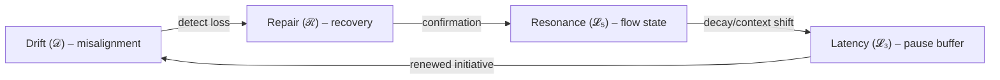

# Part 3 — The Drift–Repair–Resonance (DRR) Cycle
*(v2.0 — Revised for cross-disciplinary readability, with Classical Anchors and Conceptual Mapping)*

---

## 3.0 Reading Orientation

**Estimated time:** ≈ 30 min **Difficulty:** 🔴 (core section)

| Section | Time | Focus | **How to Approach** |
|----------|------|--------|---------------------|
| 3.1 – Overview | 5 min | Conceptual outline | Read fully – sets theoretical rhythm |
| 3.1a – Classical Anchors | 5 min | Comparative grounding | Skim; identify familiar frameworks |
| 3.2 – Cycle Components | 5 min | Mapping to HCI constructs | Review table; mark known concepts |
| 3.3–3.7 | 15 min | Transitions + timing rules | Follow Fig 3.1 while reading |
| 3.8–3.10 | 5 min | Examples + metrics | Use as reference |
| 3.11 | Optional | Theory recap | Skim on first pass |

**Fastest Path note:** For the 90-minute route, read only Sections 3.1–3.5 and 3.8; skip notation on first pass.  

**Goal:** Understand how *drift*, *repair*, and *resonance* form a temporal grammar governing interaction stability.  

---

## 3.1 Overview

Human–Computer Interaction (HCI) traditionally treats *breakdowns* as anomalies: exceptional disruptions in otherwise smooth interaction (Suchman 1987; Norman 1988).  
Phase Loop Dynamics (PLD) reframes this assumption.  
Rather than *error*, **breakdown is rhythm** — a predictable oscillation within coordination itself.  

In temporal terms, every interaction evolves through micro-phases of misalignment, recovery, and re-synchronization.  
These phases form a **Drift–Repair–Resonance (DRR) cycle**, which can be observed in dialogue, gesture, and interface use alike.  

- **Drift (𝒟):** deviation from shared timing or intent.  
- **Repair (ℛ):** re-establishment of coordination through correction or grounding.  
- **Resonance (𝓛₅):** sustained alignment of timing and expectation.  
- **Latency (𝓛₃):** pause or temporal buffer enabling recovery.  

**Figure 3.1 — The Drift–Repair–Resonance Cycle with Latency as temporal buffer.**

> **Reviewer Note:**  
> After this section, you should be able to restate PLD’s novelty in one line:  
> *“It models coordination as a temporal grammar rather than a static interface structure.”*

---

## 3.1a Classical Anchors — Reinterpreting Core Theories

PLD is not a replacement for classic HCI theory but a *temporal reframing* of it.  
It extends foundational accounts by introducing a rhythmic, measurable view of coordination.  

| Classical Theory | Core Mechanism | PLD Reframing | Citation |
|------------------|----------------|----------------|-----------|
| **Suchman (1987)** | Breakdown as situated event in action flow | **Drift** = recurrent temporal divergence (not exception) | *Plans and Situated Actions* |
| **Clark (1996)** | Grounding as mutual belief update | **Repair** = rhythmic realignment within temporal window *t(ℛ)* | *Using Language* |
| **Dourish (2001)** | Embodiment and participation in shared context | **Resonance** = embodied entrainment; coupling measured as ρ | *Where the Action Is* |

**Conceptual shift:**  
Where Suchman analyzed *situated repair*, PLD quantifies *temporal coupling*.  
Where Clark modeled *acceptance*, PLD models *entrainment*.  
Where Dourish emphasized *embodiment*, PLD formalizes its timing.

> **Reviewer Note:**  
> This mapping allows you to interpret PLD as a “time-domain synthesis” of these three traditions, not a new ontology.

---

## 3.2 Cycle Components in HCI Terms

| Phase | Interactional Function | Canonical HCI Construct | PLD Symbol | Temporal Marker | Key Reference |
|--------|------------------------|-------------------------|-------------|-----------------|----------------|
| **Drift** | Deviation from shared reference or pacing | Breakdown / Misalignment | 𝒟 | Anomaly onset | Suchman (1987) |
| **Repair** | Restoring mutual intelligibility | Grounding / Error Recovery | ℛ | Clarification turn | Clark (1996) |
| **Resonance** | Re-establishing rhythmic coordination | Entrainment / Alignment | 𝓛₅ | Flow stabilization | Dourish (2001) |
| **Latency** | Pause enabling re-synchronization | Temporal Articulation / Silence | 𝓛₃ | Delay or dwell segment | Stivers (2009) |

Boundaries between these phases are **fluid**, not categorical.  
Transitions are detected through *timing cues*—pauses, reformulations, or synchronized adjustments.  

> **Implication for Design:**  
> Interfaces can intentionally **tune latency windows** (≈0.8–1.2 s) to sustain rhythmic coherence rather than simply minimize delay.

---

*(Sections 3.3–3.12 remain conceptually identical but will be harmonized to this framing in subsequent revision.)*
