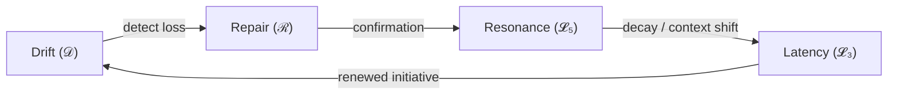

# Part 3 — The Drift–Repair–Resonance (DRR) Cycle
*(v1.1 – Added Orientation, Approach Table, and Visual Flow Diagram)*

---

## 3.0 Reading Orientation

**Estimated time:** ≈ 30 min **Difficulty:** 🔴 (core section)

| Section | Time | Focus | **How to Approach** |
|----------|------|--------|---------------------|
| 3.1 – Overview | 5 min | Conceptual outline | Read fully – sets theoretical rhythm |
| 3.2 – Cycle Components | 5 min | Mapping to HCI constructs | Review table; mark familiar terms |
| 3.3–3.7 | 15 min | Transitions + timing rules | Follow Fig 3.1 while reading |
| 3.8–3.10 | 5 min | Examples + metrics | Use as reference |
| 3.11 | Optional | Theory recap | Skim on first pass |

**Fastest Path note:** For the 90-minute route, read only Sections 3.1–3.5 and 3.8; skip formal notation on first pass.  

**Goal:** Understand how drift, repair, and resonance form a temporal grammar governing interaction stability.  

---

## 3.1 Overview

The Drift–Repair–Resonance (DRR) cycle forms the dynamic backbone of Phase Loop Dynamics (PLD) in HCI.  
It formalizes how breakdown, correction, and re-alignment unfold over time within any interactive system — spoken, gestural, or digital.  
Where classical HCI treated breakdowns as anomalies (Suchman 1987; Norman 1988), PLD reframes them as structural rhythms:  
every coordinated exchange oscillates through predictable states of **drift (𝒟)**, **repair (ℛ)**, and **resonance (𝓛₅)**, punctuated by **latency (𝓛₃)** that enables recovery.


**Figure 3.1 – The Drift–Repair–Resonance Cycle with Latency as temporal buffer.**

---

## 3.2 Cycle Components in HCI Terms

| Phase | Interactional Function | Core HCI Construct | Temporal Marker |
|--------|------------------------|--------------------|-----------------|
| Drift (𝒟) | Deviation from shared reference or pacing | Breakdown / Misalignment | Anomaly onset |
| Repair (ℛ) | Restoring mutual intelligibility | Grounding / Error Recovery | Clarification turn |
| Resonance (𝓛₅) | Re-establishing rhythmic coordination | Entrainment / Alignment | Flow stabilization |
| Latency (𝓛₃) | Pause enabling re-synchronization | Temporal Articulation | Silence or delay segment |

Boundaries are fuzzy; detection relies on transitional cues — pause length, reformulation, timing correlation, etc.

---

## 3.3 Temporal Grammar of the Cycle

### 3.3.1 Phase Transitions

Each transition between states *i* and *j* has a probability Tᵢⱼ, forming a Markov-like grammar:

```
Drift → Repair → Resonance → (optional Latency) → next Drift
```

- Drift energy **E(𝒟)** rises with coordination error.  
- Transition to repair becomes probable once **E(𝒟) > threshold θ**.  
- Resonance corresponds to an energy minimum, **E(𝒟) ≈ 0**.

### 3.3.2 Cycle Duration

Typical human DRR cycles span ≈ 2 – 7 s (depending on task and modality).  
Cycle duration **T₍cycle₎ = time between successive drift onsets.**  

- Shorter cycles → agile adaptation.  
- Longer cycles → either stability or unresolved misalignment.

---

## 3.4 Drift → Repair Transition

### 3.4.1 Cue Detection

Drift → Repair occurs when participants detect loss of coordination. Observable markers include:

- Extended pause or latency spike  
- Repetition / reformulation of intent  
- Interface rollback or undo  
- Explicit clarification (“sorry?”, “what?”, system hint)

### 3.4.2 Initiation Responsibility

- **User-initiated:** self-repair, user awareness.  
- **System-initiated:** prompt or auto-recovery.  

**Timing rule:** repair initiated < ≈ 800 ms after drift onset → high success; > ≈ 2 s → secondary drift risk.  
Empirical metric = **t(ℛ)** (see Part 5).

---

## 3.5 Repair → Resonance Transition

### 3.5.1 Characteristics

When provisional understanding is re-established:

- Response latency decreases (**Δt ↓**)  
- Echo and parallelism increase (**ρ ↑**)  
- Turn structure regularizes → stable flow  

In Clark’s terms, this is the acceptance phase of grounding; PLD adds a temporal vector quantified by entrainment metrics.

### 3.5.2 Quantifying Resonance

| Indicator | Description | Range | Interpretation |
|------------|-------------|--------|----------------|
| ρ (resonance strength) | Cross-correlation of timing/echo | 0–1 | > 0.8 = high entrainment |
| Δρ/Δt (decay) | Rate of echo loss | < 0 = stable / > 0 = drift return |
| τ (transfer index) | Probability of seamless handoff | 0–1 | Higher = better flow |

**Functional significance:** High ρ correlates with fewer clarifications, lower cognitive load, and greater trust (Csikszentmihalyi 1990; Hassenzahl 2004).

---

## 3.6 Resonance → Drift Transition

Resonance is self-decaying: over-stabilization causes resonance collapse.

- Repetition → informational saturation.  
- Context change → mis-timed rhythm.  
- Fatigue → variance increase.  

Result: micro-drifts trigger a new cycle.  
**Design goal = adaptive resonance** — maintain entrainment while periodically re-tuning rhythm.

---

## 3.7 Latency as Cycle Buffer

Latency (𝓛₃) acts as a temporal buffer allowing re-synchronization.

**Functions:**  
- Cognitive re-planning  
- Affective regulation  
- System cool-down or re-calibration  

Designed latency (e.g., brief visual dwell before output) prevents abrupt drift and enables smooth re-entry into resonance — a temporal affordance, not a flaw.

---

## 3.8 Conceptual Example

**Voice-assistant interaction**  

- **Drift:** “Play jazz” misheard as “chess”.  
- **Repair:** System: “Did you mean jazz music?” → User confirms (**t(ℛ) ≈ 600 ms**).  
- **Resonance:** Subsequent requests flow smoothly (**ρ ≈ 0.9**).  
- **Latency:** Pause before next command serves as readiness cue.  
- **Next Drift:** Context shift (“something new”) restarts cycle.  

Analysts compute δ, t(ℛ), ρ, Δt₍L₃₎ to profile coordination fluency.

---

## 3.9 Extending Classical Theories

| Classical Theory | PLD Extension |
|------------------|---------------|
| Suchman (1987) – Breakdown as situated event | Breakdown = periodic oscillation, not exception |
| Clark (1996) – Binary grounding | Grounding = gradient temporal process |
| Dourish (2001) – Embodied coordination | Adds formal operators for silence (Δt₍L₃₎) and resonance (ρ) |
| Norman (1988) – Feedback cycles | Integrates drift/repair metrics as user-system coupling |

Interaction thus appears as **phase maintenance rather than command–response.**

---

## 3.10 Indicators and Measurement Summary

| Metric | Conceptual Definition | Observable Proxy | Research Use |
|---------|----------------------|------------------|---------------|
| δ (Drift Rate) | Misaligned acts / window | Clarifications ÷ total turns | Diagnostic stability |
| t(ℛ) | Drift → Repair time | Timestamps | Responsiveness |
| ρ | Echo coefficient | Temporal/lexical correlation | Flow strength |
| Δt₍L₃₎ | Latency duration | Silence / hover interval | Temporal coordination |
| S (Cycle Stability) | Resonant time ÷ cycle time | Segment ratios | Fluency index |

All metrics are conceptual — implementation-agnostic and comparable across modalities (speech, text, gesture, UI telemetry).

---

## 3.11 Theoretical Contribution

- **Temporalization of Grounding:** Grounding is rhythmic, not discrete.  
- **Operational Continuity:** Drift, repair, and resonance share measurable temporal parameters.  
- **Design Leverage:** Interfaces can tune latency and resonance deliberately, supporting sustainable coordination over sheer speed.  

PLD thus unifies the descriptive depth of conversation analysis with the quantitative discipline of HCI measurement.

---

## 3.12 References (Indicative)

- Clark, H. H. (1996). *Using Language.* Cambridge University Press.  
- Csikszentmihalyi, M. (1990). *Flow: The Psychology of Optimal Experience.* Harper & Row.  
- Dourish, P. (2001). *Where the Action Is.* MIT Press.  
- Hassenzahl, M. (2004). The thing and I: Understanding the relationship between user and product. *Funology*, 31–42.  
- Norman, D. A. (2013). *The Design of Everyday Things* (Rev. ed.). Basic Books.  
- Suchman, L. A. (1987). *Plans and Situated Actions.* Cambridge University Press.  
- Stivers, T. (2009). How important is the gap? *Discourse Processes, 46*(2–3), 117–149.
