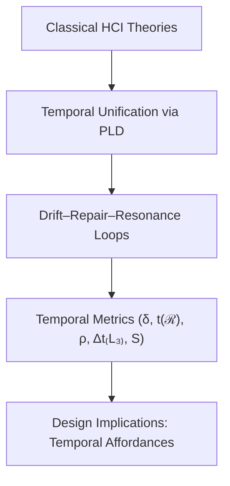

# Part 4 — Theoretical Contributions of Phase Loop Dynamics to HCI
*(v1.1 – Added Orientation, Comparison Matrix, and Visual Summary)*

---

## 4.0 Reading Orientation

**Estimated time:** ≈ 25 min **Difficulty:** 🟡–🔴 (conceptually dense)

| Section | Time | Focus | **How to Approach** |
|----------|------|--------|---------------------|
| 4.1–4.2 | 5 min | Theoretical overview | Read carefully – defines PLD’s novelty |
| 4.3–4.5 | 10 min | Core contribution tables | Compare side-by-side with Part 2/3 |
| 4.6–4.7 | 5 min | Design implications & open questions | Skim if theory-focused |
| 4.8–4.9 | 5 min | Cross-scale unification | Read last for synthesis |

**Fastest Path note:**  
For evaluators or reviewers, read **4.1–4.3** and **4.6** only (≈ 10 min) to grasp PLD’s theoretical distinctiveness.  

**Goal:**  
Understand *how PLD unifies fragmented HCI theories into a temporal mechanics of coordination*, and how this reframing yields measurable design principles.

---

## 4.1 Overview

Phase Loop Dynamics (PLD) reframes HCI as an ecology of temporal coordination.  
Rather than discrete input–output steps, joint activity is maintained by recurrent loops—**drift (𝒟)**, **repair (ℛ)**, **resonance (𝓛₅)**, **latency (𝓛₃)**—that continually re-synchronize interaction.  
PLD contributes at four levels:  
(i) conceptual unification of scattered theories,  
(ii) temporal formalization of grounding and feedback,  
(iii) a measurable schema for coordination quality, and  
(iv) an extension of design theory toward temporal affordances.  
(See Part 2 for definitions; Part 5 for metrics.)

**Figure 4.1 – From fragmented models to a unified temporal mechanics.**

---

## 4.2 Unifying Fragmented Theories of Coordination

### 4.2.1 From Breakdown to Loop Continuity

Earlier frameworks (Suchman, 1987; Winograd & Flores, 1986) cast breakdown as rupture to be fixed before resuming activity. PLD recasts breakdown as **drift**—a graded fluctuation (δ) within continuous coordination. This removes the “working vs. failing” binary and enables analysis of how often and how quickly systems drift and recover (**t(ℛ)**).

### 4.2.2 From Grounding to Temporal Resonance

Clark’s grounding model (1996) explains presentation/acceptance. PLD adds a temporal layer: **resonance (ρ)** reflects entrainment and alignment stability over time (**Δρ/Δt**). Grounding thus becomes a dynamic rhythm—amplifying or decaying—rather than a one-shot confirmation.

### 4.2.3 From Embodied Action to Temporal Ecology

Embodied and distributed perspectives (Dourish, 2001; Hutchins, 1995) highlight material/situated coordination. PLD introduces temporal operators—**latency (Δt₍L₃₎)**, **drift δ**, **resonance ρ**—to make embodiment measurable across micro-timing and session scales (**S**).

---

## 4.3 Temporalization of Grounding and Feedback

| Traditional View | PLD Perspective | Analytical Benefit |
|------------------|-----------------|--------------------|
| Feedback = a single response after an action | Feedback = micro-loops across repair → resonance → latency | Captures flow and recovery, not just confirmation |
| Breakdown = error state | Drift = predictive misalignment (δ) | Quantifies onset/duration of discoordination |
| Confirmation = end state | Resonance = sustained alignment (ρ, Δρ/Δt) | Measures quality, not only success |

PLD thus blends Norman’s action cycles with Clark’s grounding acts into a temporal continuum rather than a linear pipeline.

---

## 4.4 Operational Contribution — A Metrics Schema for Coordination Quality

PLD proposes the **coherence field C(σ,t)** as a conceptual anchor for measurement, linking cognitive, temporal, and affective coordination without prescribing instrumentation. Canonical metrics (see Part 5):

| Metric | Theoretical Basis | Conceptual Interpretation | HCI Example |
|---------|------------------|---------------------------|--------------|
| Drift Energy E(𝒟) | Deviation amplitude of C(σ,t) | Intensity of misalignment | Rise in clarifications per minute |
| Repair Latency t(ℛ) | Temporal gradient of E(𝒟) decay | Responsiveness of the loop | Time to confirmation after error |
| Resonance Stability Δρ/Δt | Derivative of alignment correlation | Persistence of shared rhythm | Duration of entrainment post-repair |
| Latency Window Δt₍L₃₎ | Silent / withheld phase | Opportunity for anticipation | Reflection-friendly delay range |
| Cycle Stability S | Resonant time ÷ cycle time | Fluency index across a session | Proportion of time in stable flow |

This schema bridges interaction analysis and interface evaluation, enabling multi-level studies of temporal coordination.

---

## 4.5 Theoretical Unification Across Timescales

| Timescale | HCI Construct | PLD Loop Focus | Analytical Lens |
|------------|---------------|----------------|-----------------|
| ms–s | Micro-timing / turn exchange | Latency (L₃) | Responsiveness, rhythm (Δt₍L₃₎) |
| s–min | Task segment / micro-episode | Drift ↔ Repair | Adaptivity, grounding (δ, t(ℛ)) |
| min–h | Session / collaboration | Resonance cycles | Flow, trust (ρ, Δρ/Δt, S) |
| days–weeks | Learning curve | Iterated loops | Habituation, long-term entrainment |

The same loop grammar scales from micro-timing to longitudinal coordination.

---

## 4.6 Design Implications

### 4.6.1 Temporal Affordances

**Temporal affordance:** Interfaces shape not only what users can do but when and how rhythmically they can do it. Controlled **Δt₍L₃₎** can foster reflection or invite self-repair; well-placed micro-pauses smooth handoffs.

### 4.6.2 Rhythmic Feedback Design

Treat **resonance (ρ)** as a design target: aim for stable turn ratios and consistent pacing over “instantaneous” response. Subtle cues (micro-animations, auditory ticks) can serve as entrainment anchors.

### 4.6.3 Drift-Aware Adaptivity

Detect temporal drift via pause variance or overlap patterns and adapt tempo (slower prompts, clarifying questions) rather than only content. Error correction becomes temporal adaptation.

**Ethical note:** Timing is a design power: over-acceleration can suppress reflection; excessive delay can erode agency. Calibrate temporal interventions transparently (see Part 6).

---

## 4.7 Novel Questions Enabled by PLD

- **Robustness under load:** How does ρ decay with multitasking?  
- **Latency optimization:** Which Δt₍L₃₎ ranges improve collective grounding?  
- **Human–human vs. human–AI:** How do t(ℛ) and ρ differ across pairings?  
- **Temporal ethics:** Where are the limits of adaptive entrainment in persuasive or safety-critical contexts?

---

## 4.8 Relation to Measurement and Theory Building

PLD offers a middle-range theory bridging traditions:

- **Conversation Analysis** → turn structures & repair types (mapped to L₂/L₄, t(ℛ))  
- **Psycholinguistics** → latency & entrainment metrics (Δt₍L₃₎, ρ)  
- **Interaction Design** → temporal affordances & feedback timing  
- **Cognitive Modeling** → predictive drift and error detection (δ trajectories)  

A shared temporal formalism enables cumulative, cross-disciplinary studies of interaction quality.

---

## 4.9 Summary of Theoretical Advances

| Contribution | Description | Contrast with Classical HCI |
|---------------|-------------|-----------------------------|
| Dynamic Grounding Model | Grounding as a continuous temporal process | Beyond binary presentation–acceptance |
| Quantified Breakdown Theory | Drift as a measurable gradient (δ) | Beyond qualitative breakdown |
| Temporal Affordance Framework | Design of interaction rhythm & latency | Beyond static affordances |
| Rhythmic Feedback Loop Model | Resonance as a design target (ρ, Δρ/Δt) | Beyond confirmation-only feedback |
| Cross-Scale Unification | One loop grammar across timescales | Replaces fragmented micro/macro models |

Collectively, PLD supplies a unifying, measurable theory of coordination rhythm in HCI.

---

**Cross-reference Note**  
This part completes PLD’s theoretical foundation.  
Proceed to Part 5 (Measurement Framework) for empirical calibration, or Part 6 (Discussion) for ethical and design-practice implications.

---

## 4.10 References (Indicative)

- Clark, H. H. (1996). *Using Language.* Cambridge University Press.  
- Dourish, P. (2001). *Where the Action Is: The Foundations of Embodied Interaction.* MIT Press.  
- Hassenzahl, M. (2004). The interplay of beauty, goodness and usability. *Human–Computer Interaction, 19*(4), 319–349.  
- Hutchins, E. (1995). *Cognition in the Wild.* MIT Press.  
- Norman, D. A. (2013). *The Design of Everyday Things* (Rev. ed.). Basic Books.  
- Suchman, L. A. (1987). *Plans and Situated Actions.* Cambridge University Press.  
- Winograd, T., & Flores, F. (1986). *Understanding Computers and Cognition.* Ablex.
