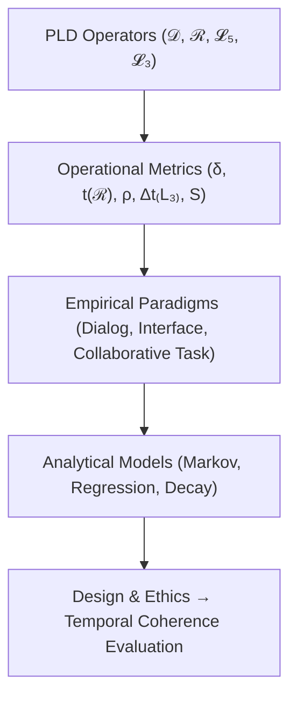

\# Part 5 — Measurement Framework and Empirical Modeling in HCI Terms
*(v1.1 – Added Orientation, Reading Guide, and Visual Summary)*

---

## 5.0 Reading Orientation

**Estimated time:** ≈ 25 min **Difficulty:** 🔴 (core empirical section)

| Section | Time | Focus | **How to Approach** |
|----------|------|--------|---------------------|
| 5.1–5.3 | 5 min | Core metrics overview | Read carefully – anchors all later figures |
| 5.4–5.7 | 10 min | Methods + models | Skim equations first → then examples |
| 5.8–5.10 | 5 min | Interpretation & ethics | Review for discussion section |
| 5.11 | Reference | For replication | Use for citations |

**Fastest Path note:**   
If you need a 10-minute overview for review or presentation:  
read **5.1 Overview**, **5.3 Metrics Table**, and **5.10 Summary of Contributions** only.  

**Goal:** Understand how PLD’s formal operators (δ, t(ℛ), ρ, Δt₍L₃₎, S) translate into empirical measurement and modeling frameworks for HCI.

---

**Figure 5.1 – From PLD operators to measurement and ethical evaluation pipeline.**

---

## 5.1 Overview

Phase Loop Dynamics (PLD) defines interaction quality as a temporal, multi-layered process, not a static usability score.  
This section reframes PLD’s formal operators into a measurement framework that bridges observational analysis, laboratory experimentation, and computational modeling.  
**Goal →** enable empirical study of drift (𝒟), repair (ℛ), resonance (𝓛₅), and latency (𝓛₃) across modalities without relying on any particular technology.

---

## 5.2 Principles of Measurement

- **Continuity of Interaction** – capture rhythm and transition, not discrete outcomes.  
- **Mutual Adaptation** – measure bidirectional timing (user ↔ system).  
- **Multimodal Evidence** – speech, gesture, cursor motion, UI events as sources.  
- **Comparability** – scalable from milliseconds to sessions.  

These principles convert symbolic PLD operators into empirically tractable constructs.

---

## 5.3 Core Metrics and Operational Definitions

| Metric | Symbolic Origin | Conceptual Definition | Observable Form (in HCI) |
|---------|------------------|-----------------------|---------------------------|
| Drift Magnitude δ | 𝒟 | Degree of misalignment between intended and observed state | Deviation from expected cursor path; semantic misrecognition; timing error |
| Repair Latency t(ℛ) | ℛ | Elapsed time from drift onset to successful realignment | Interval between error and confirmation |
| Resonance Strength ρ | 𝓛₅ | Temporal synchrony of user–system responses | Cross-correlation of turn timing / repetition frequency |
| Latency Window Δt₍L₃₎ | 𝓛₃ | Pause duration enabling anticipation or reflection | Silence length / hover time |
| Cycle Stability S | Composite | Resonant time ÷ cycle time | % of session in stable flow |

All metrics derive from temporal annotation of logs, not subjective scales, ensuring replicability.

---

## 5.4 Measurement Methods

### 5.4.1 Interactional Logging

High-resolution logging (≤ 100 ms) captures:

- User inputs (clicks, keys, speech onsets)  
- System outputs (messages, animations, state updates)  
- Timestamps + turn IDs  

Segment each log into **Drift–Repair–Resonance** cycles by changes in event frequency and latency.

### 5.4.2 Conversation Annotation

Adapt Conversation Analysis (Schegloff 1977; Stivers 2009): mark repairs, overlaps, pauses.  
Add quantitative tags (δ, t(ℛ), ρ) → hybrid qual-quant annotation.

### 5.4.3 Physiological / Behavioral Correlates

Temporal coordination also emerges in embodied signals:

- EEG entrainment to interaction rhythm  
- Eye-fixation synchrony  
- Heart-rate variability around repairs  

Such measures extend PLD to embodied interaction contexts.

---

## 5.5 Analytical Models

### 5.5.1 Cycle-Level Transition Model

Interaction ≈ Markov chain over states {𝒟, ℛ, 𝓛₅, 𝓛₃}.  
Transition probabilities Tᵢⱼ estimate stability; steady-state πᵢ → dominant phases.

**Cycle Stability:**  
\[ S ≈ 1 - T_{DR} + T_{RD}T_{RR} \]  
Higher **S** = longer resonant periods per cycle.

### 5.5.2 Temporal Regression Model

\[ RT = β₀ + β₁δ + β₂t(ℛ) + β₃ρ + ε \]  

Predicts task efficiency from loop parameters.

### 5.5.3 Entrainment Decay Function

\[ ρ(t) = ρ₀ e^{-λt} \]  

λ = resonance-decay rate → measure of coordination fatigue.

---

## 5.6 Empirical Paradigms for Validation

| Paradigm | Measure | Expected PLD Signature | Reference Theory |
|-----------|----------|------------------------|------------------|
| Dialogic Error Recovery | t(ℛ) | Shorter t(ℛ) → higher ρ | Clark (1996) Grounding |
| Interface Timing Study | δ vs RT | Non-linear U-curve | Norman (1988) Action Cycle |
| Collaborative Task | ρ | Peak post-repair | Dourish (2001) Embodied Coordination |
| Adaptive Latency | Δt₍L₃₎ | Optimum ≈ 1 – 1.5 s | Stivers (2009) Silence Threshold |

Each maps PLD operators to testable HCI hypotheses.

---

## 5.7 Computational Simulation Framework (Conceptual)

Agent-based simulation illustrates temporal loop dynamics.

- **Agents:** phase states (L₁–L₅) with transition matrix Tᵢⱼ  
- **Drift Propagation:** δ > θ triggered by noise/task change  
- **Repair Trigger:** when C(σ,t) falls below baseline → ℛ initiation  
- **Resonance Stabilization:** ρ ↑ until steady ρ₀  
- **Latency Insertion:** pause prevents oscillatory instability  

Cycle-length distributions can then be compared to empirical HCI data.

---

## 5.8 Evaluation and Interpretation

### 5.8.1 Performance vs Experience

Traditional speed/accuracy metrics miss temporal coherence.  
A system can be **fast but unstable (high δ)** or **slow but coherent (high ρ, S)**.  
PLD adds “temporal fluency” as a third axis of UX evaluation.

### 5.8.2 Cross-Participant Normalization

Normalize δ, t(ℛ), ρ to each user’s baseline tempo before group analysis.

### 5.8.3 Visualization of Loop Dynamics

Plot phase trajectories (δ, ρ, Δt₍L₃₎ over time).  
Lissajous-like patterns reveal oscillatory interaction rhythms and stability zones.

---

## 5.9 Ethical and Interpretive Notes

Quantifying timing introduces responsibilities:

- Avoid coercive entrainment or manipulative timing control.  
- Respect individual tempo differences and cognitive load.  
- Anonymize temporal signatures to protect behavioral privacy.  

**Ethical temporal design** means using timing to support coordination, not influence behavior covertly.

---

## 5.10 Summary of Empirical Contributions

| Category | Contribution | Impact on HCI Research |
|-----------|---------------|------------------------|
| Measurement Framework | Operational metrics for drift, repair, resonance, latency | Bridges qualitative & quantitative methods |
| Analytical Modeling | Markov & decay models for interaction loops | Predictive coordination theory |
| Empirical Paradigms | Operators → testable experiments | Unifies CA and HCI evaluation |
| Design Evaluation | Temporal coherence as usability dimension | Beyond speed / accuracy |
| Ethical Framework | Limits of temporal optimization | Supports human-centered timing design |

---

## 5.11 References (Indicative)

- Clark, H. H. (1996). *Using Language.* Cambridge University Press.  
- Dourish, P. (2001). *Where the Action Is.* MIT Press.  
- Norman, D. A. (2013). *The Design of Everyday Things* (Rev. ed.). Basic Books.  
- Schegloff, E. A. (1977). Repair and Structure in Conversation. *Linguistic Inquiry, 8*(3).  
- Stivers, T. (2009). How Important Is the Gap? *Discourse Processes, 46*(1).  
- Winograd, T., & Flores, F. (1986). *Understanding Computers and Cognition.* Ablex.
