# Part 6 — Discussion and Future Directions
*(v1.1 – Added Orientation, Fastest-Path Guide, and Temporal-Ecology Diagram)*

---

## 6.0 Reading Orientation

**Estimated time:** ≈ 20 min **Difficulty:** 🟡 (interpretive synthesis)

| Section | Time | Focus | **How to Approach** |
|----------|------|--------|---------------------|
| 6.1–6.3 | 8 min | Research + Design implications | Read carefully – closes empirical arc |
| 6.4–6.6 | 8 min | Cross-disciplinary links + future work | Skim table → read 6.6 for agenda |
| 6.7–6.8 | 4 min | Synthesis + conclusion | Read fully – articulation of “temporal ecology” |
| 6.9 | Reference | For citation | optional |

**Fastest Path (≈ 10 min):**
1. Read 6.1 Overview + 6.2 Implications for HCI Research (5 min)  
2. Skim 6.3 Design Implications (2 min)  
3. Read 6.7–6.8 Synthesis & Conclusion (3 min)

**Goal:**  
Grasp PLD’s broader impact—how timing becomes an ethical and designable dimension, and where empirical research should go next.

---

```mermaid
flowchart TD
  A["PLD Core Loops (𝒟, ℛ, 𝓛₅, 𝓛₃)"] --> B["Measurement & Modeling (Part 5 Metrics)"]
  B --> C["Design Implications (Temporal Affordance, Rhythmic Feedback)"]
  C --> D["Ethical Framework (User Autonomy in Timing)"]
  D --> E["Future Research (Cross-modal, Cultural, Neural)"]
  E --> F["Temporal Ecology (Interaction as Co-Regulation)"]
```

**Figure 6.1 – From loop metrics to temporal-ecology agenda.**

---

## 6.1 Overview

Phase Loop Dynamics (PLD) reconceptualizes HCI as a temporal ecology of coordination.  
Where classical models stress interface structures or cognitive representations, PLD centers on rhythmic coupling—how partners drift, repair, and re-align in time.  
This section summarizes PLD’s broader implications for research, design, and theory, outlining open directions for future work.

---

## 6.2 Implications for HCI Research

### 6.2.1 Temporal Turn in HCI

PLD strengthens the emerging temporal turn by treating time not as a by-product of interaction but as a primary design variable.  
Interaction quality depends on pacing, latency, and resonance—dimensions long dismissed as technical side-effects.  
Empirical metrics—drift δ, repair latency t(ℛ), resonance ρ—establish timing as a first-class component of usability and experience.

### 6.2.2 Bridging Qualitative and Quantitative Traditions

Conversation-analytic and ethnomethodological work describes repair and rhythm qualitatively; PLD quantifies these phenomena without stripping context.  
It connects qualitative observation → operational parameters, and mathematical modeling → interpretive grounding.  
This middle-range framework invites collaboration across ethnography, cognitive science, and computation.

### 6.2.3 Unifying Embodied and Computational Perspectives

Embodied accounts (Dourish 2001; Hutchins 1995) highlight situated coordination; computational models emphasize predictive control.  
PLD merges the two: embodied timing becomes modelable, and algorithmic latency gains phenomenological meaning.  
The result is a shared vocabulary for temporal embodiment.

---

## 6.3 Design Implications

### 6.3.1 Designing for Rhythmic Coherence

Interfaces can be tuned for coherence rather than sheer speed.  
Deliberate micro-latency windows (≈ 1 s) sustain user rhythm and flow—**Δt₍L₃₎** as a design affordance.  
Designing for rhythm replaces speed-optimization with flow-optimization.

### 6.3.2 Temporal Feedback and Adaptive Repair

Systems can issue temporal feedback—responses calibrated by delay and pacing as well as content.  
When drift cues arise (irregular δ, longer pauses), adaptive repair routines intervene softly before breakdown, aligning with human conversational repair.

### 6.3.3 Ethical Timing

Temporal control shapes cognition and affect.  
PLD therefore promotes transparency and user autonomy in rhythm management: users should perceive and, where possible, adjust system tempo.  
Timing becomes a dimension of interactional ethics, not mere optimization.

---

## 6.4 Theoretical Integration Across Disciplines

| Domain | Existing Focus | PLD Integration |
|---------|----------------|----------------|
| Conversation Analysis | Turn-taking, silence, repair | Quantified operators (Δt₍L₃₎, t(ℛ)) |
| Cognitive Science | Prediction, synchronization | Drift & resonance as coupling dynamics |
| Interaction Design | Affordance, feedback | Temporal affordance & rhythmic feedback |
| AI / Dialogue Systems | Turn management | Phase-based timing for repair/adaptation |
| Neuroscience | Entrainment, oscillation | Resonance (ρ) linked to neural coherence |

PLD thus operates as a temporal hub, linking micro-coordination with macro-design practice.

---

## 6.5 Limitations and Scope

- **Abstraction Level** — PLD is high-level; empirical use needs task-specific calibration.  
- **Data Dependence** — Requires fine-grained temporal logs or multimodal recordings.  
- **Cultural Variability** — Timing norms vary; parameters (Δt₍L₃₎, λ) must be localized.  
- **Computational Simplification** — Markov/decay models approximate social complexity; interpret heuristically.  

These constraints define PLD as a heuristic theory—a guide, not a fixed algorithm.

---

## 6.6 Future Research Directions

### 6.6.1 Cross-Modal Loop Studies

Extend PLD metrics to speech–gesture–gaze coupling.  
How do drift and resonance propagate across channels?

### 6.6.2 Cross-Cultural Timing Ecologies

Compare optimal Δt₍L₃₎ and ρ decay across linguistic communities; develop culturally adaptive timing design.

### 6.6.3 Longitudinal Temporal Learning

Study loop habituation: how repeated sessions yield stable temporal signatures (**S ↑ over weeks**).

### 6.6.4 Neuro-Computational Correlation

Correlate ρ and λ with neural entrainment (EEG/MEG) to link PLD metrics with cognitive neuroscience.

### 6.6.5 Temporal Ethics Framework

Formulate design guidelines ensuring transparency in timing modulation and user control over tempo.

---

## 6.7 Synthesis — Interaction as Temporal Ecology

At its core, PLD reframes interaction as temporal co-regulation.  
Every click, utterance, or gesture participates in a living loop of **drift → repair → resonance**.  
Coordination stability equals the capacity to recover rhythmically, not the absence of error.  

Technology does not merely respond to time — it participates in timing.

---

## 6.8 Concluding Statement

Phase Loop Dynamics offers HCI a cohesive, measurable theory of coordination rhythm.  
By revealing the temporal logic of hesitation, repair, and resonance, PLD transforms breakdowns into analytical signals and pauses into design opportunities.  
Future research will refine these measures, integrate them into adaptive systems, and develop ethical standards for temporal design—ensuring that as interfaces accelerate, human rhythm remains the reference frame.

---

## 6.9 References (Indicative)

- Clark, H. H. (1996). *Using Language.* Cambridge University Press.  
- Dourish, P. (2001). *Where the Action Is.* MIT Press.  
- Hutchins, E. (1995). *Cognition in the Wild.* MIT Press.  
- Norman, D. A. (2013). *The Design of Everyday Things* (Rev. ed.). Basic Books.  
- Suchman, L. A. (1987). *Plans and Situated Actions.* Cambridge University Press.  
- Stivers, T. (2009). Timing as a Resource for Interdependence in Conversation. *Discourse Processes, 46*(1).  
- Winograd, T., & Flores, F. (1986). *Understanding Computers and Cognition.* Ablex.
