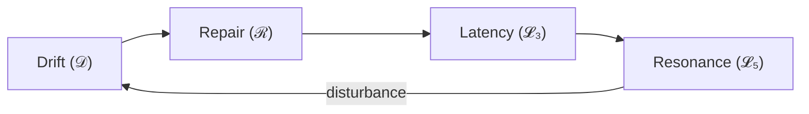

# Phase Loop Dynamics — HCI Translation Series (v1.1)

**Author:** Kiyoshi Sasano / DeepZenSpace  
**Year:** 2025  
**License:** CC BY-NC-SA 4.0  
**Repository:** https://github.com/kiyoshisasano-DeepZenSpace

---

## Reading Guide

**Estimated total reading time:** ≈ **2 hours**

| Part | Time | Difficulty | Purpose |
|------|------|------------|---------|
| 1 — Introduction | 10 min | 🟢 | Motivation, gap, notation preview |
| 2 — Theoretical Background | 20 min | 🟡 | Map PLD ↔ Suchman / Clark / Dourish |
| 3 — Core Concepts | 30 min | 🔴 | Formal definitions ("𝒟", "ℛ", "𝓛₅", "𝓛₃") |
| 4 — Theoretical Contributions | 25 min | 🟡–🔴 | Unification & design implications |
| 5 — Measurement Framework | 25 min | 🔴 | Operational metrics & models |
| 6 — Discussion | 20 min | 🟡 | Ethics, design, research agenda |
| Appendices (A–B) | 10 min | 🟢 | Lexicon governance & connectivity map |

### 🚀 Fastest Path (90-minute version)

**For initial evaluation:**
1. Part 1 (10 min)  
2. Part 2 — skim **2.1 & 2.7** (10 min)  
3. Part 3 — definitions only (30 min)  
4. Part 5 — metrics table + overview (20 min)  
5. Part 6 — **6.2–6.3** (10 min)

**Skip on first pass:** Part 4 (details of cycle), Appendices (reference)

**After 90 min you should know:**
- Whether PLD is relevant to your research  
- How it differs from Suchman / Clark / Dourish  
- What measurements it proposes

### Intended Readers (Prerequisites)

- 🟢 **HCI theorists who have read:**
  - Suchman (1987) *Plans and Situated Actions* — **Chs. 1–3**
  - Clark (1996) *Using Language* — **Chs. 3–5 (grounding)**
  - Dourish (2001) *Where the Action Is* — **Part I**

  **Self-check:** Can you explain in 1–2 sentences each  
  **“breakdown”** (Suchman), **“common ground”** (Clark), **“embodiment”** (Dourish)?  
  If yes, you have sufficient theoretical grounding.

- 🟡 **Conversation Analysis readers:** Repair organization/practice helps; Part 2 summarizes essentials.  
- 🟢 **Quantitative HCI researchers:** Only basic statistics are assumed (e.g., correlation **ρ**).

---

## Overview

This repository presents the **HCI-oriented translation** of the **Phase Loop Dynamics (PLD)** theoretical framework.  
PLD re-expresses temporal coordination in standard HCI terms, linking **interaction rhythm**, **repair**, and **resonance** to classical theories (Suchman, Clark, Dourish, Norman).

The goal is a **conceptual bridge** between classical HCI, Conversation Analysis (CA), and computational modeling—establishing **reproducible** constructs for coordination rhythm in human–computer interaction.

---

## What Is New in PLD for HCI? (Core Claims)

1. **Phase-Loop Hypothesis** — Coordination follows a recurring cycle **Drift → Repair → Resonance**, with **Latency** structuring transitions; breakdown is rhythmic, not exceptional.  
2. **Predictive Latency Window ("𝓛₃")** — A measurable window optimizes mutual predictability, mediating Repair → Resonance.  
3. **Quantitative Commitments** — Dynamics are observable in logs via indicators **|Δϕ| (δ)**, **t(ℛ)**, **ρ**, **Δt₍L₃₎**, and **S**.  
4. **Integration with Prior Theory** — PLD temporalizes:
   - **Suchman →** breakdown ⇒ **Drift (δ)**  
   - **Clark →** grounding ⇒ **Repair (t(ℛ))**  
   - **Dourish →** embodiment ⇒ **Resonance (ρ)**  
   - **Norman →** feedback/affordance ⇒ **Latency (Δt₍L₃₎)**

---

## Contributions

1. A **phase-loop model** formalizing coordination as cyclic dynamics.  
2. A set of **measurable indicators**—Drift (**δ**), Repair (**t(ℛ)**), Latency (**Δt₍L₃₎**), Resonance (**ρ**), and Cycle Stability (**S**).  
3. A **mapping** between PLD and classical HCI theories, clarifying complementarities and differences.  
4. **Empirical design templates**: logging + CA annotation + minimal statistical modeling for HCI studies.

---

## Measurement Commitments (Minimal)

| Construct | Operational Definition | Indicator | Typical Source |
|----------|-------------------------|----------|----------------|
| **Drift ("𝒟")** | Misalignment in rhythm/meaning/sequence | **δ**, overlap ratio | Dialogue & UI logs |
| **Repair ("ℛ")** | State transition restoring mutual predictability | **t(ℛ)**, depth, success ratio | Clarifications, undo/reformulations |
| **Latency ("𝓛₃")** | Predictive temporal window enabling alignment | **Δt₍L₃₎** vs baseline | Silence/hover/processing gaps |
| **Resonance ("𝓛₅")** | Sustained entrainment across turns | **ρ**, Δρ/Δt, τ | Timing & lexical echo |
| **Cycle Stability (S)** | Resonant time ÷ cycle time | **S** | Segmented state sequences |

---

## Key Concepts (at a glance)

**Drift ("𝒟")**: Momentary misalignment (|Δϕ|).  
**Repair ("ℛ")**: Recovery restoring phase alignment (t(ℛ)).  
**Latency ("𝓛₃")**: Predictive window enabling re-sync (Δt₍L₃₎).  
**Resonance ("𝓛₅")**: Sustained synchrony/entrainment (ρ).  
**Phase Loop:** Cyclic structure binding these phenomena across timescales.

---

## Repository Structure

| File | Description |
|------|--------------|
| 01_introduction_to_pld_in_hci.md | Motivation, gap, contributions, reading roadmap. |
| 02_theoretical_background_hci_foundations.md | Classical HCI mapping → PLD (Suchman/Clark/Dourish/Norman). |
| 03_core_concepts_drift_repair_resonance.md | DRR cycle; definitions & transitions with temporal grammar. |
| 04_drift_repair_resonance_cycle.md | Theoretical unification & design implications (temporal affordances). |
| 05_measurement_framework_and_empirical_modeling.md | Metrics (δ, t(ℛ), ρ, Δt₍L₃₎, S) and empirical models. |
| 06_discussion_and_future_directions.md | Ethics, design agenda, future research. |
| appendices/appendix_a_hci_lexicon_safe_usage_guide.md | Term tiers & stability (🟢/🟡/🔴), safe usage rules. |
| appendices/appendix_b_hci_conceptual_connectivity_map.md | Concept map connecting PLD terms and measures. |

---

## Scope / Non-Scope

**Scope:** Theoretical formulation, conceptual definitions, measurable indicators, empirical paradigms.  
**Non-Scope:** Specific UI implementations, algorithmic optimization, product evaluation.

---

## Compatibility

Markdown (UTF-8) with GitHub-compatible Mermaid diagrams.  
Symbols: δ, t(ℛ), ρ, Δt₍L₃₎, S.  
No runtime dependencies; viewable in GitHub web UI.

---

## Citation

Sasano, K. (2025). *Phase Loop Dynamics — HCI Translation Series (v1.1).* DeepZenSpace / GitHub.  
<https://github.com/kiyoshisasano-DeepZenSpace/kiyoshisasano-DeepZenSpace>

---

## Acknowledgments

Suchman (1987) · Winograd & Flores (1986) · Clark (1996) · Dourish (2001) · Norman (1988/2013) · Hutchins (1995)

---

## Versioning

- **v1.1 (2025-10)** — Added reading guide, prerequisites, claims, contributions, and measurement commitments; unified terminology and diagram.  
- **v1.0 (2025-10)** — Initial release with 8-file structure.

---

## Contact

For research collaboration, feedback, or translation inquiries:  
📧 deepzenspace[at]gmail[dot]com

---
