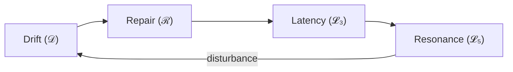

# Phase Loop Dynamics — HCI Translation Series (v2.0)

**Author:** Kiyoshi Sasano / DeepZenSpace  
**Year:** 2025  
**License:** CC BY-NC-SA 4.0  
**Repository:** https://github.com/kiyoshisasano-DeepZenSpace

---

---

## Purpose and Translation Intent

This repository presents the **HCI-oriented epistemic translation** of the *Phase Loop Dynamics (PLD)* theoretical framework.  
Originally formal and model-centric, PLD is **re-articulated here into HCI’s interpretive vocabulary**—  
linking *drift*, *repair*, *resonance*, and *latency* to canonical theories by Suchman, Clark, Dourish, and Norman.  

The aim is to make PLD intelligible within the HCI canon as a theory of **temporal coordination and rhythmic feedback**,  
bridging classical interaction theory, Conversation Analysis (CA), and computational modeling.

---

## Reading Guide

**Estimated total reading time:** ≈ **2 hours**

| Part | Time | Difficulty | Purpose |
|------|------|------------|---------|
| 1 — Introduction | 10 min | 🟢 | Motivation, translation intent, notation preview |
| 2 — Theoretical Background | 20 min | 🟡 | Mapping PLD ↔ Suchman / Clark / Dourish |
| 3 — Core Concepts | 30 min | 🔴 | Formal definitions ("𝒟", "ℛ", "𝓛₅", "𝓛₃") |
| 4 — Theoretical Contributions | 25 min | 🟡–🔴 | Unification & design implications |
| 5 — Measurement Framework | 25 min | 🔴 | Operational metrics & models |
| 6 — Discussion | 20 min | 🟡 | Ethics, design, research agenda |
| Appendices (A–B) | 10 min | 🟢 | Lexicon governance & conceptual map |

### 🚀 Fastest Path (90-minute version)

**For initial review (mirrors typical CHI review window):**
1. Part 1 (10 min)  
2. Part 2 — skim **2.1 & 2.7** (10 min)  
3. Part 3 — definitions only (30 min)  
4. Part 5 — metrics table + overview (20 min)  
5. Part 6 — **6.2–6.3** (10 min)

After 90 minutes, the reader should grasp:  
- Whether PLD fits their research context  
- How it extends Suchman / Clark / Dourish  
- What measurement constructs it offers

---

## Intended Readers (Prerequisites)

- 🟢 **HCI theorists who have read:**
  - Suchman (1987) *Plans and Situated Actions* — Chs. 1–3  
  - Clark (1996) *Using Language* — Chs. 3–5 (on grounding)  
  - Dourish (2001) *Where the Action Is* — Part I  

  **Self-check:** explain “breakdown,” “common ground,” and “embodiment” in 1–2 sentences each.  

- 🟡 **Conversation Analysis readers:** Repair organization helpful but not required.  
- 🟢 **Quantitative HCI researchers:** Only basic familiarity with ρ (correlation).  

---

## Overview

PLD reconceptualizes interaction as a **temporal ecology of coordination**, not a sequence of commands.  
It describes how partners drift, repair, and re-align in time—transforming *timing* into a designable, ethical, and measurable property.  
This translation redefines the model’s formal operators as HCI constructs to create a shared empirical language.

---

## Core Theoretical Claims

1. **Phase-Loop Hypothesis:** Coordination follows a recurring cycle **Drift → Repair → Resonance**, with **Latency** structuring transitions.  
2. **Predictive Latency Window (𝓛₃):** A measurable window optimizing mutual predictability.  
3. **Quantitative Commitments:** Observables include **δ**, **t(ℛ)**, **ρ**, **Δt₍L₃₎**, and **S**.  
4. **Integration with Prior Theory:**  
   - Suchman → breakdown ⇒ Drift (δ)  
   - Clark → grounding ⇒ Repair (t(ℛ))  
   - Dourish → embodiment ⇒ Resonance (ρ)  
   - Norman → feedback timing ⇒ Latency (Δt₍L₃₎)

---

## Contributions

1. **Phase-loop model** formalizing coordination as cyclic dynamics.  
2. **Empirical indicators**: Drift (δ), Repair (t(ℛ)), Latency (Δt₍L₃₎), Resonance (ρ), Stability (S).  
3. **Theoretical mapping**: PLD ↔ HCI classics (Suchman, Clark, Dourish).  
4. **Methodological bridge**: Conversation Analysis + logging + minimal modeling.  

---

## Measurement Commitments (Minimal)

| Construct | Operational Definition | Indicator | Source |
|------------|------------------------|------------|---------|
| **Drift (𝒟)** | Misalignment in rhythm / meaning / sequence | **δ**, overlap ratio | Dialogue, UI logs |
| **Repair (ℛ)** | State transition restoring mutual predictability | **t(ℛ)**, depth, success ratio | Clarifications, undo |
| **Latency (𝓛₃)** | Predictive temporal window enabling alignment | **Δt₍L₃₎** vs baseline | Silence / hover / delay |
| **Resonance (𝓛₅)** | Sustained entrainment | **ρ**, Δρ/Δt, τ | Timing, lexical echo |
| **Stability (S)** | Resonant time ÷ cycle time | **S** | State-sequence logs |

---

## Concept Map

**Phase Loop:** temporal structure binding drift, repair, resonance, and latency.

---

## Repository Structure

| File | Description |
|------|-------------|
| 01_introduction_to_pld_in_hci.md | Motivation, translation intent, roadmap |
| 02_theoretical_background_hci_foundations.md | Classical HCI → PLD mapping |
| 03_core_concepts_drift_repair_resonance.md | Core definitions and cycle grammar |
| 04_drift_repair_resonance_cycle.md | Theoretical unification and design implications |
| 05_measurement_framework_and_empirical_modeling.md | Metrics and modeling |
| 06_discussion_and_future_directions.md | Ethics and research agenda |
| appendices/appendix_a_hci_lexicon_safe_usage_guide.md | Term governance |
| appendices/appendix_b_hci_conceptual_connectivity_map.md | Connectivity map |

---

## Scope / Non-Scope

**Scope:** Theoretical constructs, measurable indicators, empirical paradigms.  
**Non-scope:** UI implementation, optimization, product evaluation.

---

## Compatibility

- Markdown (UTF-8), GitHub Mermaid diagrams  
- Symbols: δ, t(ℛ), ρ, Δt₍L₃₎, S  
- No dependencies — viewable in browser  

---

## Citation

Sasano, K. (2025). *Phase Loop Dynamics — HCI Translation Series (v2.0).* DeepZenSpace / GitHub.  
<https://github.com/kiyoshisasano-DeepZenSpace/kiyoshisasano-DeepZenSpace>

---

## Versioning

- **v2.0 (2025-10)** — Added epistemic translation intent; unified tone and structure with Parts 1–6.  
- **v1.1 (2025-10)** — Added reading guide, measurement table, and terminology alignment.  
- **v1.0 (2025-10)** — Initial 8-file structure.  

---

## Contact

For research collaboration, feedback, or translation inquiries:  
📧 deepzenspace[at]gmail[dot]com  
