# Appendix B — HCI Conceptual Connectivity Map (v 1.1)
*(Added Orientation, Reading Guide, and Cross-Reference Links)*

---

## B.0 Reading Orientation

**Estimated time:** ≈ 8 min **Difficulty:** 🟢 (reference / visualization)

| Section | Time | Focus | **How to Approach** |
|-----------|-------|--------|---------------------|
| B.1–B.3 | 4 min | Legend + Connectivity Diagram | Read once to grasp map structure |
| B.4–B.5 | 3 min | Interpretive and Usage notes | Skim for examples relevant to your domain |
| B.6–B.7 | 1 min | Version & Citation info | Use when referencing in reports |

**Fastest Path (≈ 4 min):**  
1. Glance at B.1 Legend → B.2 Diagram → B.3 Table.  
2. Optionally scan B.4 for causality clarifications.

---

```mermaid
flowchart TD
  A["@core Layer – Interaction Primitives"] --> B["@support Layer – Temporal Modulators"]
  B --> C["@derived Layer – Emergent Phenomena"]
  A --> D["Measurement Anchors (δ, t(ℛ), ρ, Δt₍L₃₎)"]
  D --> E["Empirical Models (Part 5)"]
  E --> F["Design + Ethics (Part 6)"]
  F --> G["Lexicon Governance (Appendix A)"]
```

**Figure B.1 – How conceptual connectivity links to measurement and design across the PLD framework.**

---

## Purpose

This appendix visualizes the conceptual relationships among the core, support, and derived terms of the **Phase Loop Dynamics → HCI** translation framework.  
It functions as a conceptual topology connecting timing, coordination, and repair processes across **Conversation Analysis (CA)** and **Human–Computer Interaction (HCI)**.

All relations are **functional rather than strictly causal** — they represent theoretical dependencies between coordination phenomena.

---

## B.1 Legend

| Symbol / Tag | Meaning | HCI Analogy |
|---------------|----------|--------------|
| @core | Foundational element of interaction dynamics | Turn-taking, repair, latency |
| @support | Contextual modulator of temporal flow | Rhythm, silence |
| @derived | Emergent phenomenon arising from loops | Resonance, coherence |
| 🟢 | Stable term | Established in HCI & CA |
| 🟡 | Cautious term | Requires contextual framing |
| 🔴 | Avoid / metaphorical | Not empirically validated |

---

## B.2 Connectivity Diagram

```mermaid
graph TD
    Drift["@core Drift (interactional misalignment) 🟡"] --> Repair["@core Repair (re-alignment) 🟢"]
    Drift --> PhaseBoundary["@derived Phase Boundary 🟡"]
    Repair --> Resonance["@derived Resonance (synchrony) 🟡"]
    Phase["@core Phase (interaction segment) 🟢"] --> PhaseBoundary
    Rhythm["@support Rhythm 🟡"] --> Phase
    Silence["@support Silence 🟡"] --> Repair
    Coherence["@derived Coherence 🟡"] --> Phase
    Latency["@derived Latency (anticipatory pause) 🟡"] --> Coherence
```

**Figure B.2 – Conceptual connectivity map of PLD constructs in HCI.**

---

## B.3 Relationship Table

| Source Term | Target Term | Relation Type | HCI Interpretation |
|--------------|--------------|---------------|--------------------|
| Drift (@core) | Repair (@core) | Sequential | Misalignment triggers recovery → parallels breakdown → repair cycles (Suchman 1987). |
| Drift | Phase Boundary | Causal | High drift magnitude marks topical or task transitions. |
| Repair | Resonance (@derived) | Recursive | Re-alignment enhances mutual prediction → temporal synchrony. |
| Phase (@core) | Phase Boundary | Structural | Segments continuous interaction into analyzable units. |
| Rhythm (@support) | Phase | Modulatory | Regular pacing stabilizes transitions between segments. |
| Silence (@support) | Repair | Trigger | Pauses cue self- or other-initiated repair. |
| Coherence (@derived) | Phase | Evaluative | Degree of semantic / temporal alignment within a segment. |
| Latency (@derived) | Coherence | Hypothetical | Predictive delay supports smoother continuation and coherence. |

---

## B.4 Interpretive Notes

### Temporal Causality vs Functional Dependency

Arrows indicate *functional dependence*, not deterministic cause.  
**Drift** statistically precedes **Repair** but may co-occur within the same segment.

### Bidirectionality

Relations are often reversible.  
**Repair** reduces **Drift**, yet excessive or premature **Repair** can re-induce **Drift** (e.g., over-correction in adaptive interfaces).

### Cross-Modality Applicability

Each link generalizes across speech, gesture, and interface events.  
Example: *Silence → Repair* covers both pause-before-rephrase and idle-before-click behaviors.

### Measurement Anchors

Every edge aligns with an empirical **PLD → HCI metric:** δ, t(ℛ), ρ, Δt₍L₃₎.  
Hence, the map is both conceptual and analytically testable.

---

## B.5 Usage Scenarios

| Stakeholder | Purpose | Example Application |
|--------------|----------|--------------------|
| HCI Researchers | Identify dependencies among temporal constructs before modeling. | Select relevant measures (δ, t(ℛ), ρ) for analysis. |
| Interaction Designers | Visualize timing relations to guide pacing. | Map silence thresholds to repair cues. |
| Cognitive Modelers | Parameterize simulation loops. | Define transition probabilities in timing models. |
| Educators / Writers | Illustrate conceptual coherence visually. | Teach the drift–repair–resonance cycle. |

---

## B.6 Evolution and Maintenance

**Version 1.0 (2025)** — First HCI translation of PLD v0.6; all relations reframed in human–computer coordination terms.  
Future updates may add quantitative weights or empirical coefficients derived from timing datasets.  
All extensions must comply with lexical stability standards (see Appendix A).

---

## B.7 Citation

**Phase Loop Dynamics — HCI Conceptual Connectivity Map (v1.0)**  
<https://github.com/kiyoshisasano-DeepZenSpacekiyoshisasano-DeepZenSpace>

> “Coordination is not a line of dialogue but a loop of timing.”

---

### Cross-Reference Note
Appendix B completes the translation suite:

- **Appendix A** → Lexical governance and term stability.  
- **Appendix B** → Conceptual connectivity and visual ontology.  
Together they support **Part 5 (Measurement)** and **Part 6 (Discussion)** by ensuring terminological and conceptual consistency across all PLD documents.

---
