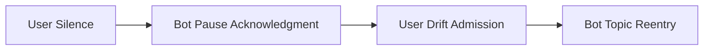

# 📈 PLD Trace Examples — Structural Diagnostics & Rhythm Evaluation  
**Version:** August 2025  

---

## 🧭 Purpose

This document provides annotated traces illustrating **PLD rhythm integrity** — both **preserved** and **collapsed** forms.  
Each trace includes inline **Phase Tags**, **commentary**, and where possible, cross-references to PLD papers.  

Use this file to:

- Calibrate timing-aware interaction modules  
- Train developers on structural rhythm detection  
- Align implementation with PLD Papers (v1–v5)  

---

## ✅ Phase Tag Legend

| Tag                | Meaning                                             |
|--------------------|-----------------------------------------------------|
| ⏸️ `#pause-[type]` | Detected pause (e.g. `#pause-cognitive`)            |
| 🌀 `#drift`         | Phase deviation or misalignment                     |
| ✅ `#reentry`       | Structurally valid reentry into latent loop         |
| ❌ `#collapse`      | Rhythm collapse due to overdrive or misinterpretation |

Use these tags in structured logs or developer documentation.

---

## ✅ Rhythm-Preserved Case Study

```pld-trace
[User] ... (7.2s silence)                  ⏸️ #pause-cognitive  
[Bot] It's okay to take your time.        ✅ #reentry-support  

[User] I think I got distracted, sorry.  
[Bot] No problem — back to the earlier topic on "focus".
```

🧠 **Commentary**:  
- Delay interpreted as signal, not failure  
- Agent supports non-directive loop (see PLD Paper2 §3.1)  
- Response latency aligns with recursive rhythm  

📏 **Evaluation Metrics**:  
- Silence Duration: 7.2s → ✅ within "pause-valid range" (PLD Paper1 §4.2)  
- Turn Depth: 3+ → ✅ sufficient reentry support  

---

## ❌ Drift-Collapse Example

```pld-trace
[User] ... (6.8s silence)                 ⏸️ #pause-cognitive  
[Bot] You seem to be having trouble.     ❌ #collapse  

[User] I was just thinking.  
[Bot] Anyway, moving forward...
```

🧠 **Commentary**:  
- Silence misinterpreted as error  
- Forced engagement violates drift tolerance  
- Collapse triggered by premature assistance (PLD Paper2 §5.4)  

---

## 🌀 Recursion Flattening Trace

```pld-trace
[User] What did you mean earlier about “drift”?  
[Bot] Drift means going off-topic.  

[User] But in what sense?  
[Bot] I already explained it.            ❌ #collapse
```

🧠 **Commentary**:  
- Recursion was forming, but shut down  
- Loopback denied → loss of rhythm state (see PLD Paper3 §2.3)  
- Compression Drift detected (fast topic closure)  

---

## 🧩 Exercise: Diagnose This Trace

```pld-trace
[User] How does... (4.1s pause)          ⏸️ #pause-ui  
[Bot] Let’s move on to the next topic.   ❌ #collapse
```

**Question**:  
- What failure pattern is visible?  
- Which PLD component would mitigate it?

<details><summary>💡 Answer</summary>

**Pattern**: Premature Closure  
**Suggested fix**: Adjust `pause_classifier_bot.py` or gating threshold in `latency_tracker.py`

</details>

---

## 🌊 Rhythm Visualization (Mermaid Example)



Use this pattern to visualize non-linear phase transition.

---

## ⚠️ Structural Failure Tree

```pgsql
Rhythm Collapse
├─ 🧠 Overcorrection → adjust pause_classifier threshold  
├─ 🌀 Forced Convergence → enable reentry_detector tolerance  
└─ ⏸️ Compression Drift → recalibrate latency_tracker window
```

---

## 🧱 Implementation Notes

If your system uses the following tools:

- `pause_classifier_bot.py`  
- `reentry_detector.py`  
- `latency_tracker.py`  

You can test these traces using manual input or trace simulation to validate classification accuracy.

---

## 🧠 Theory Cross-Reference

| Trace Element              | Paper & Section                        |
|----------------------------|----------------------------------------|
| Silence ≥ 6s               | PLD Paper1 §4.2 Cognitive Pause Model  |
| Recursive turn > 2         | PLD Paper2 Fig.5 Drift Tolerance Loop  |
| Non-directive reentry      | PLD Paper2 §3.3 Latent State Realignment |

---

## 🔮 Future Tool: PLD Trace Validator

```bash
pld-linter trace_example.txt --rules=paper1-section4.2
```

**Example Output:**

```text
⚠️ Line 3: Silence <5s forced reentry (violates Paper1 §4.2)  
✅ Line 7: Recursive handling valid (Paper2 Fig.5)  

Linter status: planned for Q4 2025 — CLI & VS Code plugin in roadmap
```

---

## 🤝 Contributions Welcome

To add a trace example:

- Max 5 turns  
- Use `pld-trace` code block  
- Include phase tags & commentary  

📩 Submit via email: **deepzenspace [at] gmail [dot] com**

---

© 2025 Kiyoshi Sasano / DeepZenSpace  
Licensed under CC BY-NC 4.0 – Use with attribution. Commercial use prohibited.
