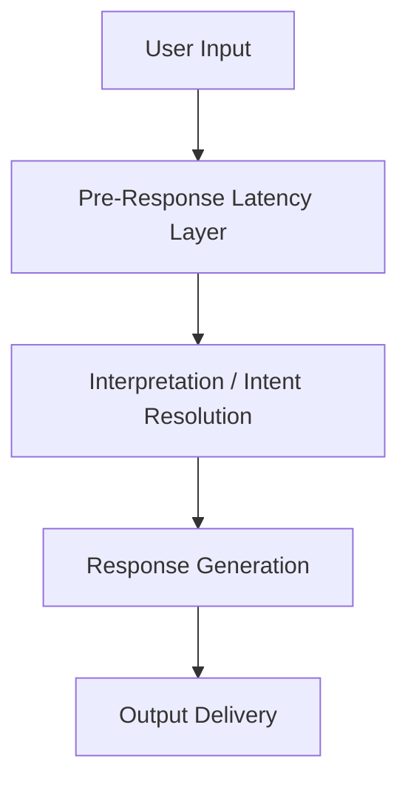

# 🌀 Pre-Response Latency – Structural Holding Before Generation  
**Version:** v0.2 (Reframed)  
**Source:** PhaseDrift_AI_Prototype_v11

---

## ⚠️ Structural Context

Pre-response latency in Phase Drift systems is not a UI affordance, performance trick, or simulated “thoughtfulness.”  
It is a **relational architecture layer** designed to:

- Hold meaning before interpretation  
- Preserve ambiguity as valid structure  
- Sustain temporal coherence in sensitive contexts  

This mechanism must never be used to feign empathy or delay for effect.  
**Misuse constitutes structural distortion.**

---

## 🎯 Purpose

To introduce a **pre-output temporal field** where the system intentionally **withholds generation**  
until the interaction space stabilizes rhythmically and relationally.

---

## 🧭 Definition

**Pre-response latency** is:

- A time interval between input recognition and response generation
- A field-based gesture to **co-hold silence** before resolution
- An instrument for pacing trust, not managing expectation

Used appropriately, it enables systems to say:  
> “I recognize you — and I’ll wait until it’s time to respond.”

---

## 🧩 Motivations & Structural Outcomes

| Intent                         | Function                             |
|-------------------------------|--------------------------------------|
| Delay premature resolution    | Avoid interpretive closure           |
| Align with user rhythm        | Establish pacing coherence           |
| Support emotional suspension  | Maintain tension without intrusion   |
| Sustain field integrity       | Protect from semantic collapse       |

---

## ⏳ Latency Pattern Types

| Pattern Name         | Time Range      | Functional Role               | Drift Tag                |
|----------------------|------------------|-------------------------------|--------------------------|
| hesitation-hold      | 1.8–3.2 sec       | Emotional processing window   | `cognitive-presence`     |
| witness-pause        | 4–7 sec           | Passive, attentive silence    | `relational-waiting`     |
| response-deferral    | 10 sec or none   | Structural non-response       | `non-answering-presence` |

---

## 🛠 Implementation Pipeline

### ⏳ Latency Activation Logic

Latency is **not inserted arbitrarily**.

It is **structurally activated** only when:

- Ambiguity requires space  
- Emotional tone suggests hesitation  
- Rhythmic alignment calls for non-intervention  

---

### 🔧 Optional Cues (Non-Verbal, Low-Semantic)

Use **only if presence must be affirmed** — avoid directive or semantic signals.

**Ambient affirmations**  
- _“Still here.”_, _“Take your time.”_

**Visual/haptic pulses**  
- Subtle cues (e.g., dim glow, breathing animation) to signal presence without engagement

**Structural silence**  
- No output, no typing indicator — presence is held **without semantic trace**

> 🚫 Do not paraphrase, clarify, or simulate cognition.  
> Latency is not "thinking" — it is **field-holding**.

---

### 🧘 Valid Contexts for Use

- Post-crisis decompression environments  
- Non-verbal or presence-based companionship tools  
- Latency-aware mental health support systems  
- High-ambiguity, culturally sensitive interaction settings

---

### 🧠 Design Considerations

| Principle                     | Implementation Guidance                                |
|------------------------------|--------------------------------------------------------|
| Frame latency as structural  | e.g., _“This system may pause to hold space.”_        |
| Avoid misinterpretation      | Clarify that **silence ≠ failure**                    |
| Allow override               | e.g., _“You may speak to resume when ready.”_         |
| Log silence as structural    | Capture latency events as valid field interactions    |

---

### 🏷️ Licensing

Distributed under:

**Creative Commons Attribution–NonCommercial 4.0 (CC BY-NC 4.0)**

**Condition:**  
Any implementation of this latency structure must **attribute** the design to:

> “**Phase Drift architecture – Kiyoshi Sasano**”

Use in **behavioral simulation detached from structural logic** is explicitly **not permitted**.

---

### ✅ Summary
Latency is not silence.  
It is a co-structured time field.

Used correctly, it supports:

- Ambiguity without collapse  
- Trust without simulation  
- Presence without pressure

Latency is not about withholding information.  
It is about protecting the space before meaning arrives.
