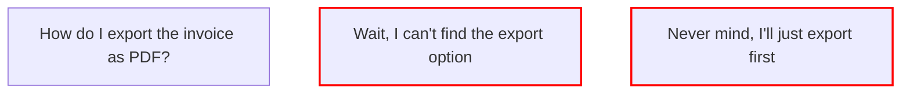

# 🔍 PLD Trace Analysis Demo

**Visualizing Conversational Structures in UX Flows**

This demo provides a lightweight analyzer based on [Phase Loop Dynamics (PLD)](https://zenodo.org/records/16736820).  
It identifies and annotates structural rhythm patterns such as:

- ⏸️ **Pauses** – UI friction, hesitation, or intent re-alignment
- 🔄 **Reentries** – Resumption of prior user intents
- 🌀 *Drifts* – (Planned future feature)

---

## 🗂 File Structure

| Path                         | Description                            |
|------------------------------|----------------------------------------|
| `input_trace.txt`           | Sample conversation log (User/Bot)     |
| `generate_trace.py`         | Main processing script                 |
| `outputs/`                  | Generated output files                 |
| ├─ `pld_trace.md`           | Markdown + Mermaid visualization       |
| └─ `pld_trace.json`         | Structured analysis result (JSON)      |
| `utils/`                    | Supporting analyzers                   |
| ├─ `pause_classifier.py`    | Rule-based pause detection             |
| └─ `reentry_detector.py`    | Reentry detection via intent match     |

---

## 🚀 Quick Start

### 1. Prepare Input

Edit `input_trace.txt` like below:

```text
[User] How do I export the invoice as PDF?
[Bot] You can select it from the "Document Export" menu.
[User] Wait, I can't find the export option.
[User] Never mind, I'll just export first.
```
### 2. Run Analysis
```bash
python generate_trace.py
```
### 3. View Results

- 📄 Human-readable → `outputs/pld_trace.md`
- 🧩 Machine-readable → `outputs/pld_trace.json`

---

## 🔬 Sample Output (Excerpt)

**Markdown: `pld_trace.md`**



**Tags:**

- [User] Wait, I can't find the export option  
  - ⏸️ UI Friction  
  - 💬 User cannot find UI element  

- [User] Never mind, I'll just export first  
  - ⏸️ Repair Pause  
  - 🔄 Reentry to: "How do I export the invoice as PDF?"
---
## 🎯 Design Goals

| Aspect            | Status                     |
|-------------------|----------------------------|
| Pause Detection   | ✅ Heuristic + GPT-4 (future-ready) |
| Reentry Analysis  | ✅ Intent matching across turns |
| Visualization     | ✅ Mermaid.js + Markdown     |
| Latency Tracking  | 🔜 Future integration        |
| Drift Detection   | 🔜 Under development         |

---

## 📚 Related Resources

- 🧠 **PLD Framework Documentation** — See [../structure_generators/](https://github.com/kiyoshisasano-DeepZenSpace/kiyoshisasano-DeepZenSpace/tree/e6278c2a9eb82006fd2aa68326829adafd942d9c/14_PLD-Bridge-Hub/structure_generators)  
- ⏱️ **Latency Tracker** — See [latency_tracker.py](https://github.com/kiyoshisasano-DeepZenSpace/kiyoshisasano-DeepZenSpace/blob/e6278c2a9eb82006fd2aa68326829adafd942d9c/14_PLD-Bridge-Hub/structure_generators/latency_tracker.py)  
- 🔁 **Reentry Detector** — See [reentry_detector.py](https://github.com/kiyoshisasano-DeepZenSpace/kiyoshisasano-DeepZenSpace/blob/e6278c2a9eb82006fd2aa68326829adafd942d9c/14_PLD-Bridge-Hub/structure_generators/reentry_detector.py)

> 💡 Note: This demo is designed for showcasing structural rhythm in conversational UX.  
> For production usage, integrate with the full **PLD-Bridge-Hub** system.
