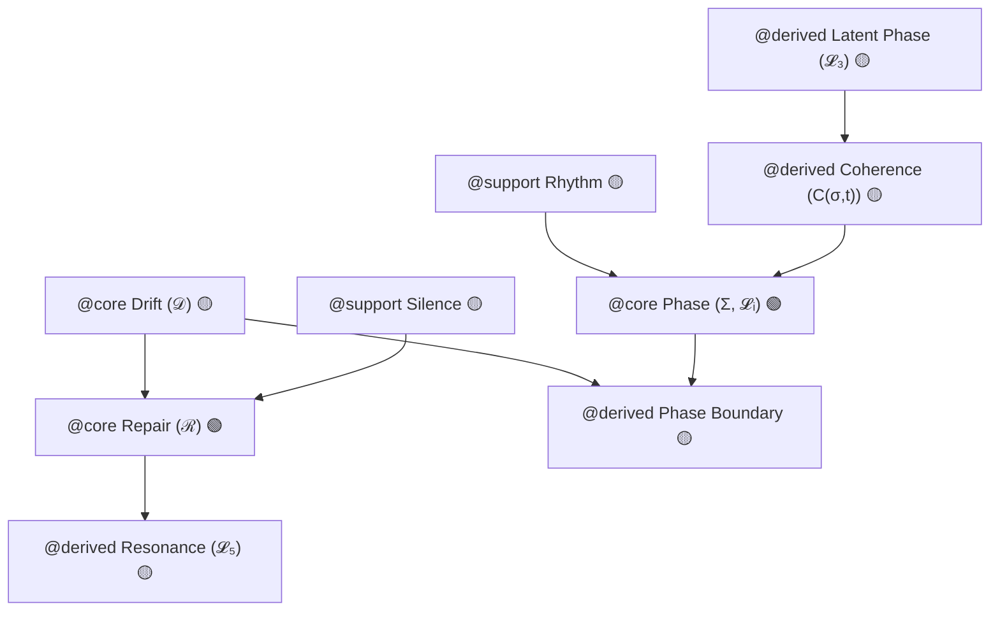

# 🗺️ PLD Lexicon Connectivity Map (v0.6)

> **Purpose:**  
> This document provides a **structural overview of lexical relationships** within the  
> Phase Loop Dynamics (PLD) framework. It is designed to help researchers, developers,  
> and collaborators navigate **core**, **support**, and **derived** terms, and to understand  
> how they interact in models, implementations, and theoretical mappings.

---

## 📖 How to Read This Map

- **@core** → Foundational concepts that anchor other terms and model logic.  
- **@support** → Contextual terms that rely on core terms for structure.  
- **@derived** → Emergent concepts formed by interaction between terms or states.  
- **Stability Indicators** (🟢 🟡 🔴) follow the [Lexicon Tiering Guide](./PLD_LEXICON_SAFE_USAGE_GUIDE.md).

> **Reference:**  
> - [Lexicon Tiering & Usage Stability Guide](./PLD_LEXICON_SAFE_USAGE_GUIDE.md)  
> - [PLD Glossary & Academic Mapping](./01_phase_loop_dynamics/09_glossary_academic_mapping.md)  

---

## 🔗 Connectivity Overview

---

## 🧩 Term Relationship Table

| Source Term              | Target Term                | Relation Type    | Notes                                                     |
|--------------------------|----------------------------|------------------|-----------------------------------------------------------|
| Drift `@core` 🟡         | Repair `@core` 🟢           | Sequential link  | Drift often triggers repair events. Linked to §1.4 Drift operator. |
| Drift `@core` 🟡         | Phase Boundary `@derived` 🟡| Causal link      | High drift magnitude can mark boundaries.                 |
| Repair `@core` 🟢        | Resonance `@derived` 🟡     | Recursive link   | Repair can create rhythmic echoes (see Dialogic Resonance). |
| Phase `@core` 🟢         | Phase Boundary `@derived` 🟡| Structural link  | Boundaries segment the phase space.                       |
| Rhythm `@support` 🟡     | Phase `@core` 🟢            | Modulatory link  | Temporal pacing influences phase transitions.             |
| Silence `@support` 🟡    | Repair `@core` 🟢           | Trigger link     | Silence can initiate repair sequences.                    |
| Coherence `@derived` 🟡  | Phase `@core` 🟢            | Evaluative link  | Coherence measures phase alignment.                       |
| Latent Phase `@derived` 🟡| Coherence `@derived` 🟡    | Hypothetical link| Supported by CA and psycholinguistic delay thresholds.     |

---

## 🧭 Usage Scenarios

- **Researchers** → Map conceptual dependencies before extending the PLD framework.  
- **Engineers** → Identify stable anchor terms for API or SDK parameter naming.  
- **Designers** → See how timing and rhythm terms connect to core structures.  

---

## 📌 Update Notes

- **v0.6** — Updated stability indicators (Drift 🟡, Resonance 🟡, Latent Phase 🟡).  
- Added explicit operator and symbol links for mathematical correspondence.  
- Maintained Mermaid diagram for GitHub compatibility.  

---

## 📘 Citation

**Phase Loop Dynamics — Lexicon Connectivity Map (v0.6)**  
<https://github.com/kiyoshisasano-DeepZenSpace>  

> These mappings are **structural guides**, not fixed taxonomies.  
> Lexical connectivity is a **field map** — it evolves as the framework matures.
