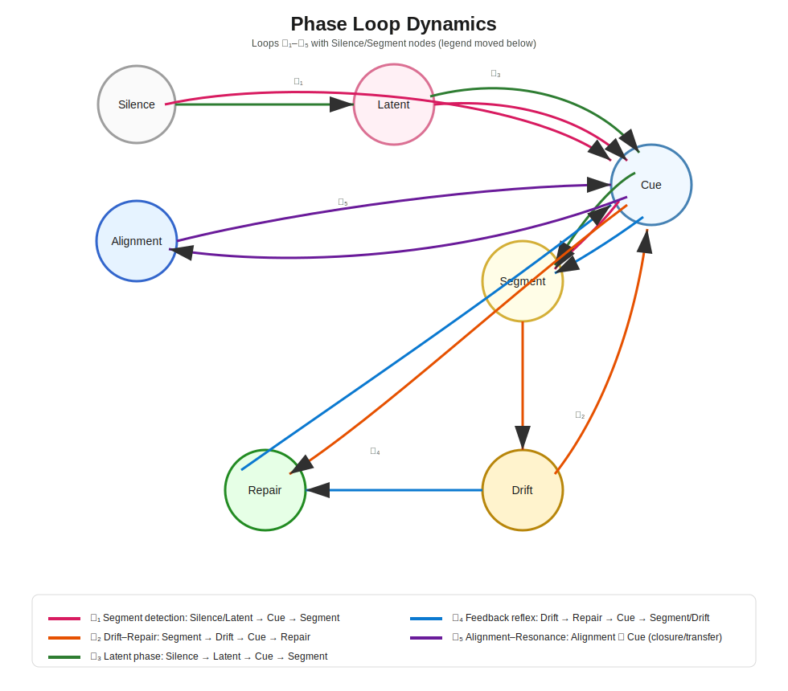
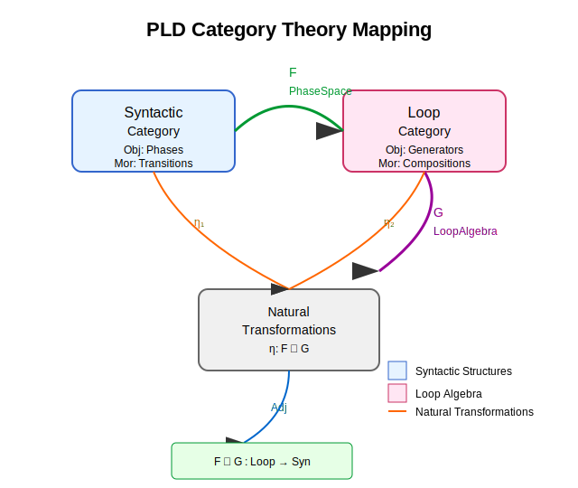

# 🔁 Phase Loop Dynamics — Structural Rhythm Architecture

> **From hesitation to harmony — design interaction rhythms that work.**

---

## 🚀 Start Here — Quick Collaboration Entry

📦 **[▶︎ Quickstart Kit](https://github.com/kiyoshisasano-DeepZenSpace/kiyoshisasano-DeepZenSpace/blob/1273de1ae451a80a71818f6bcac893dca42117f2/02_quickstart_kit/README_quickstart.md)**  
Ready-to-use patterns for **Rasa**, **Figma**, and **LLMs** —  
improve timing alignment, repair handling, and conversation reentry in hours, not weeks.

---

### 🏢 For Industry & Applied Teams
- **Reduce drop-offs** in real-time AI agents by addressing latency and rhythm gaps.
- **Embed repair loops** to recover user intent mid-interaction.
- **Turn silence into signal** — leverage hesitation as a design feature, not a failure.

📊 **Example Impact Metrics**  
| Metric                   | Before | After | Change |
|--------------------------|--------|-------|--------|
| Repair detection rate    | 70%    | 85%   | +15%   |
| Drop-off rate            | 25%    | 20.5% | –18%   |
| Reentry success rate     | 60%    | 67%   | +12%   |

---

### 🎯 For Designers & Developers
- **Rasa soft repair templates** – avoid premature conversation drops
- **Figma latency hold patterns** – keep attention during backend delays
- **LLM reentry prompts** – improve multi-turn coherence

📂 See: [`02_quickstart_kit`](https://github.com/kiyoshisasano-DeepZenSpace/kiyoshisasano-DeepZenSpace/tree/1273de1ae451a80a71818f6bcac893dca42117f2/02_quickstart_kit)

---


## 🖼 Big Picture — PLD in 4 Stages

<a href="./01_phase_loop_dynamics/10_phase_loop_dynamics.svg">

</a>  

1. **Observation** – Detect hesitations, drifts, and timing irregularities  
2. **Structural Model** – Formalize patterns into Drift / Repair / Resonance loops  
3. **Implementation Kit** – Tools for detection, logging, and integration  
4. **Applications** – Real-time systems, UX, and multi-modal environments

---

## 🤝 Collaboration Paths

| Role / Team              | Recommended First Step |
|--------------------------|------------------------|
| **Industry Partner**     | [Pilot Project Model](#pilot-project-model) |
| **UX Researcher**        | Try [Quickstart Patterns](https://github.com/kiyoshisasano-DeepZenSpace/kiyoshisasano-DeepZenSpace/tree/1273de1ae451a80a71818f6bcac893dca42117f2/02_quickstart_kit) |
| **Academic Collaborator**| See [Glossary & Academic Mapping](https://github.com/kiyoshisasano-DeepZenSpace/kiyoshisasano-DeepZenSpace/blob/1273de1ae451a80a71818f6bcac893dca42117f2/01_phase_loop_dynamics/09_academic_mapping_index.md) |

---

## 📘 Theory & Research (for Joint R&D)

> *This section connects PLD to academic frameworks and formal models.*

- **[Glossary & Academic Mapping](https://github.com/kiyoshisasano-DeepZenSpace/kiyoshisasano-DeepZenSpace/blob/1273de1ae451a80a71818f6bcac893dca42117f2/01_phase_loop_dynamics/09_academic_mapping_index.md)** — Cross-disciplinary concept alignment  
- **[Mathematical Appendix](https://github.com/kiyoshisasano-DeepZenSpace/kiyoshisasano-DeepZenSpace/blob/1273de1ae451a80a71818f6bcac893dca42117f2/01_phase_loop_dynamics/PLD_Mathematical_Appendix.md)** — Formal operators, phase space, and loop generators  
- **[Academic-to-PLD Reverse Mapping](https://github.com/kiyoshisasano-DeepZenSpace/kiyoshisasano-DeepZenSpace/blob/1273de1ae451a80a71818f6bcac893dca42117f2/01_phase_loop_dynamics/related_work/academic_to_pld_reverse.md)** — How existing literature maps back into PLD

---

## 📐 Core Principles

PLD structures interaction through rhythmic sequences:
1. **Drift (𝒟)** — delay, ambiguity, or asynchrony  
2. **Repair (ℛ)** — structural realignment or co-presence gesture  
3. **Resonance (𝓛₅)** — recursive echo or affective attunement  

📌 *Drift is not deviation — it's rhythm under construction.*

---

### 📜 Origin Story  

An unexpected insight from AI dialogue revealed that interaction rhythms start forming before words are spoken — this became the seed of PLD.  
What began as open-ended questions, with no analysis in mind, unfolded into a framework now linking design, AI, and cognitive science.


---


## 🧮 Mathematical Framing

<a href="./01_phase_loop_dynamics/diagrams/category_theory_mapping.svg">

</a>  

**Plain-language interpretation:**  
- **Drift:** When timing shifts enough to feel different, due to delay or async events.  
- **Repair:** Adjustment to realign interaction state.  
- **Reentry:** Return to a prior state after a disruption.  
- **Resonance:** Alignment between current and past state, creating rhythm.

**Optional LaTeX code (for MathJax viewers):**  

```latex
\Sigma = \mathcal{S} \times \mathcal{T} \times \mathcal{P}

\begin{aligned}
\text{Drift} &\sim \frac{\partial \Psi}{\partial t} > \theta \\
\text{Repair} &= \mathcal{R}(\sigma) \in \Sigma \\
\text{Reentry} &\iff \exists t_r : \Sigma(t_r) \approx \Sigma(t_0) \\
\text{Resonance} &\iff \langle \sigma_t, \sigma_{t-k} \rangle \to 1
\end{aligned}
```
## 📦 Quickstart Kit

📂 **[`02_quickstart_kit`](https://github.com/kiyoshisasano-DeepZenSpace/kiyoshisasano-DeepZenSpace/tree/1273de1ae451a80a71818f6bcac893dca42117f2/02_quickstart_kit)** includes:
- Hands-on examples for **Rasa**, **LLMs**, **Figma**
- Drift / Repair / Reentry logging templates
- Drop-in pattern modules

---

## 📩 Contact & Collaboration

- Email: **pld.partners@deepzenspace.org**  
- Contribution guide: [`05_field_stewardship`](./05_field_stewardship)  
- License: **Creative Commons BY-NC 4.0**

---
