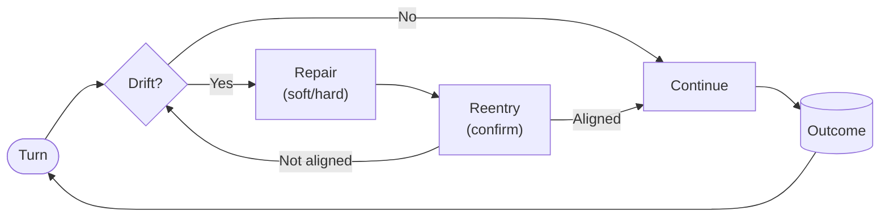

# PLD: Phase Loop Dynamics  
### *A Runtime Phase Model for Stable Multi-Turn LLM Systems*

---

## 🧠 Why PLD Exists — 10 Seconds

Modern multi-turn LLM systems rarely fail because they lack capability —  
they fail because interaction alignment **drifts over time**.

PLD provides a runtime loop that:

- Detects drift early  
- Repairs and confirms alignment  

…and ensures the agent remains stable across turns.

```
Detect → Repair → Reenter → Continue → Complete
```

---

## 🧩 What PLD *Is* — 30-Second Understanding

PLD is:

- 🧠 A **runtime phase model** for continuous multi-turn alignment  
- 🔍 A methodology for detecting and correcting conversational drift  
- 📊 An **observable behavioral framework** — not a prompt, dataset, or product  
- ⚙️ A set of **integration patterns** compatible with existing orchestrators  
- 🧩 Model-agnostic: works with RAG, tool-enabled agents, and memory systems  

> PLD defines *how alignment is maintained over time* —  
not how a single response is generated.

If you're building multi-step or tool-using agents, **PLD applies.**

---

## 🚀 Who Should Use PLD

| Role | What PLD Improves |
|---|---|
| **LLM / Agent Engineers** | Tool invocation stability, reduced error cascades |
| **Conversation & UX Designers** | Predictable repair patterns and confidence signaling |
| **Evaluation / QA / AgentOps** | Repeatable behavioral metrics and trace reviews |

---

## 🧭 The PLD Runtime Loop

| Phase | Purpose | Example Signals |
|---|---|---|
| **Drift** | System diverges from task or shared state | contradictions, wrong tool, memory errors |
| **Repair** | Apply soft or hard corrective action | clarify, restate, reset |
| **Reentry** | Confirm alignment before proceeding | summarization, explicit checkpoint |
| **Continue** | Resume task execution | next substep |
| **Outcome** | Completed, partial, failed, or abandoned | measurable end-state |

> PLD is framework-agnostic — works with LangGraph, Swarm, AutoGen, Assistants API, or custom loops.

---

### 📈 PLD Loop Diagram



📁 Full diagram: `/docs/model_diagram.md`

---

## 🆚 Before / After — What Changes With PLD?

| Scenario | Without PLD | With PLD |
|---|---|---|
| Tool calling | repeated invalid calls | drift → confirm constraints → correct call |
| Context handling | forgotten constraints | repair + reentry stabilize context |
| Failure behavior | silent collapse | graceful fallback or controlled exit |
| Trust signals | unpredictable | visible alignment & confirmation |

PLD doesn’t decorate the interaction —  
**it governs how it behaves over time.**

---

## 📂 Repository Overview

```
/quickstart     — Conceptual model + integration patterns (start here)
/pld_runtime    — Reference implementation (optional)
/docs           — Model rationale, semantics, and behavioral framework
/analytics      — Benchmark datasets + traces
/field          — Adoption methodology, onboarding, and collaboration
```

More detail: `/docs/repo_structure.md`

---

## 🧪 Getting Started (Fast Path)

| Step | Folder | Purpose |
|---|---|---|
| 1 | `/quickstart/overview/` | Understand the PLD loop |
| 2 | `/quickstart/operator_primitives/` | Use drift / repair / reentry operators |
| 3 | `/quickstart/patterns/` | Apply agent + UX integration templates |
| 4 | `/quickstart/metrics/` | Log drift → repair → reentry → outcome |
| 5 | `/analytics/` | Compare against benchmark traces |

---

### ▶ Conceptual Demonstration

> A **reference example** for understanding the runtime loop — not production code.

```python
if drift_detector.detect(state):
    state = repair_operator.apply(state)

    if not reentry.check(state):
        return graceful_exit(state)
```

Shows:

- phase transitions  
- soft/hard repair  
- behavioral logging schema  

Production integration depends on your orchestrator and tool stack.

---

## 📌 Where PLD Helps Most

| System Type | Impact |
|---|---|
| Tool-Using Agents | stops repeated mis-calls and runaway retries |
| RAG Assistants | prevents retrieval drift + hallucinated grounding |
| Workflow / Automation Agents | provides restart checkpoints |
| Support / Task Bots | improves recoverability and user trust |
| Evaluation Pipelines | enables apples-to-apples behavioral comparison |

---

## 📊 Evidence & Benchmarking

Validated with:

- MultiWOZ 2.4 — **200 labeled conversations**
- Tool-enabled autonomous agents  
- Memory-integrated orchestrators  
- Prototype production deployments  

Observed outcomes include:

- ↓ drift frequency  
- ↓ abandonment / silent reset  
- ↑ successful reentry  
- ↓ invalid tool invocation loops  

📁 Details: `analytics/`

---

## 🔌 Integrations

Supports:

- LangGraph  
- Assistants API  
- Swarm  
- AutoGen / CrewAI  
- ReAct-pattern agents  
- Rasa  
- Custom orchestration frameworks  

No lock-in — **only the loop is required.**

---

## 🤝 Contribution

Contributions most valuable when focused on:

- integration adapters  
- PLD-formatted datasets  
- logging / metrics extensions  
- alternative repair strategies  

📄 Role boundaries for collaboration:  
`field/ROLE_ALIGNMENT.md`

Before modifying quickstart behavior, check:

```
quickstart/_meta/MIGRATION.md
quickstart/_meta/CHANGELOG.md
```

---

## 📜 License

```
CC BY-NC 4.0 — internal use, experimentation, and research allowed.
Commercial deployment requires permission.
```

---

Maintainer: **Kiyoshi Sasano**

> **PLD is behavioral infrastructure — not a feature.  
It ensures systems stay aligned as they interact, not just at initialization.**

