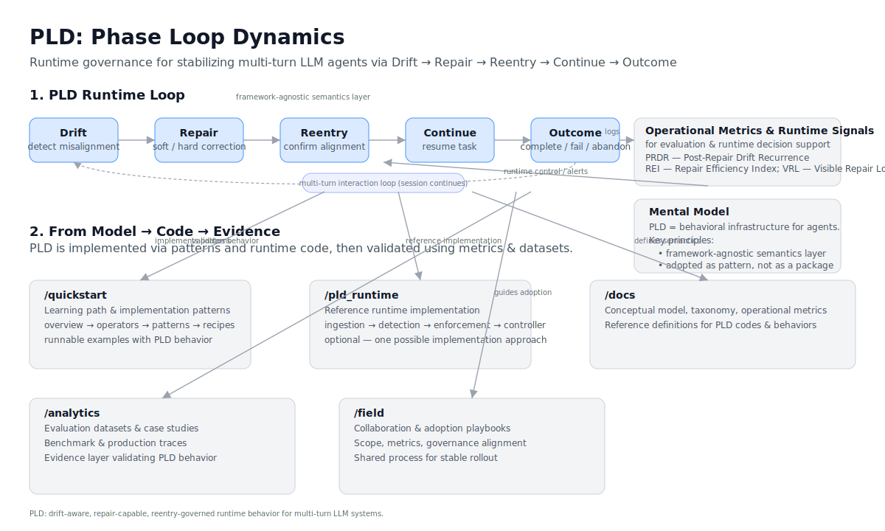

# PLD — High-Level Summary

> A runtime governance model for stabilizing multi-turn LLM agents — bridging conceptual design, implementation patterns, evaluation signals, and operational practice.

---

# Repository Summary

> High-level architecture and lifecycle overview of PLD.



---

## 1. Why PLD Exists

Multi-turn LLM agents don’t usually fail because they lack capability —  
they fail because behavior **drifts over time**.

Without runtime governance, agents develop:

- cascading tool failures
- self-contradiction and hallucinated context
- memory drift or task forgetting
- unstable reasoning loops
- silent misalignment with user intent

PLD introduces a structured runtime loop that detects misalignment early, repairs behavior, and confirms recovery before continuing.

```
Drift → Repair → Reentry → Continue → Outcome
```

---

## 2. What PLD Is (and Is Not)

PLD is:

- a **runtime phase model** for maintaining alignment over multiple turns  
- a structured method for drift detection, repair, and confirmation  
- **observable and measurable**, designed to integrate with telemetry and evaluation  
- framework-agnostic: compatible with tool agents, RAG systems, memory-enabled agents, and planners  

PLD is **not**:

- a prompt template  
- a single API or product  
- a fixed implementation  
- a one-shot evaluation method  

Rather, PLD provides a **governance layer**, not architectural lock-in.

---

## 3. Who Uses PLD

| Role | Value |
|------|-------|
| LLM / Agent Engineers | Fewer cascading failures and forced resets |
| UX Designers | Predictable repair and confirmation patterns |
| AgentOps / Eval Teams | Observable, comparable, repeatable behavior diagnostics |
| Research / Applied ML | A structured way to study alignment dynamics over time |

---

## 4. The Runtime Loop

| Phase | Purpose | Common Signals |
|-------|---------|----------------|
| **Drift** | Detect divergence from task or shared state | invalid tool use, contradiction, missing constraints |
| **Repair** | Apply a correction (soft or hard) | clarification, reset, constraint restatement |
| **Reentry** | Confirm alignment is successfully restored | checkpoint summary, task restatement |
| **Continue** | Resume task execution | next valid action or response |
| **Outcome** | Resolve the interaction | success / partial / failure / abandoned |

> Compatible with LangGraph, Assistants API, AutoGen, Swarm, Rasa, ReAct-style planners, and custom orchestrators.

---

## 5. Repository Architecture — How to Read This Repo

The repository is organized into five main areas:

```
/quickstart — Learning path + implementation patterns (start here)
/pld_runtime — Reference implementation (optional)
/docs — Conceptual model, taxonomy, diagrams, definitions
/analytics — Benchmarks, evaluation traces, case studies
/field — Adoption methodology and collaboration structure
```


A concise map:

| Layer | Role |
|-------|------|
| Concept Model | `/docs` |
| Implementation Patterns | `/quickstart` |
| Optional Runtime Reference | `/pld_runtime` |
| Evidence & Evaluation | `/analytics` |
| Organizational Adoption | `/field` |

---

## 6. How to Adopt PLD (Implementation Flow)

A recommended onboarding path:

1. Understand the runtime loop → `/quickstart/overview/`

1.5 Run the teaching runtime (first contact) → `quickstart/hello_pld_runtime.py`  
    → Experience: **Drift → Repair → Reentry → Continue**

1.75 Run the real runtime engine → `quickstart/run_minimal_engine.py`  
     → Verify: ingestion, controller logic, and enforcement policies

2. Apply drift/repair/reentry primitives → `/quickstart/operator_primitives/`

3. Use modular patterns → `/quickstart/patterns/`

4. Run runnable integration recipes → `/quickstart/patterns/04_integration_recipes/`  
　 - Optional: `failover_recipe.md` — bounded retry + controlled failover  
　　 (recommended after mastering core loop)

5. Log drift → repair → reentry → outcome signals → `/quickstart/metrics/`

6. Compare runtime behavior against evaluated traces → `/analytics/`

7. Apply operational metrics for tuning and release gating →  
   `/docs/07_pld_operational_metrics_cookbook.md`  
　 → Measure: **PRDR (stability) · REI (cost-effectiveness) · VRL (visible repair load)**

---

This onboarding path bridges:

> **Concept → Interaction → Implementation → Observability → Evaluation → Operationalization**

---

## 7. Supporting Layers

### Runtime Reference

`pld_runtime` is not required — it serves as a reference implementation demonstrating how the semantics of PLD map to real systems.

### Metrics as Control Signals

Metrics are not merely post-hoc evaluation.  
They also act as **runtime decision inputs**, including:

- phase transitions  
- confidence thresholds  
- fallback and retry gating  
- repair success validation  

📌 Metrics = evaluation + real-time observability + control.

### Evidence Layer

`analytics` provides the empirical backbone validating PLD across:

- MultiWOZ 2.4 (200 annotated dialogs)
- tool-enabled agent traces
- applied SaaS support case study
- field PoC deployments

---

## 8. One-Sentence Definition

> PLD is a runtime governance framework that stabilizes multi-turn LLM agents through structured drift detection, repair, and reentry — bridging conceptual design and operational practice.

---

Maintainer: **Kiyoshi Sasano**  
License: **CC BY 4.0 (commercial use requires written permission)**


