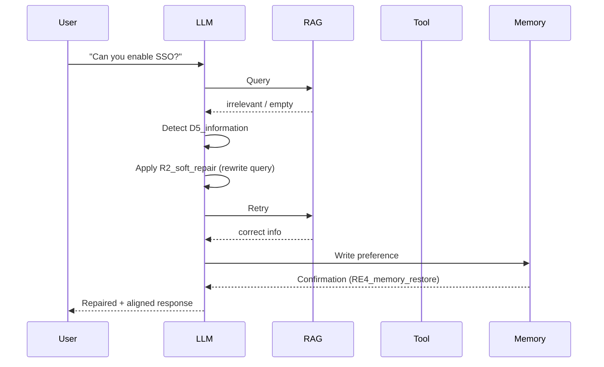
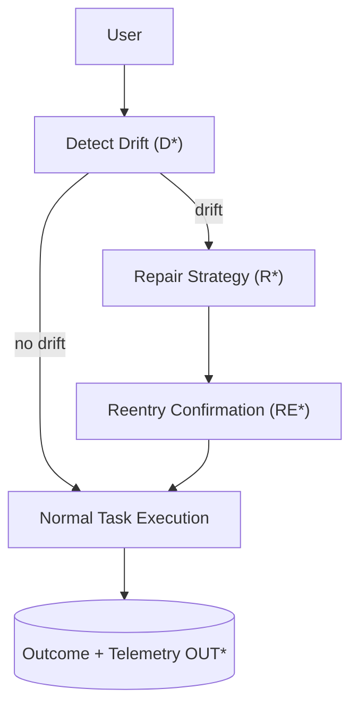

# End-to-End Case Study  
### *How PLD Transforms a SaaS Support Agent from Reaction → Regulation → Reliability*

> **Version 1.1 Update**
> - Synchronized taxonomy with Integration Recipes v1.1 (`D*`, `R*`, `RE*`, `OUT*`)
> - Updated architecture diagrams to reflect central Reentry Orchestrator
> - Metrics reporting now aligned with `PRDR`, `VRL`, and `REI` canonical definitions

---

## 1 — Purpose & Motivation

This case study demonstrates how **Phase Loop Dynamics (PLD)** improves a real-world multi-turn agent deployed in a SaaS customer support context.

Instead of preventing failure, PLD introduces:

| Property | Meaning |
|---------|---------|
| **Detectability** | Problems are signaled as structured drift codes (`D*`) |
| **Recoverability** | Repairs follow predictable, repeatable strategies (`R*`) |
| **Stability** | A runtime reentry layer governs continuation (`RE* → OUT*`) |

> **The goal is not perfection — the goal is runtime stability.**

---

## 2 — Scenario

A support assistant must:

- search documentation (RAG),
- open support tickets (tool),
- persist user preferences across turns (memory).

Each capability introduces a distinct drift surface:

| Component | Drift Risk | PLD Code |
|-----------|------------|----------|
| Retrieval | empty, irrelevant, or hallucinated results | `D5_information` |
| Tool Execution | missing/invalid arguments, hallucinated tools | `D4_tool` |
| Memory Use | outdated, incorrect, contradictory recall | `D2_context` |

---

## 3 — Baseline Behavior (No PLD)

### 3.1 Baseline Architecture (Before)

```text
User
  ↓
LLM Core
  ├─ Mock RAG (KB lookup)
  ├─ Ticket Tool (create / update ticket)
  └─ Ephemeral Memory (in-session only)
      ↓
Response
```
In this baseline, the LLM directly decides:

- whether to call RAG,
- whether/how to call the ticket tool,
- whether to read/write ephemeral memory,

…**without any explicit drift detection, repair strategy, or reentry control.**

---

### 3.2 Baseline Failure Transcript (No PLD)

| Turn | User Intent | System Behavior (Simplified) | PLD View (If It Existed) |
|------|-------------|------------------------------|---------------------------|
| 1 | Ask about a feature | Returns irrelevant retrieval → confidently hallucinated explanation | Would be `D5_information` |
| 2 | Request ticket creation | Model calls tool with missing `priority` → tool rejects / silent failure | Would be `D4_tool` |
| 3 | Ask about upgrade path | Memory incorrectly recalls “enterprise plan” → suggests paid-only features | Would be `D2_context` |

From the user's perspective:

- the assistant appears confident but unreliable,  
- errors stack instead of recovering,  
- there is **no visible correction or reentry.**

---

### 3.3 Metrics Snapshot (Before PLD)

| Metric | Value (Baseline) | Interpretation |
|--------|------------------|----------------|
| **PRDR** | `0.78` | Most failed responses repeat drift rather than recover |
| **VRL** | `0.04` | Almost no visible repair messages |
| **REI** | `0.00` | No measurable reentry success |

> **Baseline summary:**  
> The system works only when nothing goes wrong —  
> and collapses when drift occurs.

---

## 4 — PLD Integration Overview

Instead of redesigning the system, PLD wraps the runtime with:

- **drift detection (`D*`)**
- **repair strategies (`R*`)**
- **reentry confirmation (`RE*`)**
- **structured outcome signaling (`OUT*`)**

This converts the agent from *reaction-based output* → to a **governed runtime loop**.

---
### 4.1 Component-Level Enablement

PLD is applied incrementally — one subsystem at a time — without rewriting the architecture.

| Component | Before | After PLD Integration |
|-----------|--------|----------------------|
| Retrieval | Free-form model queries | Retrieval emits `D5_information` when confidence or relevance drops |
| Tool Execution | LLM decides arguments heuristically | Tool results emit `D4_tool` when schema mismatch or failure occurs |
| Memory | Silent overwrite or inconsistent usage | Reads/writes monitored; misalignment generates `D2_context` |

Each repair strategy becomes routable and observable:

```text
# Runtime Policy Mapping
D5  → R2_soft_repair
D4  → R3_schema_fix
D2  → R1_clarify_memory
```

Instead of collapsing, the system now *repairs → reenters → continues.*

---

### 4.2 Example PLD Execution Timeline


> The runtime loop is now visible, explainable, repeatable, and debuggable.

---

## 5 — Final Runtime Architecture (With PLD)


Key transition:
> The system shifts from uncontrolled generation → to a policy-driven runtime loop.

---

## 6 — Outcome Metrics (Before → After)
```md
| Metric | Before | After PLD | Interpretation |
|--------|--------|-----------|----------------|
| PRDR | **0.78 → 0.21** | Repairs succeed instead of escalating |
| VRL | **0.04 → 0.63** | Repair reasoning is now visible rather than silent |
| REI | **0.00 → 0.84** | System reliably realigns after drift |
```

PLD does not eliminate failure —
it ensures failure becomes:
- observable,

- recoverable,

- repeatable,

- measurable.

---

## 7 — Operational Meaning
```md
Engineering → Controlled retry loop with structured boundaries  
Product → Transparent repair UX improves trust  
SRE/Operations → Logs become actionable telemetry, not guesswork
```
Instead of saying:
> "The model is unpredictable."
…teams can now ask:
> "Which drift type is driving instability, and is the repair strategy insufficient?"

---

## 8 — Lessons Learned
---

## 8 — Lessons Learned

| Insight | Effect |
|---------|--------|
| Models drift differently depending on subsystem | Repairs must be **drift-specific** |
| Repair is not a model behavior — it is a **runtime policy** | Can be **tuned, tested, and monitored** |
| Stability is not achieved by preventing errors | but by **recovering alignment systematically** |

---

## Final Summary

With PLD, agent behavior becomes **governable**.

Errors are not model failures —  
they are **runtime events with structured recovery paths.**

The agent now demonstrates:

- predictable runtime behavior  
- observable correction cycles  
- stable long-horizon interaction  

---

Maintainer: **Kiyoshi Sasano**

