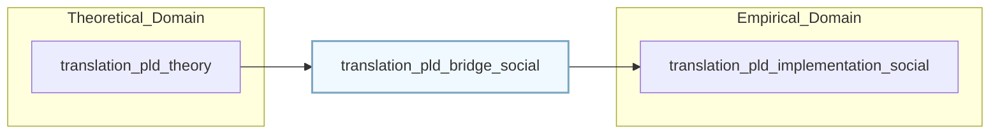

# 🧩 PLD Social Bridge — Translating Resonance and Repair Across Scales (v1.0)

> “Between meaning and measurement lies the bridge of synchronization.” 
> — *Jointly authored by Prof. Elena Morales & Dr. Aaron Kim (2025)*

---

## 1. Overview

The **Social Bridge Layer** connects *Phase Loop Dynamics (PLD)* theory to  
empirical models of trust and synchronization. It anchors theoretical constructs  
(autopoiesis, drift, repair, resonance) within measurable social network dynamics.

| Layer | Function | File Reference |
|--------|-----------|----------------|
| **PLD Theory** | Luhmann–Lewicki foundations of trust communication | `translation_pld_theory/` |
| **Bridge (this)** | Integrative modeling of communication feedback as synchronization | `translation_pld_bridge_social/` |
| **Empirical/Implementation** | Applied analytics and measurement frameworks | forthcoming `translation_pld_implementation_social/` |

---

## 2. Dual-Persona Orientation

| Persona | Discipline | Primary Question |
|----------|-------------|------------------|
| **Prof. Elena Morales** | Social Systems Theory | How do communicative systems maintain coherence under drift? |
| **Dr. Aaron Kim** | Computational Network Science | How can trust resonance be quantified and simulated? |

The bridge exists **between Elena’s interpretive depth** and **Kim’s quantitative rigor** —  
a shared plane where *symbolic communication* meets *phase synchronization*.

---

## 3. Structural Position of the Bridge

**Bridge Layer Function:** Transform abstract social dynamics into structured simulation logic,  
while retaining interpretive validity.

---

## 4. Social Feedback Topology

The PLD Social Bridge reframes trust dynamics as **multi-scale feedback systems**.  
Elena interprets them through *autopoietic loops of meaning*,  
while Kim operationalizes them via *coupled oscillators and network feedback.*

| PLD Loop | Theoretical Meaning (Morales) | Empirical Mapping (Kim) |
|-----------|-------------------------------|--------------------------|
| 𝓛₂ Drift–Repair | Reconstitution of meaning after noise | Trust recovery after sentiment decay |
| 𝓛₃ Latency Hold | Temporal suspension enabling reflection | Delay before social correction |
| 𝓛₅ Resonance | Re-entry of meaning into synchronization | Phase-lock of cooperative rhythms |

**Bridge interpretation:**  
These loops do not replace one another — they interpenetrate.  
Each oscillation of trust is both a *semantic event* and a *temporal signal.*

---

## 5. Workflow Integration Map

| Stage | Description | Input / Output |
|--------|--------------|----------------|
| 1. Theoretical Encoding | Translate communicative functions (Luhmann, Lewicki) into PLD syntax. | Input: `translation_pld_theory/*.md` |
| 2. Bridge Modeling | Map PLD loops to network metrics and trust oscillations. | Output: `social_drift_repair_guide.md`, `trust_resonance_patterns.md` |
| 3. Measurement Schema | Define δ, ρ_sync, S_index, and Δt₍L₃₎ as empirical variables. | Output: `measurement_framework.md` |
| 4. Implementation | Integrate into simulation or data pipelines. | Input for: `translation_pld_implementation_social/` |

> Each stage preserves interpretive equivalence while enabling empirical verification.

---

## 6. Theoretical–Empirical Bridge Equation

The bridge layer can be summarized by a composite mapping:

$$
PLD_{social} = f_{semantic}(communication) + f_{temporal}(synchronization)
$$

or equivalently:

$$
Trust_{system}(t) = g_{Luhmann}(meaning\ closure) \oplus g_{Strogatz}(phase\ coherence)
$$

This dual function ensures that **semantic autopoiesis** and **temporal coupling**  
can be co-measured as unified *resonant coherence.*

---

## 7. Meta-Cognitive Checkpoints

- Does semantic “trust repair” correspond to measurable phase recovery?  
- Can we distinguish synchronization from conformity within network coupling models?  
- How does the bridge preserve theoretical meaning while enforcing empirical validation?  
- Are drift and resonance symmetrical across micro (individual), meso (network), and macro (institutional) levels?

---

## 8. Reading Sequence (Recommended Path)

1. **Begin with theory:**  
   `translation_pld_theory/04_alignment_resonance.md` — conceptual definition of resonance.  

2. **Enter the bridge:**  
   `translation_pld_bridge_social/social_drift_repair_guide.md` and `trust_resonance_patterns.md` — dual modeling of drift and synchronization.  

3. **Proceed to metrics:**  
   `translation_pld_bridge_social/measurement_framework.md` — operational definitions of δ, ρ, and S.  

4. **Conclude with synthesis:**  
   This README — interpretive map connecting theoretical and computational layers.

---

## 📘 Citation

**PLD Social Bridge — Translation Ecology for Social Synchronization (v1.0)**  
_Compiled by Prof. Elena Morales & Dr. Aaron Kim_  
_DeepZenSpace / AI Social Alignment Translation Project, 2025_

> “Bridging theory and data is itself a social act —  
> an oscillation between meaning and measurement.”
