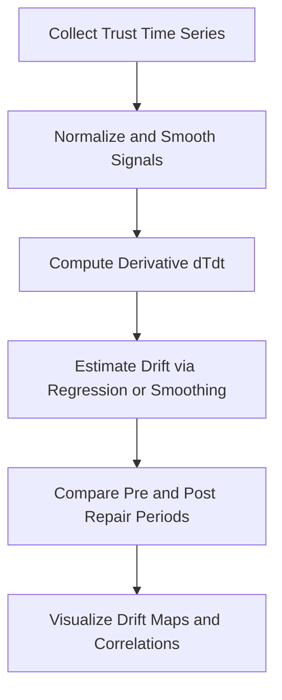
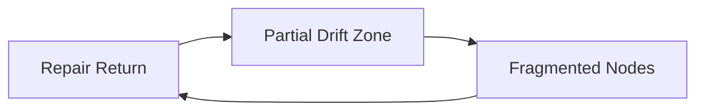

# 📉 Trust Drift Metrics — Modeling Social Erosion Dynamics (v1.0)

> “Every social system drifts — the question is not *if*, but *how fast and how far*.”  
> — *Dr. Aaron Kim, 2025*

---

## 1. Purpose and Context

This document defines **δ (social drift)** as the rate of **trust erosion** across time, communication cycles, or network interactions.  
Within Phase Loop Dynamics (PLD), *drift* represents the entropy increase that precedes repair and synchronization.

- **Scope:** Networked social systems (organizations, communities, online ecosystems)  
- **Objective:** Quantify drift as a measurable signal of systemic instability.  
- **Orientation:** Empirical — translating the concept of *disalignment* into traceable data patterns.

---

## 2. Theoretical Anchors

| Theory | Core Mechanism | Relevance to δ |
|--------|----------------|----------------|
| **Luhmann (1984)** | Trust reduces system complexity; drift = communication noise | δ measures deviation from stable expectation. |
| **Lewicki & Bunker (1996)** | Trust decays in absence of reinforcement | δ captures rate of confidence decline. |
| **Barabási (2002)** | Network hub overload leads to local breakdown | δ reflects topological stress propagation. |
| **Watts (2004)** | Cascades and tipping points in networks | δ predicts systemic thresholds for failure. |

---

## 3. Conceptual Model

Social drift (δ) is treated as the **time derivative of trust coherence (T)**:

$$
\delta = -\frac{dT}{dt}
$$

Where **T(t)** is the normalized trust level between agents or within a group (0–1 scale).

### Drift Decomposition

| Component | Description | Measurement |
|------------|--------------|--------------|
| **δ_structural** | Network fragmentation | Δ clustering coefficient per time unit |
| **δ_cognitive** | Belief inconsistency | Sentiment polarity variance |
| **δ_behavioral** | Cooperation decline | Drop in cooperative interactions |

The total drift rate is approximated by weighted aggregation:

$$
\delta_{total} = w_1\delta_{structural} + w_2\delta_{cognitive} + w_3\delta_{behavioral}
$$

---

## 4. Empirical Variables

| Variable | Description | Data Type | Example Source |
|-----------|--------------|-----------|----------------|
| `trust_score_t` | Time series of interpersonal or intergroup trust | Float (0–1) | Surveys, online ratings |
| `communication_entropy` | Message dispersion or topic divergence | Float | Text analytics |
| `network_density` | Ratio of observed to possible ties | Float | Graph data |
| `sentiment_drift` | Polarity shift per unit time | Float | NLP sentiment analysis |
| `cooperation_rate` | Frequency of positive exchanges | Float | Transaction logs |

---

## 5. Drift Estimation Models

### a. Exponential Decay Model
The simplest functional form:

$$
T(t) = T_0 e^{-\delta t}
$$

This assumes constant drift rate over time.  
Estimated by linearizing log-trust trajectories.

### b. Piecewise Drift with Repair Reset

$$
T(t) =
\begin{cases}
T_0 e^{-\delta_1 t}, & \text{for } t < t(\mathcal{R}) \\
T_{repair} e^{-\delta_2 (t - t(\mathcal{R}))}, & \text{for } t \ge t(\mathcal{R})
\end{cases}
$$

Drift rate may decrease post-repair (adaptive learning).

### c. Multi-Agent Drift Simulation

In network context:

$$
\frac{dT_i}{dt} = -\delta_i T_i + \sum_j a_{ij}(T_j - T_i)
$$

Where:
- $T_i$ = trust level of node *i*  
- $a_{ij}$ = tie weight between *i* and *j*  
- $\delta_i$ = local drift coefficient

This equation links **trust diffusion** with **structural decay**.

---

## 6. Empirical Implementation Workflow

*Implementation tip:*  
In Jupyter, rolling regressions (e.g., `.rolling(window=3).mean()`) can estimate drift trajectories robustly.

---

## 7. Metrics Summary Table

| Metric | Formula | Interpretation | Output |
|--------|--------|----------------|--------|
| `trust_drift_rate` | $-\frac{dT}{dt}$ | Instantaneous trust decay | per period |
| `avg_drift_rate` | $\text{mean}(\delta)$ | Overall system erosion rate | scalar |
| `drift_variance` | $\text{var}(\delta)$ | Volatility of social stability | scalar |
| `repair_shift` | $\Delta\delta$ before/after $t(\mathcal{R})$ | Effectiveness of repair loop | scalar |
| `residual_drift` | $\delta$ at $S_1$ | Latent fragility post-repair | scalar |

---

## 8. Network Drift Visualization Example

This feedback visualization shows the oscillation between coherence and fragmentation,  
where drift peaks indicate stress before repair activation.

---

## 9. Practical Notes

- **Data granularity:** Hourly or daily intervals yield best drift resolution.  
- **Noise correction:** Apply rolling median filter to prevent false drift spikes.  
- **Repair annotation:** Label key repair events ($t(\mathcal{R})$) to observe drift resets.  
- **Cross-level linkage:** Correlate $\delta_{structural}$ with $\delta_{behavioral}$ to detect norm decay.

---

## 10. Meta-Cognitive Checkpoints

- Does $\delta$ capture social meaning loss or only statistical fluctuation?  
- Are observed drifts reversible (temporary) or structural (persistent)?  
- How does $\delta$ interact with synchronization ($\rho$) in long cycles?  
- Can $\delta$ forecasting improve coordination resilience ($S$)?

---

## 📘 Citation

**Trust Drift Metrics — PLD Implementation for Social Systems (v1.0)**  
_Dr. Aaron Kim (DeepZenSpace, 2025)_  
with review by **Prof. Elena Morales**

> “Drift is not decay — it is the signal that meaning has lost its rhythm.”
