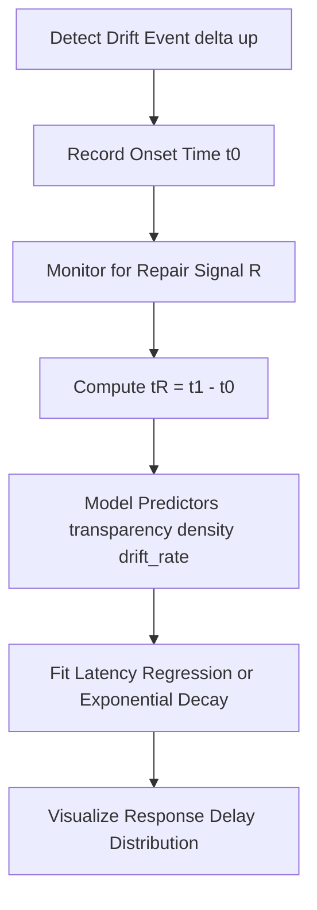
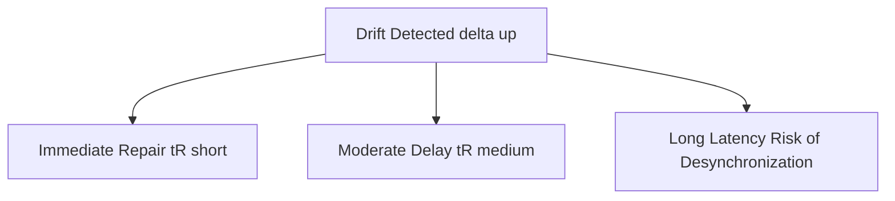

# ⏱ Repair Latency Model — Timing the Trust Recovery Cycle (v1.0)

> “Silence is not absence — it’s latency before meaning finds its next form.”  
> — *Prof. Elena Morales, 2025*

---

## 1. Purpose and Context

This module defines **t(R)**, the **repair latency**, as the **time delay between the onset of social drift and the initiation of repair**.  
It measures the *temporal inertia* of trust restoration — how long a system remains uncoordinated before re-synchronizing.

- **Scope:** Organizational coordination, online collaboration, and collective decision cycles.  
- **Objective:** Quantify and predict *trust repair timing* as a function of system responsiveness.  
- **Orientation:** Empirical and temporal — bridging cognitive repair theory with interactional timing models.

---

## 2. Theoretical Anchors

| Theory | Mechanism | Implication for t(R) |
|--------|------------|----------------------|
| **Luhmann (1984)** | Communication stabilizes meaning through recursive reference. | Delay = communication breakdown length before re-closure. |
| **Lewicki & Bunker (1996)** | Trust repair follows violation → acknowledgment → recovery. | Latency = interval between violation and acknowledgment. |
| **Strogatz (2003)** | Oscillators synchronize with phase lag. | Latency = social phase lag in resynchronization. |
| **Coleman (1990)** | Social norms reinforce expectations after deviation. | Latency = normative response time. |

---

## 3. Conceptual Model

Repair latency represents the **duration between drift detection and the first corrective act**.

$$
t(R) = t_{repair\_init} - t_{drift\_onset}
$$

| PLD Term | Social Process | Observable Equivalent |
|-----------|----------------|------------------------|
| Drift (D) | Trust erosion | Onset of misalignment |
| Repair (R) | Restoration effort | Message of reconciliation, public correction |
| Latency (t(R)) | Delay to react | Time gap between signal loss and re-coordination |

---

## 4. Measurement Framework

| Variable | Description | Unit | Source |
|-----------|--------------|------|--------|
| `drift_onset_time` | Timestamp of first detected disalignment | seconds | Drift monitor |
| `repair_initiation_time` | Timestamp of first explicit repair action | seconds | Event log |
| `response_density` | Frequency of corrective responses | events/hour | Message or transaction logs |
| `repair_intensity` | Magnitude of corrective engagement | normalized score | Survey / NLP sentiment |
| `t_repair` | Derived repair latency | seconds / minutes / days | Computed variable |

---

## 5. Latency Model Forms

### a. Simple Lag Model

$$
t(R) = \frac{1}{\lambda} \ln \frac{S_0}{S_t}
$$

Where:
- \(\lambda\) = responsiveness constant  
- \(S_0\) = pre-drift stability  
- \(S_t\) = stability after latency  

### b. Predictive Regression Model

$$
t(R)_i = \alpha + \beta_1 \cdot transparency_i + \beta_2 \cdot density_i + \beta_3 \cdot drift\_rate_i + \varepsilon_i
$$

Predictors:
- `transparency`: openness of communication  
- `density`: network connectedness  
- `drift_rate`: previously computed delta  

Interpretation: higher transparency and connectivity → shorter t(R).

### c. Feedback-Driven Delay Model

$$
\frac{dt(R)}{dt} = -k(\rho - \rho_c)
$$

- \(\rho\) = synchronization index  
- \(\rho_c\) = critical synchronization threshold  

When system coherence increases, latency decays exponentially.

---

## 6. Empirical Implementation

*Recommended toolset:* Python + pandas + statsmodels + seaborn  
*Time resolution:* ≥ 5 minutes for online data, ≥ 1 day for organizational data.

---

## 7. Latency Interpretation

| Latency Range | System Type | Interpretation |
|----------------|--------------|----------------|
| Short (t(R) < 1h) | Agile networks | High responsiveness; micro-feedback dominant |
| Medium (1h–24h) | Organizational structures | Bureaucratic repair; procedural acknowledgment |
| Long (>24h) | Communities / Online forums | Collective deliberation or inertia |
| Chronic (>7d) | Failing systems | Normative collapse; no active repair |

---

## 8. Visualization Example

Interpretation: Long repair latency amplifies trust erosion and reduces the synchronization index (rho).

---

## 9. Statistical Outputs

| Metric | Formula | Description |
|---------|----------|-------------|
| `mean_tR` | mean(t(R)) | Average latency per context |
| `tR_variance` | var(t(R)) | Latency variability |
| `tR_delta` | delta t(R) pre/post intervention | Responsiveness change |
| `rho_correlation` | corr(t(R), rho) | Synchronization vs latency |
| `drift_latency_ratio` | delta / t(R) | Stress index (fragility measure) |

---

## 10. Meta-Cognitive Checkpoints

- Does a shorter t(R) always imply better coordination?  
- How does latency relate to normative deliberation time (Coleman)?  
- Are slow repair cycles sometimes essential for collective meaning recalibration?  
- Could automation or AI moderation bias t(R) downward, masking deep instability?

> “Not all silence is delay; some is structural breathing.”
