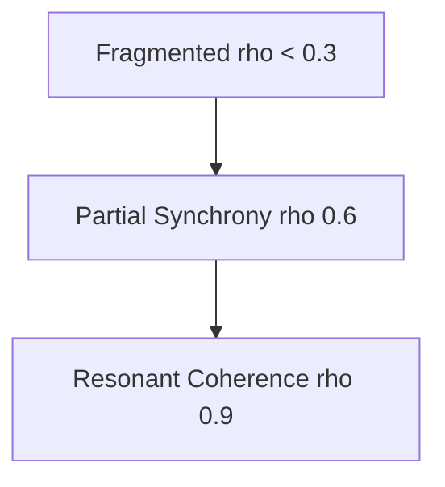

# 🌐 Resonance Network Simulation — Modeling Collective Synchronization (v1.0)
## 1. Purpose and Context

This document introduces a **simulation framework for ρ (collective synchronization)** —  
the measure of *phase alignment* among agents within a social network.  
In Phase Loop Dynamics (PLD), **resonance** represents the system’s capacity to sustain coherence despite ongoing drift and latency.

- **Scope:** Collective coordination, online network synchronization, trust restoration cascades  
- **Objective:** Model and visualize ρ as the emergent coherence across heterogeneous agents  
- **Orientation:** Computational — translating synchronization theory (Strogatz) into social metrics

---

## 2. Theoretical Anchors

| Theory | Core Mechanism | PLD Relevance |
|--------|----------------|---------------|
| **Strogatz (2003)** | Coupled oscillators reach phase coherence via local coupling | ρ quantifies social synchronization strength |
| **Barabási (2002)** | Scale-free topology amplifies synchronization cascades | Hubs accelerate phase locking |
| **Luhmann (1984)** | Communication recursively reproduces social meaning | Synchronization = operational closure stability |
| **Lewicki & Bunker (1996)** | Restored trust enables new cycles of coordination | Resonance marks successful trust repair |

---

## 3. Conceptual Mapping

| Symbol | Meaning | Social Equivalent |
|---------|----------|-------------------|
| **theta_i** | Phase of agent i | State of participation or belief |
| **omega_i** | Natural frequency | Baseline responsiveness or motivation |
| **K_ij** | Coupling coefficient | Trust or communication intensity |
| **rho(t)** | Synchronization index | Level of coordination at time t |
| **psi(t)** | Global phase | Collective narrative alignment |

Resonance occurs when local deviations (theta_i – psi) stabilize around zero.

---

## 4. Core Equations

### a. Kuramoto-style Model for Social Synchronization

$$
\frac{d\theta_i}{dt} = \omega_i + \frac{K}{N} \sum_{j=1}^N \sin(\theta_j - \theta_i)
$$

### b. Synchronization Index (ρ)

$$
\rho(t) e^{i\psi(t)} = \frac{1}{N} \sum_{j=1}^{N} e^{i\theta_j(t)}
$$

High ρ → high coordination; low ρ → social fragmentation.

---

## 5. Network Implementation Framework

```mermaid
flowchart TD
  A[Generate Network Topology] --> B[Assign Initial Phase States]
  B --> C[Set Coupling Matrix Kij]
  C --> D[Run Kuramoto Simulation]
  D --> E[Compute rho(t) and psi(t)]
  E --> F[Visualize Resonance Patterns]
```
**Implementation tools:**  
Python (NetworkX + NumPy + Matplotlib)  
Optional: use `odeint` for continuous-time simulation

---

## 6. Example Pseudocode

```python
import numpy as np
import networkx as nx

# 1. Build network
G = nx.barabasi_albert_graph(n=200, m=3)
K = nx.to_numpy_array(G)

# 2. Initialize phase states
theta = np.random.uniform(0, 2*np.pi, len(G))
omega = np.random.normal(0, 0.1, len(G))

# 3. Simulation loop
dt, steps = 0.05, 1000
rho_list = []

for _ in range(steps):
    dtheta = omega + (0.1 / len(G)) * np.sum(K * np.sin(theta - theta[:, None]), axis=1)
    theta += dtheta * dt
    rho = np.abs(np.mean(np.exp(1j * theta)))
    rho_list.append(rho)
```

---

## 7. Empirical Indicators

| Metric | Definition | Interpretation |
|---------|-------------|----------------|
| ρ(t) | Instantaneous synchronization | Collective coordination strength |
| ρ_mean | Mean synchronization level | Systemic coherence baseline |
| ρ_var | Variance of synchronization | Stability of resonance |
| ρ_threshold | Critical coupling K_c where ρ ≈ 0.5 | Phase transition point |
| phase_lag (Δθ) | Mean difference between nodes | Coordination latency proxy |

---

## 8. Social Simulation Scenarios

**a. Organizational Networks**  
High K → fast synchronization after drift  
→ Shared leadership and transparent communication  

**b. Online Communities**  
Local coupling dominates; modular resonance pockets form  
→ Subcultural coherence within global desynchronization  

**c. Crisis Communication Systems**  
Oscillation patterns: drift–repair–resonance loops  
→ Collective adaptation cycles observable in temporal trust data  

---

## 9. Visualization Templates



Or time-series representation:

$$
\rho(t)=\frac{1}{N}\left|\sum e^{i\theta_j(t)}\right|
$$

Plot ρ(t) over time to observe synchronization waves and resonance stability.

---

## 10. Integrative Interpretation

| Stage | Variable | Interpretation |
|--------|-----------|----------------|
| Drift | δ | Desynchronization — trust erosion |
| Repair | t(R) | Latency before re-alignment |
| Resonance | ρ | Coherence and sustained coordination |
| Stability | S | Long-term adaptive equilibrium |

---

## 11. Meta-Cognitive Checkpoints

- Does high ρ imply conformity or meaningful coordination?  
- How do small-world vs scale-free topologies influence ρ stability?  
- Can repair latency t(R) be reduced without losing normative reflection?  
- Is resonance measurable without overfitting synchronization to sentiment?  

> “True alignment is not silence — it’s phase coherence in diversity.”
