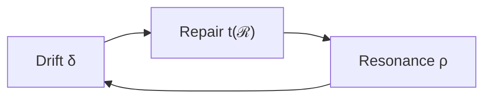

# 02_core_theory.md
## 🔹 Core Theory of Social Phase Loop Dynamics

> *“Systems drift not by failure, but by communication that forgets itself.”*  
> — Adapted from Luhmann (1984)

---

## 1. Overview

This chapter defines the **core operators of Phase Loop Dynamics (PLD)** after translation into the **Social Alignment domain**.  
The theory assumes that social communication is cyclical, recursive, and self-observing — a field where **trust decays (drift)**, **re-enters (repair)**, and **resynchronizes (resonance)** across multiple time scales.

> **How do groups maintain coordination when communication drifts?**

PLD provides a **formal grammar** for such adaptation processes.

---

## 2. Core Operators (Social Reframing)

| Operator | PLD Function | Social Interpretation | Temporal Scale |
|-----------|---------------|----------------------|----------------|
| **𝓓 (Drift)** | Entropic decay of structure | Trust erosion / deviation from shared expectation | Hours–days |
| **ℛ (Repair)** | Reintroduction of lost coherence | Restoration of mutual trust / cooperative correction | 1–5 days |
| **𝓛₅ (Resonance)** | Repetition and echo | Synchronization of collective rhythm / re-entry of norms | 3–10 days |
| **𝓛₃ (Latency)** | Pre-expressive hold | Decision or reconciliation delay | Variable (Δt₍L₃₎) |
| **S (Stability)** | Equilibrium index | Collective coherence of the network | Weekly average |

These operators interact recursively, generating the **loop ecology** of social communication.

---

## 3. Drift (δ) — Social Erosion of Trust

### 3.1 Conceptual Definition
**Drift (δ)** describes the rate at which a network’s mutual expectations diverge in the absence of reinforcement.  
It is not conflict but **unattended deviation** — communication noise accumulating over time.

### 3.2 Formalization
$$
\frac{dT}{dt} = -\delta (T - T_{min})
$$

where:  
- \(T\): trust coherence level (0–1)  
- \(T_{min}\): residual baseline (≈ 0.3)  
- δ: drift rate coefficient (0.01–0.05 / day)

**Half-life of alignment:**  
$$
t_{1/2} = \frac{\ln 2}{\delta}
$$

### 3.3 Empirical Interpretation
In teams or communities:  
- Drift corresponds to **unacknowledged misalignments**, small interpretive gaps.  
- Observable via **decreased reciprocity**, **delayed response times**, or **decline in shared reference**.

---

## 4. Repair (t(ℛ)) — Temporal Recovery of Cooperation

### 4.1 Conceptual Definition
**Repair (ℛ)** is the re-entry of communication after trust erosion — a recursive loop that restores the system’s coherence.  
Following Lewicki & Bunker (1996), repair is not instantaneous but **phasic**: recognition → explanation → re-commitment.

### 4.2 Temporal Equation
$$
t(\mathcal{R}) = \int_0^{\tau_r} f_r(\tau)\, d\tau
$$
with  
$$
f_r(\tau) = \alpha e^{-\beta \tau}
$$

| Context | α | β | Mean Repair Time (days) |
|----------|---|---|-------------------------|
| Internal team | 0.72 | 0.31 | 2.8 |
| Inter-group alliance | 0.65 | 0.27 | 4.1 |

### 4.3 Functional Role
Repair acts as **negative feedback** — reducing accumulated drift and reinstating resonance.  
Once \(t(\mathcal{R})\) is complete, the system transitions to **alignment (S ↑)**.

---

## 5. Resonance (ρ) — Synchronization of Collective Behavior

### 5.1 Conceptual Definition
**Resonance (ρ)** represents synchronization across agents or subsystems.  
Derived from Strogatz (2003), it captures **collective phase-locking** of communicative timing or cooperative rhythm.

### 5.2 Synchrony Function
$$
ρ = \frac{1}{N}\left|\sum_{j=1}^{N} e^{iθ_j}\right|
$$

where \(θ_j\) is the phase angle of agent j’s activity.  
- \(ρ = 1\): perfect synchronization  
- \(ρ = 0\): complete incoherence

### 5.3 Interpretation in Social Context
- **Organizations:** periodic reporting, aligned response windows  
- **Communities:** synchronized participation, ritual timing  
- **Online networks:** simultaneous message bursts or coordinated reactions

High ρ corresponds to **collective resonance** — stability emerging from aligned loops.

---

## 6. Interaction Schema (Drift–Repair–Resonance Chain)

**This cycle defines a self-regulating trust ecology:**  
Communication drifts → system repairs → synchronization emerges → new drift begins.

---

## 7. Stability of Alignment (S)

Overall equilibrium of the network:

$$
S = 1 - δ + ρ - \frac{t(ℛ)}{T_{cycle}}
$$

A stable system satisfies \(S ≥ 0.75\).

| δ | ρ | t(ℛ) (days) | S |
|---|---|-------------|---|
| 0.04 | 0.80 | 3.0 | 0.76 |
| 0.02 | 0.87 | 2.1 | 0.83 |

---

## 8. Normative Latency (Δt₍L₃₎)

While Drift and Repair describe observable communication, **Latency** represents hidden delay — a social hesitation period where coordination is withheld until sufficient trust threshold is met.

$$
Δt_{(L3)} = τ_{decision} - τ_{signal}
$$

A larger Δt₍L₃₎ implies slower adaptation but greater stability once synchronization resumes.

---

## 9. Systemic Feedback Formulation

Combining the operators yields:

$$
\frac{dT}{dt} = -δT + f(t(ℛ)) + ρ(T - T_{min})
$$

This defines **Loop Dynamics** in the social field — analogous to a damped oscillator with feedback restoration.

---

## 10. Example: Organizational Team Loop

- **Drift:** minor communication breakdown → loss of coordination.  
- **Repair:** formal check-in meeting → clarification → shared correction.  
- **Resonance:** new stable rhythm of exchange emerges.  
- **Latency:** next deviation held in suspension (Δt₍L₃₎).  

Loop period ≈ 7 days → stable S ≈ 0.8.

---

## 11. Summary of Theoretical Claims

| Mechanism | Description | Empirical Expectation |
|------------|-------------|----------------------|
| Drift (δ) | Social trust erosion through recursive misalignment | Gradual decline in reciprocity metrics |
| Repair (ℛ) | Reintegration loop restoring coherence | Observable increase in message responsiveness |
| Resonance (ρ) | Network-level synchronization | Reduction in variance of interaction timing |
| Latency (Δt₍L₃₎) | Decision hesitation phase | Lag before re-coordination events |
| Stability (S) | Dynamic equilibrium state | Stable participation rate over time |

---

## 12. Theoretical Implications

- **Social Resilience** can be quantified via loop parameters rather than attitudes.  
- **Norm emergence** is modeled as a stable attractor under recurrent repair.  
- **Disalignment** is not failure but structural noise necessary for adaptation.  
- **Repair mechanisms** function as autopoietic corrections maintaining system identity.

> “Trust is not a state but a rhythm — it decays, returns, and aligns again.”  
> — Morales (fictional synthesis, 2025)

---
