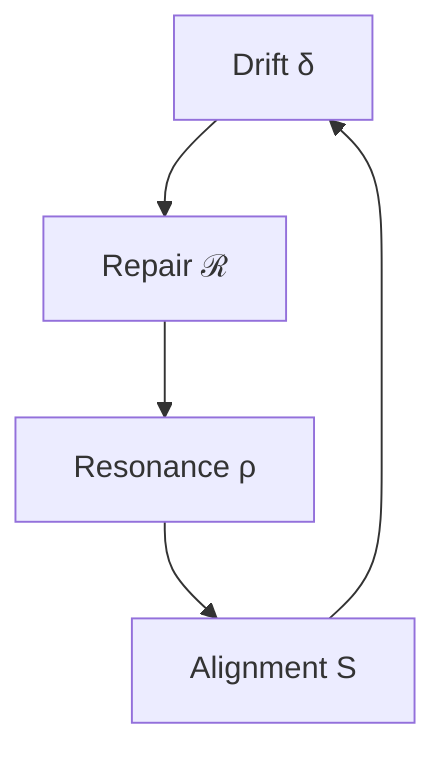

# 05_summary_conclusion.md
## 📘 Social Phase Loop Dynamics — Summary & Theoretical Synthesis

> *“Social order does not persist by structure, but by the rhythm of its own repair.”*  
> — Reframed from Phase Loop Dynamics (Language Systems Collective, 2025)

---

## 1. Overview

The **Social Phase Loop Dynamics (S-PLD)** framework translates the linguistic *Phase Loop Dynamics* into the language of **social coordination**.  
It reconceptualizes communication not as message exchange, but as a **recursive system of loops** through which **trust, alignment, and cooperation** evolve.

| Core Loop | Function | Social Equivalent |
|------------|-----------|------------------|
| 𝓛₁ | Segment detection | Recognition of interaction boundary |
| 𝓛₂ | Drift–Repair loop | Cycle of deviation and re-coherence |
| 𝓛₃ | Latent phase | Hesitation or trust delay before engagement |
| 𝓛₄ | Feedback reflex | Self-correction of group rhythm |
| 𝓛₅ | Alignment–Resonance | Synchronization of collective rhythm |

---

## 2. Central Theoretical Claim

**S-PLD** posits that:  
> “Social stability emerges not from equilibrium but from rhythmic correction.”

Communication loops are **self-calibrating** — capable of absorbing drift through recursive repair and resonance.  
This process transforms uncertainty into systemic adaptability.

$$
S(t) = 1 - δ + ρ - \frac{t(\mathcal{R})}{T_{cycle}}
$$

where:  
- δ = drift rate  
- ρ = resonance index  
- t(ℛ) = repair duration  
- T₍cycle₎ = loop period  

Stable systems maintain $S ≥ 0.75$.

---

## 3. Social Interpretation of the Loops

| Loop | Mechanism | Social Function | Observed Pattern |
|------|------------|-----------------|-----------------|
| 𝓛₁ | Recognition & segmentation | Identifies communicative openings | Greeting, topic start |
| 𝓛₂ | Drift–Repair | Restores coherence after misalignment | Apology, clarification |
| 𝓛₃ | Latency & hesitation | Holds coordination under uncertainty | Silence before action |
| 𝓛₄ | Reflexive feedback | Monitors and self-corrects | Meta-comments, self-checks |
| 𝓛₅ | Resonance & re-entry | Re-establishes shared rhythm | Rituals, meetings, shared laughter |

Each loop contributes to **social autopoiesis** — the self-reproduction of communicative order.

---

## 4. Dynamic Equilibrium

This cyclical model implies:

- Every social drift contains the seed of its own repair.  
- Every repair stabilizes new resonance.  
- Every resonance eventually drifts again.  

Thus, **social coherence = oscillatory resilience**.

---

## 5. Latent Trust as Structural Memory

The **Latent Phase (𝓛₃)** stores unexpressed coordination — the *structural memory* of the system.  
Without latency, society would react too quickly; with it, adaptation gains temporal elasticity.

$$
Δt_{(L3)} = τ_{decision} - τ_{signal}
$$

This delay is productive, not inefficient — it buffers against overreaction.

---

## 6. Resonance as Synchronization of Diversity

Resonance (𝓛₅) does not imply uniformity.  
It is the **temporal harmonization of difference** — a rhythm through which multiple voices remain coherent.

$$
ρC - δt(ℛ) > 0
$$

This ensures the persistence of alignment despite divergence.  
S-PLD thus supports *plural stability*: systems that stay coherent while allowing heterogeneity.

---

## 7. Quantitative Framework Summary

| Parameter | Symbol | Description | Empirical Range |
|------------|---------|-------------|-----------------|
| Drift rate | δ | Rate of trust erosion | 0.01–0.05 day⁻¹ |
| Repair time | t(ℛ) | Duration of correction cycle | 2–4 days |
| Resonance | ρ | Synchronization strength | 0.5–0.9 |
| Latency | Δt₍L₃₎ | Coordination hesitation | 1–3 days |
| Stability | S | Coherence index | ≥ 0.75 stable |

Together, these define a **minimal phase grammar of cooperation**.

---

## 8. Systemic Implications

### Organizational Design  
- Drift = informational entropy  
- Repair = feedback meetings  
- Resonance = team rhythm  
Predictive metric: $ρ(t)$ from interaction logs.

### AI Social Alignment  
PLD loops model conversational trust recovery and misalignment repair.  
LLM dialogue management can be tuned via **ρ/δ ratios**.

### Cross-cultural Dynamics  
Different cultures exhibit distinct $Δt_{(L3)}$ windows (trust latency norms).  
Predictive applications in **diplomacy and coordination modeling**.

### Sociotechnical Systems  
Algorithmic trust cycles mirror human PLD structures.  
Resonance–repair coupling stabilizes **multi-agent communication**.

---

## 9. Relation to Original PLD Theory

| Original (Linguistic) | Social Translation | Shared Mechanism |
|------------------------|-------------------|------------------|
| Drift of syntax | Drift of trust | Entropic deviation |
| Repair of phrasing | Repair of coordination | Negative feedback |
| Resonant phrasing | Collective synchronization | Phase alignment |
| Latent phase | Trust latency | Structural potential |
| Segment boundary | Interaction threshold | Temporal segmentation |

S-PLD retains the loop logic, replacing *syntax* with *social coordination*.

---

## 10. Philosophical Reflection

> “A society that never drifts cannot repair itself.  
> A system that never hesitates cannot learn.”

The loop is the **fundamental unit of social cognition** —  
a structure that enables both failure and renewal.

Rather than preventing drift, S-PLD emphasizes **controlled oscillation** —  
a rhythmic dance of coherence and uncertainty.

---

## 11. Future Research Directions

| Domain | Focus | Method |
|---------|--------|--------|
| Computational Sociology | Simulation of drift–repair loops | Agent-based modeling |
| Cognitive Science | Neural correlates of trust latency | EEG/fMRI temporal analysis |
| AI Interaction | Trust-adaptive dialogue control | Feedback-tuned prompting |
| Organizational Studies | Temporal alignment metrics | Communication entropy tracking |

---

## 12. Concluding Synthesis

**Social Phase Loop Dynamics** reframes alignment not as consensus, but as a *looped rhythm of trust*.  
Systems stay alive through structured imperfection —  
they **drift**, **repair**, and **resonate** in perpetual motion.

> “To align is to oscillate —  
> to remember not what was said, but how it returned.”
