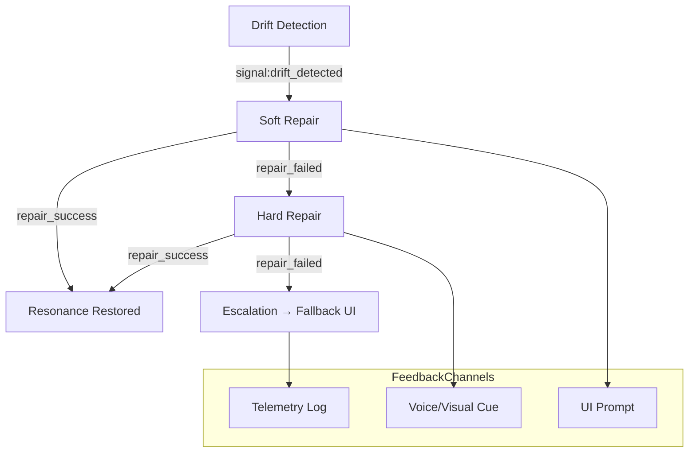
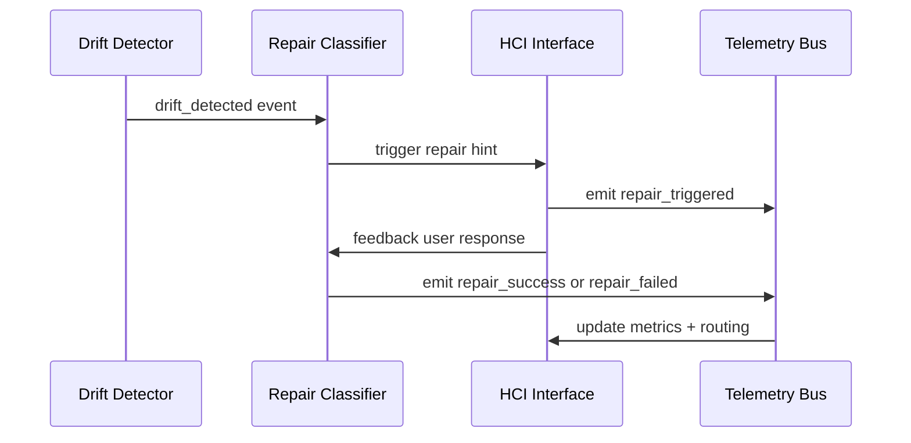

# PLD Bridge Hub — Feedback and Repair Routing
**Folder:** `06_translation_interface/HCI_translation/hci_translation_pld_bridge_hub/`  
**Version:** 1.0 • Last updated: 2025-10-14  
**License:** CC BY-NC 4.0  
**Maintainers:** PLD–HCI Integration Working Group

---

## 1) Purpose
This document defines how **feedback signals** and **repair actions** are routed through the PLD Bridge Hub to maintain alignment between cognitive drift detection and user-facing corrections.  
It connects theoretical constructs from Phase Loop Dynamics (PLD) — especially *Drift → Repair → Resonance* — with practical HCI repair loops.

---

## 2) Concept Overview

| Concept | Description | Output Channel |
|----------|--------------|----------------|
| **Drift Feedback** | Detected loss of coherence; triggers corrective route. | UI hint, system probe |
| **Soft Repair** | Immediate correction with minimal friction. | Same context |
| **Hard Repair** | Requires redirection or full context reset. | New context |
| **Repair Escalation** | Multiple failed repairs; escalate or fallback. | Safety monitor |
| **Feedback Routing** | Links internal metrics to user-visible feedback. | Telemetry + Interface |

**Key Insight:** Feedback is not a single response but a controlled re-alignment of human-system rhythm. Each feedback path must be *context-aware*, *cancellable*, and *schema-valid*.

---

## 3) Routing Architecture



**Interpretation:**
- Every *repair event* propagates through one or more feedback channels.  
- The Bridge Hub ensures signal validity, safety timing, and routing consistency.  
- Escalations (after N failed repairs) route to fallback or support handoff.

---

## 4) Repair State Table

| Event | From State | To State | Action | Notes |
|--------|-------------|----------|--------|-------|
| `drift_detected` | resonance | repair | UI displays corrective hint | Triggers repair loop |
| `repair_triggered` | repair | resonance | Re-alignment successful | Ends loop |
| `repair_failed` | repair | drift | Log + prepare escalation | Retry count increments |
| `repair_escalation` | drift | fallback | Notify supervisor / exit | Safety path |
| `reentry_success` | drift | resonance | Flow restored | Optional: reward metric |

---

## 5) Soft vs Hard Repair — HCI Implementation

| Dimension | Soft Repair | Hard Repair |
|------------|--------------|--------------|
| **Scope** | Local, same UI context | Global, may reload or reset |
| **Trigger** | Immediate drift | Unresolved drift after N retries |
| **UI Element** | Tooltip, gentle nudge | Modal, confirmation, or reload |
| **Recovery Time** | < 500 ms | < 1500 ms |
| **Feedback Type** | Suggestive | Directive |
| **Data Logged** | repair_triggered | repair_escalation |
| **User Control** | Can dismiss | Must confirm |

---

## 6) Routing Rules

| Rule ID | Condition | Action | Target |
|----------|------------|--------|---------|
| R1 | Drift confidence < 0.5 | Ignore (no repair) | None |
| R2 | Drift confidence ≥ 0.5 and < 0.8 | Trigger soft repair | Same UI |
| R3 | Drift confidence ≥ 0.8 | Trigger hard repair | System reset |
| R4 | Two consecutive repair_failed events | Escalate | Support or fallback |
| R5 | Repair success event | Resume resonance | Normal flow |
| R6 | Latency hold active | Delay repair routing until release | StateSync |

---

## 7) Feedback Loop — Sequence Flow



---

## 8) Example Repair Routing Log

```json
{
  "session_id": "sess_demo_001",
  "event_type": "repair_escalation",
  "timestamp": "2025-10-14T10:12:35Z",
  "metadata": {
    "from": "soft_repair",
    "to": "hard_repair",
    "reason": "no_response",
    "confidence_score": 0.92
  }
}
```

This entry is **schema-valid**, observable by validators, and linked to the user’s previous drift chain.  
The routing engine uses this to track escalation thresholds and rollback paths.

---

## 9) Repair Timing Envelope (HCI Safe Bounds)

| Type | Time Budget | Notes |
|------|--------------|--------|
| Soft Repair | ≤ 500 ms | Fast hint or corrective cue |
| Hard Repair | ≤ 1500 ms | Context reload or reset |
| Escalation Decision | ≤ 100 ms | Routing trigger |
| Recovery Acknowledgment | ≤ 300 ms | Metric confirmation |
| UI Feedback Latency | ≤ 50 ms | Human-perceptual limit |

---

## 10) Feedback Safety & Accessibility
- All feedback must be **interruptible** by user input.  
- Avoid flashing, color-only cues; provide multimodal feedback (sound, text, haptics).  
- Provide a visible **“Cancel Repair”** option for user agency.  
- Logged feedback metadata must exclude personal identifiers.  
- Escalation logs should include a reason field and confidence score.  

---

## 11) Integration Points
| Layer | Responsibility | Output |
|--------|----------------|---------|
| Drift Detector | Identifies dissonance | `drift_detected` |
| Pause Classifier | Suggests repair route | `repair_triggered` |
| Reentry Detector | Confirms correction | `reentry_success` |
| Bridge Hub Router | Validates + logs feedback | JSONL event |
| HCI UI | Executes corrective action | Visual/voice cue |

---

## 12) Testing Checklist
- [ ] Drift → Soft repair path executes in < 500 ms.  
- [ ] Escalation threshold reached after 2 consecutive failures.  
- [ ] Repair escalation emits `repair_escalation` event.  
- [ ] User can cancel feedback sequence at any stage.  
- [ ] Logs show valid schema for all repair transitions.  

---

## 13) Summary
The **Feedback and Repair Routing Layer** provides deterministic, schema-driven recovery from cognitive drift.  
It ensures all user feedback remains perceptually stable, ethically bounded, and analytically verifiable — grounding PLD’s repair philosophy in measurable HCI practice.

