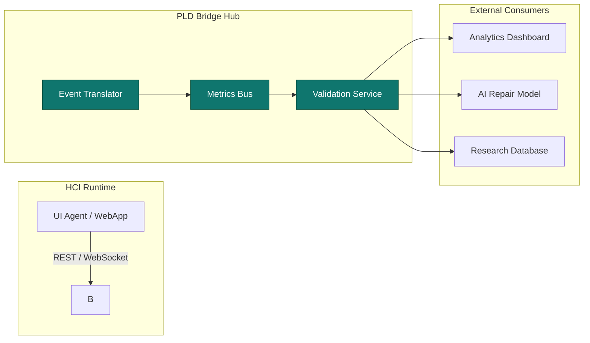

# PLD Bridge Hub — Integration Protocols and APIs
**Folder:** `06_translation_interface/HCI_translation/hci_translation_pld_bridge_hub/`  
**Version:** 1.0 • Last updated: 2025-10-14  
**License:** CC BY-NC 4.0  
**Maintainers:** PLD–HCI Integration Working Group

---

## 1) Purpose
This document defines the **API specifications and communication protocols** enabling integration between the **PLD Bridge Hub** and external systems, including UX clients, telemetry dashboards, and machine-learning agents.  
Its goal is to standardize how cognitive-phase events (drift, repair, reentry, latency hold) are exchanged, acknowledged, and monitored.

---

## 2) Architecture Overview



**Key Channels:**
- **Inbound:** HCI clients send user events (JSON over REST or WS).  
- **Outbound:** Bridge Hub emits validated PLD events + metrics updates.  
- **Control:** External tools can query or subscribe to event streams.  

---

## 3) API Categories

| Category | Description | Format |
|-----------|--------------|---------|
| **Event Ingestion API** | Accepts PLD/HCI events | REST + JSON |
| **Metrics Stream API** | Publishes live analytics | WebSocket |
| **Validation API** | Schema verification endpoint | REST + JSON |
| **Control / Config API** | Runtime tuning for thresholds | REST |
| **Replay API** | Query historical event windows | REST + CSV / JSONL |

---

## 4) Event Ingestion API

### Endpoint
`POST /api/v1/events`

### Request Example
```json
{
  "event_type": "repair_triggered",
  "timestamp": "2025-10-14T09:45:00Z",
  "session_id": "sess_demo_003",
  "metadata": {
    "reason": "tooltip_retry",
    "context": "export_flow",
    "confidence": 0.88
  }
}
```

### Response Example
```json
{
  "status": "accepted",
  "event_id": "evt_0fa2d4",
  "validated": true,
  "latency_ms": 17
}
```

### Error Responses
| Code | Meaning | Description |
|------|----------|-------------|
| 400 | Bad Request | Invalid schema or missing fields |
| 409 | Conflict | Duplicate event ID |
| 500 | Internal Error | Bus or validation failure |

---

## 5) Metrics Stream API (WebSocket)

### URL
`wss://bridgehub.local/ws/metrics`

### Message Example
```json
{
  "type": "metric_update",
  "timestamp": "2025-10-14T09:50:00Z",
  "data": {
    "repair_rate": 0.78,
    "drift_count": 14,
    "resonance_index": 0.92
  }
}
```

### Subprotocols
| Subprotocol | Use | Format |
|--------------|-----|--------|
| `pld.metrics.v1` | Live numerical telemetry | JSON stream |
| `pld.state.v1` | Real-time state transitions | JSON stream |

### Notes
- Heartbeat: every 10 s (`{"type":"ping"}` → expect `{"type":"pong"}`)  
- Dropped connection auto-retries with exponential backoff  

---

## 6) Validation API

### Endpoint
`POST /api/v1/validate`

### Request
```json
{
  "schema": "pld_event.schema.json",
  "payload": {
    "event_type": "latency_hold",
    "timestamp": "2025-10-14T09:51:22Z",
    "session_id": "sess_demo_004"
  }
}
```

### Response
```json
{
  "valid": true,
  "errors": [],
  "duration_ms": 2
}
```

If invalid, returns `valid=false` with list of failed field paths.

---

## 7) Replay & Query API

### Endpoint
`GET /api/v1/events/query`

### Parameters
| Name | Type | Description |
|------|------|-------------|
| `session_id` | string | Filter by session |
| `event_type` | string | Filter by event class |
| `since` | ISO8601 | Start timestamp |
| `until` | ISO8601 | End timestamp |
| `format` | string | `jsonl` (default) or `csv` |

### Response Example
```json
[
  {
    "event_type": "repair_triggered",
    "timestamp": "2025-10-14T09:46:20Z",
    "metadata": {"reason":"retry_button"}
  },
  {
    "event_type": "repair_failed",
    "timestamp": "2025-10-14T09:46:30Z"
  }
]
```

---

## 8) Control and Configuration API

### Endpoint
`PATCH /api/v1/config`

### Body
```json
{
  "thresholds": {
    "pause_ms": 800,
    "repair_confidence_min": 0.6
  },
  "mode": "auto",
  "debug": false
}
```

### Response
```json
{
  "status": "updated",
  "applied": true,
  "effective_config": {
    "pause_ms": 800,
    "repair_confidence_min": 0.6,
    "mode": "auto"
  }
}
```

---

## 9) Authentication

| Method | Description |
|--------|-------------|
| **API Key Header** | `Authorization: Bearer <token>` |
| **WebSocket Auth** | URL parameter: `?token=<session_key>` |
| **Local Mode** | Environment variable `PLD_BRIDGE_LOCAL=1` for testing |
| **Session Scope** | Each connection tagged with `session_id` for logs |

---

## 10) Rate Limits

| Endpoint | Limit | Reset Window |
|-----------|--------|---------------|
| `/api/v1/events` | 200 req/min | 60 s |
| `/api/v1/validate` | 60 req/min | 60 s |
| `/api/v1/query` | 30 req/min | 60 s |
| `/api/v1/config` | 10 req/min | 300 s |
| WebSocket Streams | 1 connection / client | N/A |

When exceeded, response:  
```json
{"error":"rate_limit_exceeded","retry_after":10}
```

---

## 11) Integration Example (Python)

```python
import requests, json

BASE = "https://bridgehub.local/api/v1"
payload = {
  "event_type": "repair_triggered",
  "timestamp": "2025-10-14T09:55:00Z",
  "session_id": "sess_demo_005",
  "metadata": {"reason": "clarification", "context": "dialog_input"}
}

r = requests.post(f"{BASE}/events", json=payload, headers={"Authorization": "Bearer sk-demo"})
print(r.json())
```

---

## 12) Integration Example (WebSocket)

```javascript
const ws = new WebSocket("wss://bridgehub.local/ws/metrics?token=sk-demo");

ws.onmessage = (msg) => {
  const data = JSON.parse(msg.data);
  if (data.type === "metric_update") {
    console.log("Resonance Index:", data.data.resonance_index);
  }
};
```

---

## 13) Error Taxonomy

| Code | Type | Description |
|------|------|-------------|
| `E100` | SchemaError | JSON validation failed |
| `E200` | AuthError | Invalid or expired token |
| `E300` | TimeoutError | Event queue not responding |
| `E400` | RateLimit | Too many requests |
| `E500` | InternalError | Unexpected server fault |

Errors always follow this format:
```json
{
  "error_code": "E100",
  "error_type": "SchemaError",
  "message": "Missing required property: timestamp"
}
```

---

## 14) Compatibility and Versioning

| Component | Version | Compatibility |
|------------|----------|----------------|
| Event Schema | v1.2.0 | Backward-compatible |
| REST API | v1.1 | Stable |
| WS Metrics API | v1.0 | Beta |
| Validation Engine | v2.0 | Supports Draft-07 |

All breaking changes must increment the **major version number** and update the manifest.

---

## 15) Summary
The **Integration Protocols and APIs** document formalizes how PLD Bridge Hub interfaces with both cognitive and UI systems.  
Its REST + WebSocket design ensures bidirectional, low-latency communication — enabling real-time synchronization between theoretical PLD models and live HCI applications.

