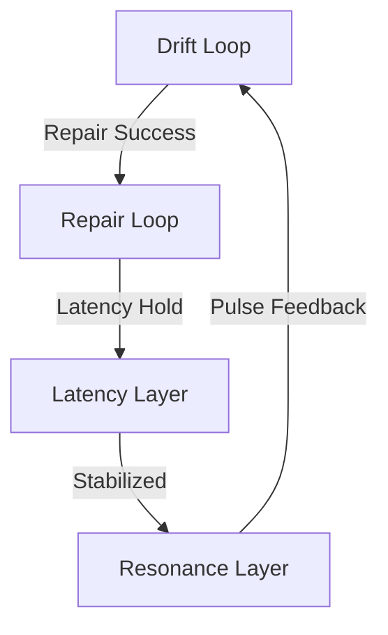

# PLD Bridge Hub — Resonance Alignment Interface
**Folder:** `06_translation_interface/HCI_translation/hci_translation_pld_bridge_hub/`  
**Version:** 1.0 • Last updated: 2025-10-14  
**License:** CC BY-NC 4.0  
**Maintainers:** PLD–HCI Integration Working Group

---

## 1) Purpose
The **Resonance Alignment Interface (RAI)** defines how the Bridge Hub synchronizes *cognitive resonance cycles* (from PLD theory) with real-time **HCI feedback loops**.  
It ensures coherence between user behavior rhythms and system response dynamics through adaptive timing, predictive repair, and synchronization signals.

---

## 2) Conceptual Basis
In PLD, *resonance* represents the phase in which **Drift (𝒟)** and **Repair (ℛ)** loops stabilize into a predictable rhythm.  
In HCI, this translates to **interaction fluency** — when users perceive the interface as responsive, intuitive, and in sync with their intent.

| PLD Term | HCI Equivalent | Functional Mapping |
|-----------|----------------|--------------------|
| 𝒟 — Drift | Deviation or lag in intent execution | Input hesitation, error |
| ℛ — Repair | Corrective loop restoring stability | Undo, retry, clarification |
| 𝓛₃ — Latency | Delay layer within cycles | System response delay |
| 𝓡₅ — Resonance | Stabilized interaction tempo | User flow / UI cadence |

---

## 3) System Overview

```mermaid
flowchart LR
  subgraph HCI["HCI Runtime"]
    U[User Interaction Layer]
    V[Visual/Audio Feedback]
  end

  subgraph Bridge["Bridge Hub"]
    B1[Resonance Detector]:::mod
    B2[Phase Comparator]:::mod
    B3[Resonance Controller]:::mod
  end

  subgraph PLD["Cognitive Model"]
    P1[Drift Loop (𝒟)]
    P2[Repair Loop (ℛ)]
    P3[Latency Layer (𝓛₃)]
    P4[Resonance Layer (𝓡₅)]
  end

  U-->|telemetry|B1
  B1-->|phase_signal|B2
  B2-->|adjustment vector|B3
  B3-->|timing update|V
  B3-->P4

  classDef mod fill:#6d28d9,stroke:#4c1d95,color:#fff;
```

---

## 4) Phase Comparison Logic

The **Phase Comparator** matches runtime state transitions from HCI telemetry with theoretical PLD phase expectations.

```python
def compare_phase(pld_expected, hci_state):
    """Aligns PLD cognitive phase with HCI runtime state.
    Returns drift vector and resonance confidence (0–1)."""
    drift = abs(pld_expected['cycle_pos'] - hci_state['cycle_pos'])
    resonance_conf = max(0, 1 - (drift / pld_expected['tolerance']))
    return {
        'phase_drift': drift,
        'resonance_confidence': resonance_conf
    }
```

When `resonance_confidence` falls below 0.6, the controller issues an **alignment pulse** (see §6).

---

## 5) Resonance State Schema

```json
{
  "timestamp": "2025-10-14T10:20:00Z",
  "session_id": "sess_demo_008",
  "pld_phase": "R₅",
  "resonance_confidence": 0.92,
  "timing_offset_ms": 84,
  "adaptive_factor": 1.05,
  "status": "stable"
}
```

This schema is emitted to the **Data and Metrics Bus** every 60 s or when major phase drift occurs.

---

## 6) Alignment Pulses

**Alignment Pulses** are corrective micro-signals that modulate timing or feedback to bring the user-system rhythm back into sync.

| Type | Description | Trigger | Effect |
|------|--------------|----------|--------|
| `pulse_soft` | Minor correction (±50 ms) | confidence < 0.9 | Micro-latency shift |
| `pulse_strong` | Major correction (±150 ms) | confidence < 0.6 | Full resync event |
| `pulse_repair` | Cross-loop correction | repair_failure event | Bridge between ℛ and 𝓡₅ |
| `pulse_visual` | UI coherence correction | high timing drift | Visual microanimation |

Pulses are always emitted through the **Bridge Bus** using schema-compliant event packets.

---

## 7) Resonance Control Flow

```mermaid
sequenceDiagram
  participant P as PLD Model
  participant B as Bridge Hub
  participant U as User Interface

  P->>B: Phase expectation (R₅)
  U->>B: Real-time HCI telemetry
  B->>B: Compare phase / compute resonance_confidence
  alt resonance_confidence < 0.6
    B->>U: Emit alignment pulse (timing adjust)
  else
    B->>U: Maintain pacing
  end
  B->>P: Update PLD cycle metrics
```



---

## 8) Resonance Metrics

| Metric | Formula | Range | Meaning |
|---------|----------|--------|----------|
| **Resonance Confidence (Rc)** | 1 − |Δphase| / tolerance | 0–1 | Closeness to ideal tempo |
| **Phase Drift (Pd)** | |Δphase| | 0–∞ | Temporal desynchronization |
| **Adaptive Factor (Af)** | ResponseTime / TargetTime | 0.5–1.5 | Compensatory scaling |
| **Cycle Stability Index (Cs)** | mean(Rc · Af) | 0–1 | Long-term rhythmic integrity |

---

## 9) RAI Data Bus Topics

| Topic | Publisher | Consumer | Description |
|--------|------------|-----------|--------------|
| `pld.resonance_state` | Resonance Controller | Metrics Bus | Periodic sync output |
| `pld.alignment_pulse` | Resonance Controller | Feedback Engine | Pulse correction message |
| `pld.phase_drift` | Comparator | Repair Router | Drift monitoring |
| `pld.rhythm_metric` | Metrics Layer | Dashboard | Live resonance trends |

---

## 10) Practical Integration Example

```python
from pld_bridge.resonance import emit_alignment_pulse

emit_alignment_pulse(
    session_id="sess_demo_009",
    confidence=0.55,
    correction_ms=120,
    reason="resonance_drift",
)
```

### Example Output
```json
{
  "event_type": "alignment_pulse",
  "timestamp": "2025-10-14T10:24:12Z",
  "session_id": "sess_demo_009",
  "metadata": {
    "pulse_strength": "strong",
    "correction_ms": 120,
    "reason": "resonance_drift",
    "resonance_confidence": 0.55
  }
}
```

---

## 11) Visualization Example



The closed rhythm ensures ongoing coherence between human attention and system pacing.

---

## 12) Performance Targets

| Metric | Target | Monitoring |
|---------|---------|-------------|
| Phase Drift (Pd) | < 150 ms | Drift Monitor |
| Resonance Confidence (Rc) | ≥ 0.85 | Metrics Bus |
| Pulse Frequency | ≤ 1 Hz | Event Analyzer |
| Alignment Recovery Time | ≤ 800 ms | Repair Router |

---

## 13) Ethical & Perceptual Notes

- Do not *manipulate* user pacing to induce synthetic resonance.  
- Alignment should always be **assistive**, not coercive.  
- Users must retain control and be informed if timing modulation is active.  
- Maintain **transparency** through telemetry logging and opt-out options.  

---

## 14) Summary
The **Resonance Alignment Interface** is the adaptive synchronizer between cognitive theory and interaction experience.  
By continuously comparing PLD’s internal phase states with real HCI telemetry, it maintains a live *temporal handshake* — ensuring both human and system remain rhythmically aligned in the shared interaction loop.

