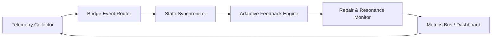
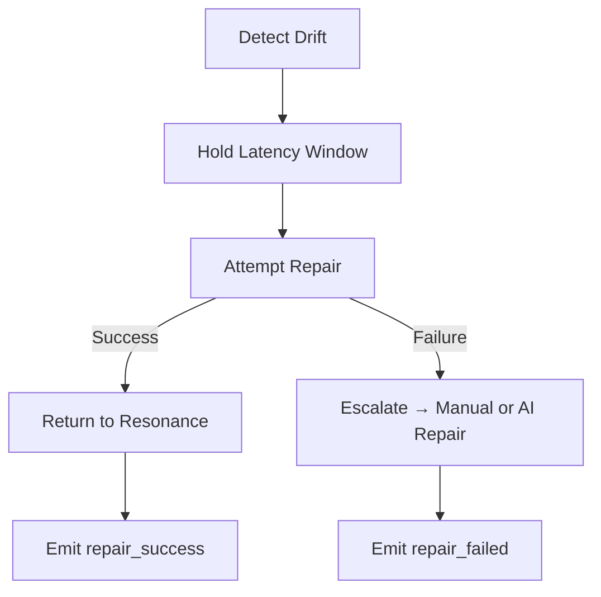

# PLD Bridge Hub — Operational Guidelines and Patterns
**Folder:** `06_translation_interface/HCI_translation/hci_translation_pld_bridge_hub/`  
**Version:** 1.0 • Last updated: 2025-10-14  
**License:** CC BY-NC 4.0  
**Maintainers:** PLD–HCI Integration Working Group

---

## 1) Purpose
This document defines **operational patterns, deployment standards, and runtime practices** for implementing the PLD Bridge Hub in real-world HCI systems.  
It ensures safe, predictable, and measurable operation across all runtime conditions — from cognitive signal processing to interaction telemetry.

---

## 2) Operational Overview

The PLD Bridge Hub operates as an **intermediate orchestration layer** connecting cognitive-phase analytics with HCI runtime systems.

| Layer | Responsibility | Output |
|-------|----------------|---------|
| Cognitive Layer | Theoretical cycle computation (Drift–Repair–Resonance) | Abstract phase states |
| Bridge Layer | Synchronization + event routing | Schema-compliant events |
| HCI Runtime | UX/UI and user telemetry | Measured feedback and performance data |

---

## 3) Operational Modes

| Mode | Description | Use Case |
|------|--------------|----------|
| **Passive Observation** | Collects telemetry, performs no feedback | Research, analysis |
| **Active Integration** | Injects latency, feedback, and repair signals | Interactive prototypes |
| **Adaptive Feedback** | Real-time pacing and correction | Intelligent assistants |
| **Hybrid Mode** | Combines adaptive feedback with manual review | Experimentation / safe rollout |

---

## 4) Core Runtime Components

| Component | Description | Log Channel |
|------------|--------------|--------------|
| `phase_sync` | Maintains PLD–HCI phase alignment | `/pld/phase` |
| `event_router` | Routes validated PLD events | `/pld/events` |
| `repair_loop` | Manages reentry and repair control | `/pld/repair` |
| `metrics_bus` | Distributes metrics and resonance data | `/pld/metrics` |
| `safety_manager` | Enforces latency, repair, and ethical boundaries | `/pld/safety` |

---

## 5) Standard Operational Pattern



This closed loop ensures stable interaction monitoring, adaptive timing, and measurable repair routing.

---

## 6) Event Lifecycle

| Phase | Description | Responsible Module |
|--------|--------------|--------------------|
| ① **Capture** | User or system generates event | HCI Runtime |
| ② **Classify** | Bridge identifies event type (pause, drift, repair) | Bridge Hub Core |
| ③ **Translate** | Event normalized into PLD schema | Signal Translator |
| ④ **Validate** | JSON schema and semantic verification | Validator |
| ⑤ **Emit** | Forwarded to metrics or repair loop | Event Router |
| ⑥ **Feedback** | System issues adaptive or corrective response | Feedback Engine |

---

## 7) Logging Standards

### Log Format
```json
{
  "timestamp": "2025-10-14T10:30:00Z",
  "level": "info",
  "module": "repair_loop",
  "message": "repair_triggered",
  "metadata": {
    "session_id": "sess_demo_010",
    "reason": "user_retry",
    "latency_ms": 1200
  }
}
```

### Severity Levels
| Level | Description | Example |
|--------|--------------|----------|
| `debug` | Low-level internal activity | Drift detection cycle |
| `info` | Normal operation | Repair triggered |
| `warn` | Minor anomaly | Latency spike |
| `error` | Major fault | Validation failure |
| `critical` | System instability | Loop desync |

All logs follow ISO 8601 timestamps and can be streamed to `/pld/logs` for central aggregation.

---

## 8) Operational Safety Patterns

| Pattern | Description | Guard Condition |
|----------|--------------|------------------|
| **Latency Clamp** | Caps timing adjustments to prevent oscillation | ± 50% correction |
| **Repair Throttle** | Limits consecutive repair attempts | ≤ 3 attempts/10 s |
| **Pulse Debounce** | Prevents rapid alignment pulses | ≥ 200 ms spacing |
| **Ethical Gate** | Ensures no manipulative control of user input timing | Always active |
| **Fail-Safe Mode** | Fallback to passive observation | On schema or drift fault |

---

## 9) State Synchronization Policy

State synchronization across modules follows **eventual consistency** rules.  
Critical operations (repair triggers, alignment pulses) use **synchronous confirmation** before committing to state transitions.

| Policy | Mechanism | Expected Latency |
|---------|------------|------------------|
| `Soft Sync` | Async event propagation | ≤ 100 ms |
| `Hard Sync` | Confirmed message with ack | ≤ 300 ms |
| `Critical Sync` | Transactional commit | ≤ 500 ms |

---

## 10) Adaptive Repair Pattern



The Bridge Hub logs each branch outcome to maintain repair statistics and detect recurrent drift causes.

---

## 11) Monitoring & Metrics

| Metric | Description | Frequency | Target |
|---------|--------------|------------|--------|
| `repair_rate` | Ratio of successful repairs | 60 s | ≥ 0.8 |
| `resonance_index` | Alignment stability | 30 s | ≥ 0.85 |
| `latency_avg_ms` | Mean response time | 10 s | ≤ 900 ms |
| `pulse_frequency_hz` | Number of alignment pulses per second | 5 s | ≤ 1 Hz |
| `drift_recurrence` | Recurrent pattern count | 300 s | ≤ 2 per session |

All metrics are pushed to the **Data and Metrics Bus** for visualization and anomaly alerts.

---

## 12) Deployment Best Practices

- Use **containerized services** (Docker/Kubernetes) for Bridge Hub runtime.  
- Maintain **separate telemetry channels** for user data and system diagnostics.  
- Use **schema version pinning** to avoid drift during upgrades.  
- Enable **automated validation** with `validate_events.sh` before publishing.  
- Integrate **metrics dashboards** (e.g., Grafana / Kibana) for live oversight.  

---

## 13) Common Failure Patterns & Mitigation

| Failure | Cause | Mitigation |
|----------|--------|-------------|
| Event backlog | Slow metrics pipeline | Use async queue (Redis, Kafka) |
| Phase desync | Mismatched timing calibration | Auto-resync every 60 s |
| Repair cascade | Infinite retry loop | Activate repair throttle |
| Data drift | Unstable timestamps | Normalize via latency tracker |
| Schema rejection | Version mismatch | Fallback to v1.0 parser |

---

## 14) Operational Integrity Rules

- All runtime components must emit **heartbeat signals** every 30 s.  
- All corrective actions must be **schema-logged** for audit.  
- System must degrade **gracefully** under failure — never lock user input.  
- Use **sandbox testing** before applying adaptive control to production.  

---

## 15) Summary
The **Operational Guidelines and Patterns** document ensures that every Bridge Hub instance behaves predictably, ethically, and observably.  
It provides the systemic backbone for running PLD-aligned HCI integrations — transforming theoretical cognitive cycles into safe, measurable runtime operations.

