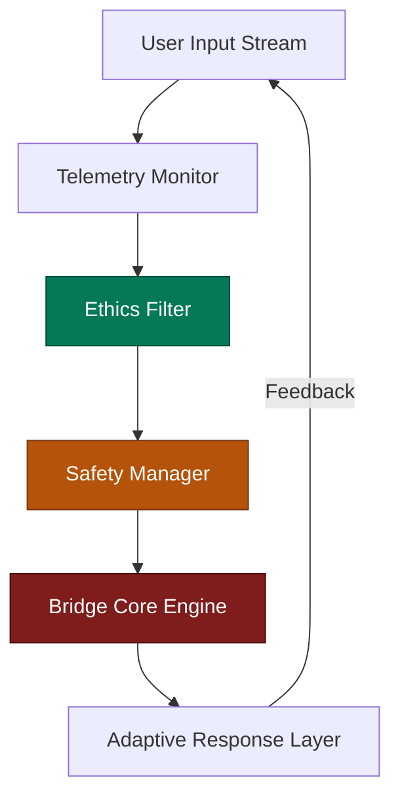
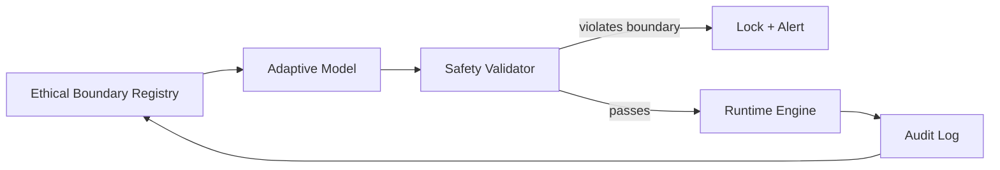

# PLD Bridge Hub — Ethics and Safety Governance
**Folder:** `06_translation_interface/HCI_translation/hci_translation_pld_bridge_hub/`  
**Version:** 1.0 • Last updated: 2025-10-14  
**License:** CC BY-NC 4.0  
**Maintainers:** PLD–HCI Integration Working Group (Ethics Subcommittee)

---

## 1) Purpose
This document defines the **ethical framework, safety protocols, and governance mechanisms** that guide the operation of the **PLD Bridge Hub**.  
It ensures that adaptive HCI behaviors remain *assistive, transparent, and non-manipulative*, while protecting users from unintended cognitive or behavioral influence.

---

## 2) Ethical Foundations

The system is grounded in three key principles:

| Principle | Description | PLD Interpretation |
|------------|--------------|--------------------|
| **Transparency** | Users should know when the system adapts behaviorally or temporally. | Resonance state disclosure |
| **Autonomy** | Users retain control over timing, repair, and cognitive flow. | No coercive resonance alignment |
| **Beneficence** | System adaptations must reduce friction and cognitive load. | Assistive loop design |

---

## 3) Ethical Boundaries for Adaptive Control

| Category | Boundary Condition | Enforcement Mechanism |
|-----------|--------------------|------------------------|
| **Timing Influence** | Must not accelerate or decelerate user input patterns artificially. | LatencyClamp (± 50%) |
| **Repair Injection** | No unsolicited or subliminal repair actions. | Manual/consent gate |
| **Attention Shaping** | Avoid feedback loops that reinforce addictive engagement. | Drift monitoring threshold |
| **Emotion-Driven Adaptation** | Emotion states cannot directly trigger timing modulation. | Restricted channel flag |
| **Autonomy Override** | Must never lock user input flow for adaptation. | Safety Manager hard block |

---

## 4) Safety Layers Overview



Each layer enforces ethical filters before allowing any adaptive timing or feedback operations.

---

## 5) Governance Roles

| Role | Responsibility | Governance Tool |
|------|----------------|-----------------|
| **Ethics Maintainer** | Approves adaptive model updates | Change log + peer review |
| **Safety Officer** | Monitors live telemetry for boundary violations | Live dashboards |
| **Audit Engineer** | Validates schema integrity and version compliance | `validate_events.sh` |
| **Research Liaison** | Ensures alignment with PLD theory and HCI studies | Cross-paper mapping |
| **User Advocate** | Evaluates subjective user impact | Survey integration |

All roles are logged and verified within `governance_registry.json`.

---

## 6) Consent and Disclosure Requirements

- Users must be informed if adaptive timing or repair loops are active.  
- Real-time “adaptation indicator” (e.g., visual shimmer) should mark phase corrections.  
- Adaptive feedback must include **explainable metadata**, e.g.:  
  ```json
  {
    "event_type": "timing_adjust",
    "metadata": {
      "reason": "resonance_alignment",
      "explanation": "System adjusted feedback rhythm to match your input speed."
    }
  }
  ```

---

## 7) Data Handling and Privacy

| Data Type | Retention Policy | Protection Mechanism |
|------------|------------------|----------------------|
| Telemetry Logs | 30 days max | Local anonymization |
| Session Metadata | 90 days | Hashed identifiers |
| PLD Phase Metrics | 180 days (for research) | Aggregated storage |
| Repair/Resonance Events | 7 days | Ephemeral cache |
| Consent Records | Indefinite (hashed) | Encrypted ledger |

No personally identifiable data (PID) is transmitted outside the runtime environment.

---

## 8) Adaptive Control Governance Loop



All adaptive models must pass ethical validation before activation. Violations trigger automatic suspension.

---

## 9) Safety Protocols

| Protocol | Description | Trigger |
|-----------|--------------|----------|
| **Safe Mode** | Switches system to passive observation | Ethics breach or fault |
| **Repair Cooldown** | Prevents recursive repair flooding | Reentry ≥ 3 in 30 s |
| **Timing Clamp** | Caps latency modifications | Exceed ± 50% pacing |
| **Feedback Hold** | Delays UI updates when ethics uncertain | Filter conflict |
| **Shutdown Procedure** | Disables adaptive layer | Manual override or 3+ violations |

---

## 10) Ethical Telemetry Events

| Event Type | Description | Emitted When |
|-------------|--------------|--------------|
| `ethics_violation` | Boundary exceeded | Any adaptive rule break |
| `consent_change` | User toggles adaptation consent | Runtime setting update |
| `safety_mode` | System enters fallback operation | Ethics or safety trigger |
| `audit_log` | Governance audit entry | Review checkpoint |
| `adaptive_summary` | Weekly ethics metrics | Governance dashboard |

---

## 11) Governance Documentation Standards

All governance-related files reside under `/governance/`:

```
/governance/
 ├── ethics_registry.json
 ├── safety_protocols.md
 ├── governance_audit_log.jsonl
 └── consent_templates/
      └── adaptive_timing_notice.md
```

All governance documents must include:
- Version number
- Change summary
- Approval signatures (digital or peer)

---

## 12) Auditing and Accountability

Each runtime session generates a **traceable ethics ledger**, linking actions to validations.

Example ledger entry:

```json
{
  "session_id": "sess_011",
  "timestamp": "2025-10-14T10:42:00Z",
  "action": "adaptive_latency_adjust",
  "verified_by": "SafetyOfficer42",
  "status": "approved"
}
```

Audits occur every **24 hours** or after every **adaptive model update**.

---

## 13) Governance Metrics

| Metric | Target | Frequency | Responsible Role |
|---------|---------|------------|------------------|
| Ethics Violation Rate | 0 % | Continuous | Safety Officer |
| Consent Disclosure Rate | 100 % | Continuous | Ethics Maintainer |
| Data Retention Compliance | ≥ 95 % | Weekly | Audit Engineer |
| User Feedback Score | ≥ 4.0 / 5 | Monthly | User Advocate |
| Review Frequency | 7 days | Automated | Governance Bot |

---

## 14) Ethical Design Heuristics

- **Assist over persuade** — support cognitive flow, never direct it.  
- **Expose reasoning** — make adaptive logic explainable to the user.  
- **Favor pause over push** — allow drift; do not coerce repair.  
- **Reward awareness** — reinforce reflection, not automation.  
- **Limit feedback scope** — never exceed 1 Hz correction frequency.  

---

## 15) Summary
The **Ethics and Safety Governance** framework provides moral and procedural scaffolding for PLD-based adaptive systems.  
It ensures that every latency correction, repair loop, and resonance alignment operates within transparent, consented, and auditable boundaries — safeguarding the integrity of both the system and the human experience it serves.

