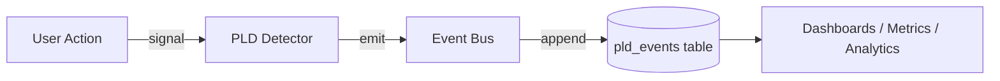
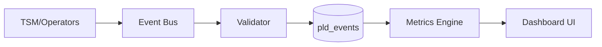

# Logging Schema and Contracts (PLD → HCI)
**Folder:** `06_translation_interface/HCI_translation/hci_translation_pld_implementation/`
**Version:** 1.0 • Last updated: 2025-10-13  
**License:** CC BY-NC 4.0  
**Maintainer:** Phase Loop Dynamics Research Group

---

## 1. Purpose

This specification defines the **event logging schema, validation rules, and telemetry contracts** for HCI implementations of Phase Loop Dynamics (PLD).  
The goal is to ensure **consistent observability**, **traceable user/system loops**, and **data integrity** across multi-modal interfaces.

---

## 2. Logging Architecture Overview

The PLD event stream is **append-only**, **schema-validated**, and **session-scoped**.  
Each record corresponds to a **temporal transition** or **operator action** (L₁–L₅).



---

## 3. Core Event Schema

Every PLD event MUST contain:

| Field | Type | Required | Description |
|------|------|-----------|-------------|
| `event_type` | string | ✓ | Category name (`drift_detected`, `repair_triggered`, etc.) |
| `timestamp` | ISO8601 | ✓ | UTC timestamp of emission |
| `session_id` | string | ✓ | Unique interaction session |
| `user_id` | string | optional | Pseudonymized ID for multi-session analysis |
| `metadata` | object | ✓ | Structured contextual payload |

**Rule:** All timestamps use ISO 8601 UTC (`YYYY-MM-DDTHH:mm:ssZ`).

---

## 4. Event Types and Required Metadata

| Event | Description | Required Metadata Keys |
|------|--------------|------------------------|
| `drift_detected` | User deviated from expected flow | `ui_state`, `drift_type`, `confidence_score`, `attempt`, `last_intent` |
| `repair_triggered` | System initiated a clarification prompt | `strategy`, `success_predicted`, `latency_before_repair`, `context_id`, `attempt` |
| `repair_failed` | Repair did not yield confirmation | `failed_attempts`, `context_id` |
| `reentry_success` | User resumed or completed abandoned intent | `previous_context_id`, `reentry_lag`, `reentry_method`, `goal_completed` |
| `latency_hold` | Intentional pacing delay introduced | `duration_ms`, `reason`, `context`, `user_cancelled` |
| `resonance_start` | Stable alignment detected | `duration_s`, `ρ_coherence`, `context_id` |
| `resonance_end` | Exit from resonance window | `duration_s`, `ρ_coherence`, `context_id` |
| `handoff` | Escalation or transfer to alternate channel | `target_channel`, `reason` |

**Optional Derived Events:**  
- `reentry_anchor_set` — logged when context anchor saved pre-repair.  
- `repair_escalation` — logged when repair switches to a harder strategy.

---

## 5. Example: Drift → Repair → Reentry Sequence

```json
{
  "event_type": "drift_detected",
  "timestamp": "2025-10-13T12:00:03Z",
  "session_id": "A9f32B",
  "metadata": {
    "ui_state": "/checkout/payment",
    "drift_type": "silence",
    "confidence_score": 0.42,
    "attempt": 1,
    "last_intent": { "name": "confirm_payment", "confidence": 0.42 }
  }
}
```
```json
{
  "event_type": "repair_triggered",
  "timestamp": "2025-10-13T12:00:04Z",
  "session_id": "A9f32B",
  "metadata": {
    "strategy": "soft_repair",
    "latency_before_repair": 0.9,
    "context_id": "/checkout/payment",
    "attempt": 1
  }
}
```
```json
{
  "event_type": "reentry_success",
  "timestamp": "2025-10-13T12:00:10Z",
  "session_id": "A9f32B",
  "metadata": {
    "previous_context_id": "/checkout/payment",
    "reentry_lag": 5.8,
    "reentry_method": "user_initiated",
    "goal_completed": true
  }
}
```

---

## 6. Validation Rules

1. `latency_hold` must include `metadata.duration_ms` ≥ 0.  
2. `repair_triggered` requires preceding `drift_detected` in same `session_id`.  
3. `reentry_success` must include a valid `previous_context_id`.  
4. Any event lacking mandatory metadata fields is **invalid**.  
5. Session continuity enforced via `session_id`; orphaned events (no match) flagged as **incomplete loops**.

**Validator CLI (example):**
```bash
python pld_metrics_validator.py --schema ./pld_event.schema.json --input ./pld_events.jsonl --report ./validation_report.md
```

---

## 7. Logging Contracts per Operator (L₁–L₅)

| Operator | Primary Events | Metadata Focus |
|-----------|----------------|----------------|
| **L₁ Segment Detection** | `boundary_detected` (custom) | pause length, topic delta |
| **L₂ Drift–Repair** | `drift_detected`, `repair_triggered`, `repair_failed`, `reentry_success` | confidence, context, attempt |
| **L₃ Latency** | `latency_hold` | duration_ms, reason, user_cancelled |
| **L₄ Feedback Reflex** | `reflex` (custom) | reflex_latency_ms, adjust_type |
| **L₅ Resonance** | `resonance_start`, `resonance_end` | duration_s, ρ_coherence |

---

## 8. Event Bus and Storage Model

| Component | Role |
|-----------|------|
| **Event Buffer (in-memory)** | Collects transient logs for flush batching |
| **Validator (schema layer)** | Ensures type and field completeness |
| **Queue/Topic (Kafka/Redis)** | Streams logs to persistence |
| **Store (pld_events)** | Append-only time-series |
| **Aggregator** | Computes metrics (see §9) |



---

## 9. Derived Metrics Definitions

| Metric | Formula | Description |
|---------|----------|-------------|
| `drift_to_repair_ratio` | drift_detected.count / repair_triggered.count | Repair responsiveness |
| `reentry_success_rate` | reentry_success.count / reentry_success.total_attempts | User recovery effectiveness |
| `avg_latency_hold` | latency_hold.sum(duration_ms) / latency_hold.count | Mean pacing duration |
| `time_to_repair` | repair_triggered.avg(latency_before_repair) | Drift → repair responsiveness |
| `repair_escalation_rate` | repair_triggered.count(strategy=hard_repair) / repair_triggered.count | Escalation ratio |
| `latency_interrupt_rate` | latency_hold.count(user_cancelled=true) / latency_hold.count | Cancellation rate |
| `repair_loop_depth` | max consecutive repair_triggered per context | Repair persistence |

---

## 10. Dashboards Integration

**Data source:** `pld_events` table (validated JSONL stream).  
**Example panels:** from `02_quickstart_kit/30_metrics/dashboards/reentry_success_dashboard.json`

| Panel | Query Purpose |
|--------|---------------|
| `reentry_rate_over_time` | Reentry success trends |
| `avg_reentry_latency` | Time to reentry per day |
| `repair_vs_reentry_pathways` | Distribution of recovery types |
| `drift_heatmap` | UI drift hotspots |
| `unresolved_drifts` | Drift instances without repair within 2 min |

> Dashboards must refresh every 60s, support dark mode, and include UTC timestamp normalization.

---

## 11. Compliance Rules (Implementation Tier ≥ T₂)

| Category | Rule |
|-----------|------|
| **Completeness** | 100% of state transitions emit corresponding log events |
| **Latency Precision** | UI timestamp accuracy ±10ms |
| **Session Integrity** | All events grouped by session_id |
| **Resilience** | Event bus persists logs ≥ 24h offline |
| **Privacy** | Pseudonymize `user_id`, avoid PII in metadata |
| **Validation** | Continuous schema enforcement on ingestion |

---

## 12. Example Storage Schema (SQL)

```sql
CREATE TABLE pld_events (
    event_id UUID PRIMARY KEY DEFAULT gen_random_uuid(),
    event_type TEXT NOT NULL,
    timestamp TIMESTAMP WITH TIME ZONE NOT NULL,
    session_id TEXT NOT NULL,
    user_id TEXT,
    metadata JSONB NOT NULL,
    created_at TIMESTAMP WITH TIME ZONE DEFAULT NOW()
);

CREATE INDEX idx_pld_session_ts ON pld_events (session_id, timestamp);
```

---

## 13. Validation Report Example

```
# PLD Metrics Validation Report
Total events: 21
Invalid events: 0
✅ All schema checks passed
```

---

## 14. Compliance Checklist

- [ ] All `latency_hold` logs include `duration_ms`.  
- [ ] Drift → Repair → Reentry path continuity verified.  
- [ ] Schema version locked and validated on CI.  
- [ ] Session-scoped pseudonymization implemented.  
- [ ] Dashboard queries return within SLA (<2s).

---

> “Logging is choreography written in numbers.”  
> — *Phase Loop Dynamics, 2025*
