# 08_Temporal_Affordance_Design_Guidelines.md

## Title
**Temporal Affordance Design Guidelines for PLD–HCI Translation**

---

## Overview
Temporal affordance design concerns the **perceptible timing of system feedback**, translating the *Phase Loop Dynamics (PLD)* rhythm (Drift → Repair → Reentry → Resonance) into **human-perceivable temporal structures**. It ensures that users experience continuity, trust, and control through *pacing* rather than raw computation speed.

This document provides **HCI design guidance** for implementing temporal affordances within the PLD–HCI framework, bridging perceptual design, timing control, and adaptive rhythm feedback.

---

## 1. Conceptual Foundations
Temporal affordances connect **cognitive rhythm** and **interaction pacing**. According to PLD theory:

| PLD Operator | Temporal Construct | Human–Computer Analogue |
|---------------|---------------------|---------------------------|
| **ᵊ (Drift)** | Delay, hesitation, silence | Perceptual gap / ambiguity |
| **ℛ (Repair)** | Temporal reset / pause | Clarification, soft prompt |
| **ᵋ₃ (Latency)** | Controlled time offset | Visual pause, shimmer, loading cue |
| **ᵋ₅ (Resonance)** | Timing echo / feedback alignment | Tone mirroring, pacing match |

> **Design Principle:** Time is part of the interface surface. The rhythm of feedback shapes how the user perceives comprehension, empathy, and system intelligence.

---

## 2. Timing Heuristics
The following timing windows have been validated in PLD experimental loops and should guide implementation:

| Interaction Phase | Target Duration | UX Intent | Feedback Example |
|-------------------|------------------|------------|------------------|
| Drift Detection | 800–1200 ms | Capture hesitation | Fade shimmer / micro-delay |
| Soft Repair (Clarification) | 900 ± 200 ms | Gentle clarification | Tooltip, subtle prompt |
| Latency Hold | 1000–1500 ms | Pacing modulation | Shimmer overlay, pulse animation |
| Reentry Resume | < 600 ms | Continuity assurance | Context restore animation |
| Resonance Echo | 400–900 ms | Timing empathy | Matching user typing or tone |

> **Heuristic Rule:** Any delay beyond **1.5 s** must communicate intent (visual or textual). Any delay under **400 ms** risks being imperceptible as rhythm.

---

## 3. Diagram — Temporal Loop Composition

```mermaid
gantt
    title Temporal Loop Mapping — Drift → Repair → Reentry → Resonance
    dateFormat  X
    section PLD Phase
    Drift (Detection)           :active, 0, 1
    Latency Hold (L₃)           : 1, 2
    Soft Repair (Clarification) : 2, 3
    Reentry Resume              : 3, 3.6
    Resonance Feedback          : 3.6, 4.5
```


> The sequence represents **one cognitive rhythm cycle** within a PLD-guided interaction. Drift detection signals ambiguity; Latency introduces a rhythmic pause; Repair provides clarification; Reentry restores continuity; Resonance stabilizes pacing.

---

## 4. Microinteraction Patterns
Each temporal phase may be represented via **multimodal microinteractions**.

| Phase | Visual Affordance | Auditory Cue | Haptic / Motion | Cognitive Effect |
|-------|-------------------|---------------|-----------------|------------------|
| Drift | Soft shimmer fade | None | Light micro-vibration | Indicates low certainty |
| Repair | Tooltip fade-in | Soft confirmation tone | None | Encourages user response |
| Latency Hold | Loading dots / shimmer | Subtle ambient hum | None | Suggests reflection time |
| Reentry | Context fade-in | Resume tone | Short haptic pulse | Signifies continuity |
| Resonance | Micro echo / tempo match | Repeat tone rhythm | Optional pulse | Reinforces alignment |

---

## 5. Temporal Synchronization Guidelines
To maintain **loop stability**, all time-based feedback should follow **synchronous rhythm envelopes**:

- Align all transition animations to **4–6 Hz perceptual rhythm** (psychophysical comfort zone).
- Avoid chaining more than two latency holds; combine instead with **Resonance cues**.
- Temporal affordances should be **interruptible**: any user action cancels pending holds immediately.
- UI frameworks should expose latency control hooks (`suggest_latency_ms`) for flexible orchestration.
- Each rhythm cue must be **loggable** as a PLD event (`latency_hold`, `repair_triggered`, etc.).

---

## 6. Adaptive Pacing & Feedback Resonance
Adaptive systems should adjust latency and resonance timing dynamically:

- **Fast-paced users:** reduce `suggest_latency_ms` by 30–50%.
- **Hesitant users:** extend latency hold to 1200–1500 ms for cognitive comfort.
- **Multimodal systems:** sync audio–visual cues to the same rhythmic phase (e.g., shimmer pulse aligns with tone onset).
- Record rhythm adjustments in telemetry for model fine-tuning.

---

## 7. Accessibility & Inclusivity
Temporal affordances must remain perceptible and non-blocking:

- Respect OS-level reduced-motion settings.
- Offer alternative cues (visual ↔ auditory ↔ haptic substitution).
- Maintain **maximum interaction latency < 2.5 s** under all conditions.
- Use clear copy for temporal transitions: *“One moment…”*, *“Continuing…”*.

---

## 8. Evaluation Metrics (Temporal UX)
Measure perceptual stability using PLD event telemetry:

| Metric | Formula | Target |
|--------|----------|--------|
| **Temporal Coherence** | (Reentry success / Drift count) | > 0.75 |
| **Latency Precision** | σ(duration_ms) / μ(duration_ms) | < 0.15 |
| **Resonance Consistency** | Average sync offset (ms) | < 150 ms |
| **Repair Efficiency** | Time to repair / total drift time | < 0.5 |

> Use the PLD Metrics Schema (`30_metrics/schemas/metrics_schema.yaml`) to validate telemetry integrity.

---

## 9. Implementation Snippet (Pseudocode)
```python
if drift_detected():
    log_event('drift_detected')
    suggest_latency_ms = 900
    render_shimmer_overlay(delay=suggest_latency_ms)
    log_event('latency_hold', metadata={'duration_ms': suggest_latency_ms})
    trigger_soft_repair_prompt()
```

---

## 10. Summary — Designing with Time as Material
Temporal affordance design reframes time as an *interaction substrate* rather than an artifact of computation. Within the PLD–HCI translation model, the **timing of events** forms part of the system’s cognitive interface — communicating anticipation, care, and understanding.

> *Good temporal design doesn’t slow the system down — it lets the user breathe with it.*

